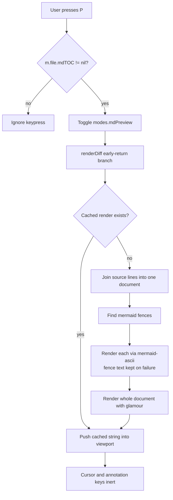

# Markdown Preview Mode (local patch)

## Overview

Add a read-only rendered markdown view to revdiff, toggled with `P`. In this mode a markdown file is
shown with real tables, styled headings, framed code blocks, and Mermaid diagrams drawn as
box-drawing art. Pressing `P` again returns to the normal annotatable view.

The problem: plan documents are reviewed in the terminal, and every plan carries a Mermaid diagram.
revdiff currently shows markdown *source* with chroma colouring, so tables do not line up and a
Mermaid fence is an unreadable block of `A[Plan] --> B{Has Mermaid?}`.

This is a **personal patch on a local clone**, not an upstream contribution. The maintainer declined
this feature twice — discussion #164 "Feat: markdown preview" (2026-05-01) and issue #244 "feat:
Better table rendering" (closed NOT_PLANNED, 2026-06-28) — on the grounds that the payoff did not
justify the complexity. He was not against it technically; in #164 he sketched this exact design,
including the `--markdown-preview` flag and the `P` hotkey. There will be no PR and no GitHub fork.

Two objections he raised do not apply to a local build. **Theme sync** was a problem because a
released feature would need a glamour style generated from revdiff's 23 theme colour fields and kept
in sync; locally we pick one style and stop. **Code fences highlighted twice** only happens when
glamour renders inside the existing per-line chroma path; a whole-document render replaces that path,
so nothing nests. His third objection — that a diff showing only some rows of a table cannot render
sensibly — is avoided by the gate described below.

## Context (from discovery)

- Repo: local clone of `umputun/revdiff` at `~/dev/revdiff`, branch `md-preview`, based on master
  commit `1b563f8` (after tag `v1.11.1`). Go 1.26.2, golangci-lint installed.
- Annotations anchor to **source line numbers**: `Annotation` struct at `app/annotation/store.go:13-19`
  (`File`, `Line`, `EndLine`, `Type`, `Comment`). The cursor (`m.nav.diffCursor`) is an index into
  `m.file.lines`. Rendering reflows text, so rendered rows cannot match source lines.
- There is **no stored source-line to display-row map**. Row positions are recomputed on demand by
  walking lines and summing heights: `wrappedLineCount` (`app/ui/diffview.go:413-424`),
  `hunkLineHeight` (`app/ui/annotate.go:528-544`), `cursorViewportYUsing` (`app/ui/annotate.go:560-582`).
  Everything assumes one entry per source line.
- There is **no markdown parser anywhere**. The TOC pane is hand-written scanning:
  `ParseTOC` (`app/ui/sidepane/toc.go:34-104`), with a fence helper `fencePrefix`
  (`app/ui/sidepane/toc.go:266-284`).
- There is **no view-mode enum**. Modes are independent bools on `modeState` in `app/ui/model.go`
  (`wrap`, `collapsed.enabled`, `compact`, `lineNumbers`, `wordDiff`, `showBlame`). The only render
  dispatch point is `renderDiff` (`app/ui/diffview.go:273-295`), which early-returns to
  `renderCollapsedDiff()` when collapsed mode is on. A new mode is a new bool plus a new early return.
- Test conventions: table-driven tests with `stretchr/testify`, mocks via `matryer/moq`
  (`docs/ARCHITECTURE.md:457-458`). CI runs `go test -race -covermode=atomic ./...` plus
  golangci-lint (`.github/workflows/ci.yml:26-28`).
- revdiff **vendors** its dependencies, so any dependency change requires `go mod tidy && go mod vendor`.

## Development Approach

- **testing approach**: TDD — write the failing test first, then the implementation.
- complete each task fully before moving to the next
- make small, focused changes
- **every task MUST include new/updated tests**, listed as separate checklist items
- **all tests must pass before starting the next task**
- **update this plan file when scope changes during implementation**
- run tests after each change
- maintain backward compatibility: with the mode off, behaviour must be byte-identical to upstream

### Patch discipline (specific to this plan)

This fork is rebased onto every upstream release by hand, and conflicts happen in *edited* lines, not
in new files. Therefore:

- Put essentially all logic in the new file `app/ui/mdpreview.go`.
- Keep edits to existing files to the five small hunks listed in Task 4. Do not refactor surrounding
  code, do not reformat, do not "improve" nearby lines. Every extra changed line is a future conflict.
- `app/ui/diffview.go` and `app/ui/model.go` are actively developed upstream and are the most likely
  conflict sites. Touch the minimum.

## Testing Strategy

- **unit tests**: required for every task, in `app/ui/mdpreview_test.go` unless stated otherwise.
- **e2e tests**: the project has no UI e2e harness. Manual terminal verification is specified in
  Task 8 and in Post-Completion instead, and it must check rendered *content*, not merely that the
  program started without error.

## Progress Tracking

- mark completed items with `[x]` immediately when done
- add newly discovered tasks with ➕ prefix
- document issues/blockers with ⚠️ prefix
- keep plan in sync with actual work done

## Solution Overview

Preview mode is **read-only**. While it is on, the cursor and the annotation keys do nothing. This is
the entire trick: it means the patch never touches the line-anchoring machinery, which is what made
this feature expensive in every previous discussion. Annotations created in the normal view are
untouched and are still there when the mode is toggled off.



### Gate

Use `m.file.mdTOC != nil`. That field is set at `app/ui/loaders.go:534-538` and already means
"single file, markdown extension, full context". No new condition is needed, and because full context
means the whole file is present, a partially-shown table cannot occur.

## Technical Details

### Dependencies to add

- `github.com/charmbracelet/glamour` **v1.0.0** — markdown rendering. Deliberately v1, not v2: v2 is
  `charm.land/glamour/v2` and requires `charm.land/lipgloss/v2`, a different module path from the
  `github.com/charmbracelet/lipgloss` revdiff already vendors, which would vendor two copies of
  lipgloss. v1 shares revdiff's existing chroma, lipgloss, x/ansi, termenv, colorprofile, uniseg,
  runewidth and regexp2. It adds roughly eight modules, mainly goldmark and bluemonday.
- `github.com/AlexanderGrooff/mermaid-ascii` (MIT) — Mermaid rendering, imported as a library.
  Entry point: `cmd.RenderDiagram(input string, config *diagram.Config) (string, error)` in
  `cmd/render.go`. Note the flowchart renderer lives in package `cmd`, which also imports gin, cobra
  and logrus, so this pulls roughly 30 extra modules into the vendor tree. This cost was chosen
  deliberately over depending on an external binary.

### New state

One field on the existing `modeState` struct in `app/ui/model.go`: `mdPreview bool`. Plus a render
cache so toggling does not re-run glamour and mermaid every time — key it on the file name and the
viewport width, since a width change must invalidate it.

## What Goes Where

- **Implementation Steps** (`[ ]`): everything doable inside this clone.
- **Post-Completion** (no checkboxes): manual terminal checks and the Claude tooling wiring.

## Implementation Steps

### Task 1: Dependency spike — no feature code

The purpose is to find out early whether glamour's newer pinned lipgloss breaks revdiff's existing UI.
glamour v1.0.0 requires a slightly newer `charmbracelet/lipgloss` than revdiff pins, and Go selects one
version for the whole build. If the suite goes red here, **stop and report** rather than starting the
feature.

**Files:**
- Modify: `go.mod`
- Modify: `go.sum`
- Modify: `vendor/` (regenerated)

- [ ] record the baseline: run `go test -race ./...` on the clean branch and save the result
- [ ] `go get github.com/charmbracelet/glamour@v1.0.0`
- [ ] `go get github.com/AlexanderGrooff/mermaid-ascii@latest`
- [ ] `go mod tidy && go mod vendor`
- [ ] run `go build ./...` — must succeed
- [ ] run `go test -race ./...` — must match the baseline, no new failures
- [ ] run `golangci-lint run` — must not report new issues
- [ ] record the resulting lipgloss version and the vendor directory size in this plan file
- [ ] commit as a separate commit so the dependency change can be reverted on its own

### Task 2: Mermaid fence extraction

**Files:**
- Create: `app/ui/mdpreview.go`
- Create: `app/ui/mdpreview_test.go`

- [ ] write a failing test for a function that takes source lines and returns the document with
      ` ```mermaid ` fences replaced by rendered art
- [ ] write failing tests for: no fences present, two fences in one document, an unterminated fence,
      a fence with a language other than mermaid (must be left alone)
- [ ] write a failing test asserting that a diagram which fails to parse falls back to the original
      fence text verbatim, and never returns an error to the caller
- [ ] implement the extraction, reusing `fencePrefix` from `app/ui/sidepane/toc.go:266-284` rather than
      writing new fence parsing
- [ ] implement the `cmd.RenderDiagram` call with the fallback behaviour
- [ ] run tests — must pass before task 3

### Task 3: Document rendering via glamour

**Files:**
- Modify: `app/ui/mdpreview.go`
- Modify: `app/ui/mdpreview_test.go`

- [ ] write a failing test that a document with a table renders to output containing aligned column
      borders rather than raw pipe characters
- [ ] write a failing test that rendered Mermaid art survives glamour without being re-wrapped or
      reflowed (this is the likely failure — glamour wraps text, and diagram art must not be wrapped)
- [ ] write a failing test for width handling: rendering at a narrow width must not panic and must not
      produce lines wider than the viewport
- [ ] implement the glamour render with a fixed style, feeding it the mermaid-substituted document
- [ ] implement the render cache keyed on file name plus viewport width
- [ ] write a test that a width change invalidates the cache
- [ ] run tests — must pass before task 4

### Task 4: Mode wiring — the five hunks

Keep each edit minimal; see Patch discipline above. Follow the existing `toggle_wrap` action as the
template, it uses exactly these five sites.

**Files:**
- Modify: `app/keymap/keymap.go`
- Modify: `app/ui/model.go`
- Modify: `app/ui/diffview.go`
- Modify: `app/ui/view.go`
- Modify: `app/ui/mdpreview.go`
- Modify: `app/keymap/keymap_test.go`

- [ ] add `ActionToggleMarkdownPreview` constant to the `Action` enum in `app/keymap/keymap.go`
- [ ] bind `P` to it in the default keymap, and add the help-section entry
- [ ] add `mdPreview bool` to `modeState` in `app/ui/model.go`
- [ ] add the dispatch case calling `m.toggleMarkdownPreview()` in `app/ui/model.go`
- [ ] implement `toggleMarkdownPreview()` in `app/ui/mdpreview.go`, refusing to enable when
      `m.file.mdTOC == nil`
- [ ] add the early-return branch in `renderDiff` (`app/ui/diffview.go`), beside the existing
      `m.modes.collapsed.enabled` branch
- [ ] add the status-bar mode icon in `app/ui/view.go`
- [ ] write a test that the toggle is refused when `m.file.mdTOC == nil`
- [ ] write a test that the keymap resolves `P` to the new action
- [ ] run tests — must pass before task 5

### Task 5: Make annotation keys inert in preview mode

**Files:**
- Modify: `app/ui/mdpreview.go`
- Modify: `app/ui/mdpreview_test.go`

- [ ] write a failing test that the annotation-creating key does nothing while preview is on
- [ ] write a failing test that the cursor position is preserved across toggle on then off
- [ ] write a failing test that annotations created before enabling preview still exist after toggling
      back, with the same line anchors
- [ ] implement the guard
- [ ] run tests — must pass before task 6

### Task 6: Regression check — mode off must be unchanged

**Files:**
- Modify: `app/ui/mdpreview_test.go`

- [ ] write a test asserting `renderDiff` output is identical with the feature compiled in but the
      mode off, for a markdown file and for a non-markdown file
- [ ] run the full suite `go test -race -covermode=atomic ./...` — must pass
- [ ] run `golangci-lint run` — must be clean
- [ ] run tests — must pass before task 7

### Task 7: Build the `revdiffm` binary

**Files:**
- Create: `PATCH.md`

- [ ] build the patched binary and install it as `revdiffm` (not `revdiff`, so the brew build is left
      alone and nothing is shadowed)
- [ ] confirm the brew `revdiff` still runs and is unaffected
- [ ] write `PATCH.md`: which upstream tag the branch sits on, the five hunk locations, the rebuild
      command, and the rebase procedure

### Task 8: Verify acceptance criteria

Verification must check rendered **content**, not merely that the program launched.

- [ ] open `docs/plans/completed/20260713-parallel-dev-stacks.md` from `~/dev/local-dev-plugin` in
      `revdiffm`, press `P`, and confirm the Mermaid diagram is readable and headings are styled
- [ ] open the torture document at
      `/private/tmp/claude-501/-Users-sasha/5a4c7a1a-9881-4c7d-974e-e195093d504a/scratchpad/render-test.md`
      and check each element: narrow table, over-wide table, flowchart, sequence diagram, nested
      lists, blockquote, LaTeX
- [ ] compare the over-wide table against `markdown-reader` on the same file — note whether glamour
      truncates the header the way `glow` did
- [ ] confirm `P` is refused on a non-markdown file and on a partial-context diff
- [ ] add an annotation in normal view, toggle preview on and off, confirm it survived
- [ ] run the full test suite and record the output

### Task 9: [Final] Update documentation

- [ ] update `PATCH.md` with anything learned during implementation
- [ ] record in this plan file any deviation from the original design
- [ ] move this plan to `docs/plans/completed/`

## Post-Completion

*Items requiring manual intervention — no checkboxes, informational only*

**Claude tooling wiring:**

The `revdiff` skill and the planning plugin launch `revdiff` **by name**, so with the binary named
`revdiffm` they will keep using the unpatched brew build. revdiff supports a custom launcher resolved
through a user-then-bundled chain at `${CLAUDE_PLUGIN_DATA}/scripts/<launcher>`; the exact contract is
in `.claude-plugin/skills/revdiff/references/install.md` in this repo. Decide then whether to point
the launcher at `revdiffm`, or to leave the Claude tooling on stock revdiff and use `revdiffm` by hand.

**Manual verification:**

- Check rendering in both light and dark terminal themes, since the glamour style is fixed rather than
  derived from the revdiff theme.
- Check a very large plan file for toggle latency; if it is slow, the cache key or the mermaid render
  is the place to look.

**Ongoing maintenance:**

- On each upstream release: `git fetch`, rebase `md-preview` onto the new tag, re-run
  `go mod tidy && go mod vendor`, run the suite, rebuild `revdiffm`.
- Expect conflicts in `app/ui/diffview.go` and `app/ui/model.go` first; they are the actively
  developed files.
