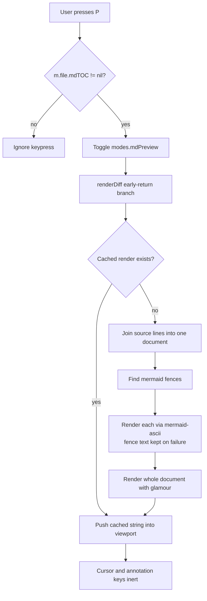

# Markdown Preview Mode (local patch)

## Overview

Add a read-only rendered markdown view to revdiff, toggled with `P`. In this mode a markdown file is
shown with real tables, styled headings, framed code blocks, and Mermaid diagrams drawn as
box-drawing art. Pressing `P` again returns to the normal annotatable view.

The problem: plan documents are reviewed in the terminal, and every plan carries a Mermaid diagram.
revdiff currently shows markdown *source* with chroma colouring, so tables do not line up and a
Mermaid fence is an unreadable block of `A[Plan] --> B{Has Mermaid?}`.

This is a **personal patch on a local clone**, not an upstream contribution. The maintainer declined
this feature twice — discussion #164 "Feat: markdown preview" (2026-05-01) and issue #244 "feat:
Better table rendering" (closed NOT_PLANNED, 2026-06-28) — on the grounds that the payoff did not
justify the complexity. He was not against it technically; in #164 he sketched this exact design,
including the `--markdown-preview` flag and the `P` hotkey. There will be no PR and no GitHub fork.

Two objections he raised do not apply to a local build. **Theme sync** was a problem because a
released feature would need a glamour style generated from revdiff's 23 theme colour fields and kept
in sync; locally we pick one style and stop. **Code fences highlighted twice** only happens when
glamour renders inside the existing per-line chroma path; a whole-document render replaces that path,
so nothing nests. His third objection — that a diff showing only some rows of a table cannot render
sensibly — is avoided by the gate described below.

## Context (from discovery)

- Repo: local clone of `umputun/revdiff` at `~/dev/revdiff`, branch `md-preview`, based on master
  commit `1b563f8` (after tag `v1.11.1`). Go 1.26.2, golangci-lint installed.
- Annotations anchor to **source line numbers**: `Annotation` struct at `app/annotation/store.go:13-19`
  (`File`, `Line`, `EndLine`, `Type`, `Comment`). The cursor (`m.nav.diffCursor`) is an index into
  `m.file.lines`. Rendering reflows text, so rendered rows cannot match source lines.
- There is **no stored source-line to display-row map**. Row positions are recomputed on demand by
  walking lines and summing heights: `wrappedLineCount` (`app/ui/diffview.go:413-424`),
  `hunkLineHeight` (`app/ui/annotate.go:528-544`), `cursorViewportYUsing` (`app/ui/annotate.go:560-582`).
  Everything assumes one entry per source line.
- There is **no markdown parser anywhere**. The TOC pane is hand-written scanning:
  `ParseTOC` (`app/ui/sidepane/toc.go:34-104`), with a fence helper `fencePrefix`
  (`app/ui/sidepane/toc.go:266-284`).
- There is **no view-mode enum**. Modes are independent bools on `modeState` in `app/ui/model.go`
  (`wrap`, `collapsed.enabled`, `compact`, `lineNumbers`, `wordDiff`, `showBlame`). The only render
  dispatch point is `renderDiff` (`app/ui/diffview.go:273-295`), which early-returns to
  `renderCollapsedDiff()` when collapsed mode is on. A new mode is a new bool plus a new early return.
- Test conventions: table-driven tests with `stretchr/testify`, mocks via `matryer/moq`
  (`docs/ARCHITECTURE.md:457-458`). CI runs `go test -race -covermode=atomic ./...` plus
  golangci-lint (`.github/workflows/ci.yml:26-28`).
- revdiff **vendors** its dependencies, so any dependency change requires `go mod tidy && go mod vendor`.

## Development Approach

- **testing approach**: TDD — write the failing test first, then the implementation.
- complete each task fully before moving to the next
- make small, focused changes
- **every task MUST include new/updated tests**, listed as separate checklist items
- **all tests must pass before starting the next task**
- **update this plan file when scope changes during implementation**
- run tests after each change
- maintain backward compatibility: with the mode off, behaviour must be byte-identical to upstream

### Patch discipline (specific to this plan)

This fork is rebased onto every upstream release by hand, and conflicts happen in *edited* lines, not
in new files. Therefore:

- Put essentially all logic in the new file `app/ui/mdpreview.go`.
- Keep edits to existing files to the five small hunks listed in Task 4. Do not refactor surrounding
  code, do not reformat, do not "improve" nearby lines. Every extra changed line is a future conflict.
- `app/ui/diffview.go` and `app/ui/model.go` are actively developed upstream and are the most likely
  conflict sites. Touch the minimum.

## Testing Strategy

- **unit tests**: required for every task, in `app/ui/mdpreview_test.go` unless stated otherwise.
- **e2e tests**: the project has no UI e2e harness. Manual terminal verification is specified in
  Task 8 and in Post-Completion instead, and it must check rendered *content*, not merely that the
  program started without error.

## Progress Tracking

- mark completed items with `[x]` immediately when done
- add newly discovered tasks with ➕ prefix
- document issues/blockers with ⚠️ prefix
- keep plan in sync with actual work done

## Solution Overview

Preview mode is **read-only**. While it is on, the cursor and the annotation keys do nothing. This is
the entire trick: it means the patch never touches the line-anchoring machinery, which is what made
this feature expensive in every previous discussion. Annotations created in the normal view are
untouched and are still there when the mode is toggled off.



### Gate

Use `m.file.mdTOC != nil`. That field is set at `app/ui/loaders.go:534-538` and already means
"single file, markdown extension, full context". No new condition is needed, and because full context
means the whole file is present, a partially-shown table cannot occur.

## Technical Details

### Dependencies to add

- `github.com/charmbracelet/glamour` **v1.0.0** — markdown rendering. Deliberately v1, not v2: v2 is
  `charm.land/glamour/v2` and requires `charm.land/lipgloss/v2`, a different module path from the
  `github.com/charmbracelet/lipgloss` revdiff already vendors, which would vendor two copies of
  lipgloss. v1 shares revdiff's existing chroma, lipgloss, x/ansi, termenv, colorprofile, uniseg,
  runewidth and regexp2. It adds roughly eight modules, mainly goldmark and bluemonday.
- `github.com/AlexanderGrooff/mermaid-ascii` (MIT) — Mermaid rendering, imported as a library.
  Entry point: `cmd.RenderDiagram(input string, config *diagram.Config) (string, error)` in
  `cmd/render.go`. Note the flowchart renderer lives in package `cmd`, which also imports gin, cobra
  and logrus, so this pulls roughly 30 extra modules into the vendor tree. This cost was chosen
  deliberately over depending on an external binary.

### New state

One field on the existing `modeState` struct in `app/ui/model.go`: `mdPreview bool`. Plus a render
cache so toggling does not re-run glamour and mermaid every time — key it on the file name and the
viewport width, since a width change must invalidate it.

## What Goes Where

- **Implementation Steps** (`[ ]`): everything doable inside this clone.
- **Post-Completion** (no checkboxes): manual terminal checks and the Claude tooling wiring.

## Implementation Steps

### Task 1: Dependency spike — no feature code

The purpose is to find out early whether glamour's newer pinned lipgloss breaks revdiff's existing UI.
glamour v1.0.0 requires a slightly newer `charmbracelet/lipgloss` than revdiff pins, and Go selects one
version for the whole build. If the suite goes red here, **stop and report** rather than starting the
feature.

**Files:**
- Modify: `go.mod`
- Modify: `go.sum`
- Modify: `vendor/` (regenerated)

- [x] record the baseline: run `go test -race ./...` on the clean branch and save the result — all 14
      testable packages `ok`, no failures (full listing below)
- [x] `go get github.com/charmbracelet/glamour@v1.0.0`
- [x] `go get github.com/AlexanderGrooff/mermaid-ascii@latest`
- [x] `go mod tidy && go mod vendor`
- [x] run `go build ./...` — must succeed (succeeded, no output)
- [x] run `go test -race ./...` — must match the baseline, no new failures (matched exactly, see below)
- [x] run `golangci-lint run` — must not report new issues (`0 issues.`)
- [x] record the resulting lipgloss version and the vendor directory size in this plan file (below)
- [x] commit as a separate commit so the dependency change can be reverted on its own

**Baseline test result** (before any dependency change, `go test -race ./...`):

```
ok  	github.com/umputun/revdiff/app	62.956s
ok  	github.com/umputun/revdiff/app/annotation	1.317s
ok  	github.com/umputun/revdiff/app/diff	11.029s
?   	github.com/umputun/revdiff/app/diff/mocks	[no test files]
ok  	github.com/umputun/revdiff/app/editor	2.906s
ok  	github.com/umputun/revdiff/app/fsutil	2.059s
ok  	github.com/umputun/revdiff/app/handoff	2.341s
ok  	github.com/umputun/revdiff/app/highlight	3.594s
ok  	github.com/umputun/revdiff/app/history	3.769s
ok  	github.com/umputun/revdiff/app/keymap	3.778s
ok  	github.com/umputun/revdiff/app/review	3.177s
ok  	github.com/umputun/revdiff/app/theme	4.083s
ok  	github.com/umputun/revdiff/app/ui	4.301s
?   	github.com/umputun/revdiff/app/ui/mocks	[no test files]
ok  	github.com/umputun/revdiff/app/ui/overlay	3.281s
ok  	github.com/umputun/revdiff/app/ui/sidepane	3.103s
ok  	github.com/umputun/revdiff/app/ui/style	3.103s
ok  	github.com/umputun/revdiff/app/ui/worddiff	2.806s
?   	github.com/umputun/revdiff/themes	[no test files]
```

**Post-change test result** (`go test -race -count=1 ./...`, uncached): the same 14 packages report
`ok`, the same 3 packages report `[no test files]`, no new failures. golangci-lint reports `0 issues.`

**Resulting lipgloss version**: `github.com/charmbracelet/lipgloss v1.1.1-0.20250404203927-76690c660834`
(up from `v1.1.0` before this task).

**Vendor directory size**: 19M before, 19M after (`du -sk vendor/`: 19052 KB in both cases, unchanged
at that granularity). See the ⚠️ note below for why — glamour and mermaid-ascii themselves are not
present in the vendor tree yet, only the lipgloss bump is.

⚠️ **`go mod tidy` pruned glamour and mermaid-ascii back out of go.mod/go.sum.** Task 1 deliberately
adds no feature code, so nothing in the repo imports `glamour` or `mermaid-ascii` yet. `go mod tidy`
removes any module requirement that is not needed to build or test a package in the main module, so
right after `go get` added both modules, the following `go mod tidy` deleted them again — `go.mod`
after this task lists the same direct dependencies as before this task, minus glamour and
mermaid-ascii, which appear in neither `go.mod`, `go.sum`, nor `vendor/`. `go mod vendor` only copies
packages that are actually imported (transitively) by the main module, so it did not create
`vendor/github.com/charmbracelet/glamour/` or `vendor/github.com/AlexanderGrooff/` either, regardless
of whether they are listed in `go.mod`. This is expected, standard Go module behavior for an
add-then-tidy sequence with no consuming import — not a bug in this task.

What *did* survive, and is the part that actually matters for this spike: `lipgloss` itself is already
a **direct** dependency of revdiff (imported throughout `app/ui/style` and elsewhere), and `go get
glamour@v1.0.0` bumped revdiff's own direct `lipgloss` requirement to satisfy glamour's higher pin.
`go mod tidy` does not downgrade an already-recorded direct requirement just because the reason for the
bump (glamour) was itself later pruned — re-running `go mod tidy` a second time confirmed the lipgloss
version stays at `v1.1.1-0.20250404203927-76690c660834`. So the exact risk this spike set out to test —
"a newer lipgloss, selected by MVS for the whole build, could change rendering behaviour in revdiff's
existing UI code" — was genuinely exercised: `go build ./...`, `go test -race ./...`, and
`golangci-lint run` all ran against this newer lipgloss, without the noise of glamour/mermaid-ascii's
~90 additional transitive modules (which are irrelevant to existing code, since nothing imports them
yet). Result: no behaviour change detected in the existing suite.

Consequence for later tasks: when Task 2 or Task 3 add the first real `import
"github.com/charmbracelet/glamour"` (and later the `mermaid-ascii` import) in `app/ui/mdpreview.go`,
`go mod tidy && go mod vendor` must be re-run at that point to pull both modules and their transitive
tree back into `go.mod`/`go.sum`/`vendor/` — this is expected, not a regression, and vendor size will
grow substantially at that point (glamour brings roughly eight modules including goldmark and
bluemonday; mermaid-ascii's `cmd` package pulls in roughly 30 more, including gin, cobra and logrus,
per the Technical Details section above).

### Task 2: Mermaid fence extraction

**Files:**
- Create: `app/ui/mdpreview.go`
- Create: `app/ui/mdpreview_test.go`

- [x] write a failing test for a function that takes source lines and returns the document with
      ` ```mermaid ` fences replaced by rendered art
- [x] write failing tests for: no fences present, two fences in one document, an unterminated fence,
      a fence with a language other than mermaid (must be left alone)
- [x] write a failing test asserting that a diagram which fails to parse falls back to the original
      fence text verbatim, and never returns an error to the caller
- [x] implement the extraction, reusing `fencePrefix` from `app/ui/sidepane/toc.go:266-284` rather than
      writing new fence parsing
- [x] implement the `cmd.RenderDiagram` call with the fallback behaviour
- [x] run tests — must pass before task 3

⚠️ **`fencePrefix` turned out unexported.** As flagged in the task guidance, `sidepane.fencePrefix`
(`app/ui/sidepane/toc.go:266-284`) is lowercase — package `app/ui` cannot call it. Wrote a local
duplicate, `mdFencePrefix`, inside the new `app/ui/mdpreview.go` instead of exporting the sidepane
helper. This touches zero existing files (patch-discipline preference) versus exporting `FencePrefix`
across the package boundary for a single caller, which would edit `toc.go` and every future upstream
rebase would need to re-apply that rename. The two copies are five lines each and share no state, so
duplication costs nothing structurally.

`go get github.com/AlexanderGrooff/mermaid-ascii@latest` plus `go mod tidy && go mod vendor` pulled the
dependency tree back in cleanly: vendored module count went from 31 to 62 (+31, close to the ~30
estimated in Technical Details), vendor directory size from 19M to 49M. `go build ./...`,
`go test -race -covermode=atomic ./...` (all 14 previously-passing packages still `ok`, no new
failures), and `golangci-lint run` (`0 issues.`) all passed against the full tree including gin, cobra,
and logrus. No breakage from the new dependency tree — nothing to report as a blocker.

Malformed-input safety: `cmd.RenderDiagram` itself always returns `(string, error)` and does not panic
on the malformed input exercised in tests (confirmed by reading `mermaidFileToMap` in the vendored
source — non-graph/flowchart input returns a clean `"unsupported graph type"` error). `renderMermaidBlock`
still wraps the call in `recover()` as defense-in-depth per the plan's "must never panic" requirement,
since that guarantee cannot be proven from reading one version of a third-party library. No test proves
an actual panic path (none was found or constructed) — the recover code itself is therefore exercised
structurally but not by a red-then-green panic test. See final report for the same caveat.

### Task 3: Document rendering via glamour

**Files:**
- Modify: `app/ui/mdpreview.go`
- Modify: `app/ui/mdpreview_test.go`

- [x] write a failing test that a document with a table renders to output containing aligned column
      borders rather than raw pipe characters
- [x] write a failing test that rendered Mermaid art survives glamour without being re-wrapped or
      reflowed (this is the likely failure — glamour wraps text, and diagram art must not be wrapped)
- [x] write a failing test for width handling: rendering at a narrow width must not panic and must not
      produce lines wider than the viewport
- [x] implement the glamour render with a fixed style, feeding it the mermaid-substituted document
- [x] implement the render cache keyed on file name plus viewport width
- [x] write a test that a width change invalidates the cache
- [x] run tests — must pass before task 4

⚠️ **A fenced code block alone does not protect the art — confirmed empirically, and this changed the
design from what "Technical Details" implied.** The obvious plan ("emit the rendered art inside a
```text fence so glamour treats it as preformatted") was tried first and fails. Reading
`glamour@v1.0.0/ansi/codeblock.go` shows `CodeBlockElement.Render` never word-wraps — true, but
misleading: `glamour@v1.0.0/ansi/blockelement.go`'s `BlockElement.Finish` (used for the Document
element, which every top-level block including a code fence renders into) always runs
`x/ansi.Wordwrap` over the **entire accumulated document buffer** before writing it out, with no
awareness of which byte ranges came from a code fence versus prose. This is not configurable through
any style field — `Document`'s `Margin: true` is a Go literal in `elements.go`. A spike test (rendering
a fenced code block containing wide box-drawing art at width 40) proved this concretely: the second
line of a 3-line diagram came back split across 3 output lines. So embedding art in a fence and relying
on `WithWordWrap` guarantees nothing.

**Solution actually implemented — render around the art, not through it.** `mermaidPlaceholderDocument`
replaces each mermaid fence with a plain, isolated sentinel paragraph (`mermaidPlaceholder`, alphanumeric
only, no markdown or `x/ansi.Wordwrap` break characters `" ,.;-+|"` — a hyphen is *always* a break
character regardless of the passed set, confirmed by reading `x/ansi/wrap.go`) — so the token survives
`ansi.Wordwrap` as a single atomic word, never split mid-token, and does not merge into adjacent prose
because it is wrapped in its own blank-line-separated paragraph. `renderMarkdownDocument` renders that
placeholder document with glamour, then `spliceMermaidArt` finds the one output line matching each
placeholder (after `ansi.Strip` + `TrimSpace`, to ignore glamour's own color codes and pad/margin
whitespace) and replaces that line wholesale with the raw diagram text — verbatim, never passed through
glamour at all. `renderMermaidFences` (Task 2, still directly tested by the Task 2 suite) was refactored
into a 3-line wrapper around a new shared walk, `joinWithMermaidFences`, parameterized on what to do
with each mermaid fence — `renderMermaidFences` still inlines the art directly (used by nothing yet,
kept for the Task 2 tests and as a plain-text fallback), `mermaidPlaceholderDocument` substitutes the
placeholder instead. No Task 2 test was touched; all still pass unchanged after the refactor.

**Proof the test would actually catch a regression**: reverted `renderMarkdownDocument` locally to the
naive `doc := renderMermaidFences(lines)` (art inlined, fed straight to glamour, no placeholder/splice),
re-ran just the two width/reflow tests, watched them fail with the diagram visibly broken across
multiple re-wrapped lines (e.g. `│ This is a` / `moderately long` / `label for node A │` — a 3-line
diagram box split into what should have been one line, now several), then restored the real
implementation and confirmed green again. Diagram fixture: `wideMermaidSrc`, two nodes with long labels,
natural width 46 runes — wider than every narrow width used in these tests (20), so the reflow tests
are not vacuous.

**Width decision**: `renderMarkdownDocument`'s `width` parameter is glamour's word-wrap target for
prose/headings/tables (floored at `mdPreviewMinWidth = 8`, purely defensive — glamour itself does not
panic at width ≤ 0, `x/ansi.Wordwrap`'s `limit < 1` case just returns the input unwrapped, confirmed by
reading `x/ansi/wrap.go` and by a spike test sweeping widths 0/-5/1/5/20/80, none of which panicked).
Spliced-in diagram art is **never** constrained by this width — same as glamour's own code-block
rendering, which the plan's Technical Details already noted is not word-wrapped. Decision, made
explicit here per the task's instruction to decide and document rather than leave implicit: box-drawing
art has a natural minimum width, and truncating or reflowing it to fit a narrow viewport would corrupt
its shape rather than just shrink it, so a narrow viewport is expected to let the diagram overflow
horizontally (Task 4's viewport wiring will need horizontal scroll for this — already true today for
wide diff lines, not a new requirement). `TestRenderMarkdownDocument_NarrowWidth_ProseRespectsWidthArtOverflows`
asserts both halves of this: every non-diagram line stays within the requested width, and the diagram
line(s) are allowed past it, with a sanity check that the fixture diagram is actually wider than the
tested width (so the assertion is not accidentally vacuous).

**Style**: one fixed built-in style, `glamour/styles.DarkStyleConfig`, unmodified — no per-repo-theme
derivation, per the plan's explicit ruling-out of that. Since the art is spliced in after glamour has
already finished rendering (never passed through glamour's own code-block styling), no code-block
margin/indent tuning was needed either, which simplified the original plan further: the fixed style
needs zero customization for this feature to work correctly.

**ANSI nesting (gotchas.md)**: read before writing any of this. Not directly applicable here — the
gotchas note is about embedding a `lipgloss.Render()`-produced *substring* inside an already
lipgloss-rendered *parent* (its full reset breaks the outer background). glamour's output here is not
nested inside another lipgloss render; it *is* the entire pane content handed to `viewport.SetContent`,
the same relationship the existing chroma-highlighted diff content already has to the viewport. Checked
glamour's raw ANSI output directly (spike test, `%q`-dumped): every styled run is a matched
`\x1b[...m...\x1b[0m` pair, never left open across a line boundary, so it composes safely with whatever
pane-level background/border treatment Task 4's wiring applies on top (`extendLineBg`/`padContentBg`
emit their own color codes for padding rather than relying on inherited SGR state, the same way they
already do for chroma output).

**Vendoring**: `go get glamour@v1.0.0` resolved cleanly, no forced v2. Vendored module count went from
62 (after Task 2) to 71 (+9 — glamour itself plus `aymerick/douceur`, `charmbracelet/x/exp/slice`,
`gorilla/css`, `microcosm-cc/bluemonday`, `muesli/reflow`, `yuin/goldmark`, `yuin/goldmark-emoji`, close
to the ~8 estimated in Technical Details), vendor directory size from 49M to 51M. `go get` also bumped
three already-present transitive deps to satisfy glamour's own requirements:
`golang.org/x/crypto` v0.23.0→v0.36.0, `golang.org/x/net` v0.25.0→v0.38.0, and newly added
`golang.org/x/term` v0.36.0 (glamour imports it directly for `term.IsTerminal`/`termenv.HasDarkBackground`
auto-style detection, a code path this feature never calls since it always passes an explicit fixed
style). `go build ./...`, `go test -race -covermode=atomic ./...` (all 16 previously-`ok` packages —
Task 1's plan text says 14 but the actual baseline list has 16 `ok` entries plus 3 `[no test files]` —
still `ok`, no new failures), and `golangci-lint run` (`0 issues.`, after fixing two `modernize` lint
findings: `if w < x { w = x }` → `max(w, x)`, and three `strings.Split` range loops → `strings.SplitSeq`)
all passed.

### Task 4: Mode wiring — the five hunks

Keep each edit minimal; see Patch discipline above. Follow the existing `toggle_wrap` action as the
template, it uses exactly these five sites.

**Files:**
- Modify: `app/keymap/keymap.go`
- Modify: `app/ui/model.go`
- Modify: `app/ui/diffview.go`
- Modify: `app/ui/view.go`
- Modify: `app/ui/mdpreview.go`
- Modify: `app/keymap/keymap_test.go`

- [ ] add `ActionToggleMarkdownPreview` constant to the `Action` enum in `app/keymap/keymap.go`
- [ ] bind `P` to it in the default keymap, and add the help-section entry
- [ ] add `mdPreview bool` to `modeState` in `app/ui/model.go`
- [ ] add the dispatch case calling `m.toggleMarkdownPreview()` in `app/ui/model.go`
- [ ] implement `toggleMarkdownPreview()` in `app/ui/mdpreview.go`, refusing to enable when
      `m.file.mdTOC == nil`
- [ ] add the early-return branch in `renderDiff` (`app/ui/diffview.go`), beside the existing
      `m.modes.collapsed.enabled` branch
- [ ] add the status-bar mode icon in `app/ui/view.go`
- [ ] write a test that the toggle is refused when `m.file.mdTOC == nil`
- [ ] write a test that the keymap resolves `P` to the new action
- [ ] run tests — must pass before task 5

### Task 5: Make annotation keys inert in preview mode

**Files:**
- Modify: `app/ui/mdpreview.go`
- Modify: `app/ui/mdpreview_test.go`

- [ ] write a failing test that the annotation-creating key does nothing while preview is on
- [ ] write a failing test that the cursor position is preserved across toggle on then off
- [ ] write a failing test that annotations created before enabling preview still exist after toggling
      back, with the same line anchors
- [ ] implement the guard
- [ ] run tests — must pass before task 6

### Task 6: Regression check — mode off must be unchanged

**Files:**
- Modify: `app/ui/mdpreview_test.go`

- [ ] write a test asserting `renderDiff` output is identical with the feature compiled in but the
      mode off, for a markdown file and for a non-markdown file
- [ ] run the full suite `go test -race -covermode=atomic ./...` — must pass
- [ ] run `golangci-lint run` — must be clean
- [ ] run tests — must pass before task 7

### Task 7: Build the `revdiffm` binary

**Files:**
- Create: `PATCH.md`

- [ ] build the patched binary and install it as `revdiffm` (not `revdiff`, so the brew build is left
      alone and nothing is shadowed)
- [ ] confirm the brew `revdiff` still runs and is unaffected
- [ ] write `PATCH.md`: which upstream tag the branch sits on, the five hunk locations, the rebuild
      command, and the rebase procedure

### Task 8: Verify acceptance criteria

Verification must check rendered **content**, not merely that the program launched.

- [ ] open `docs/plans/completed/20260713-parallel-dev-stacks.md` from `~/dev/local-dev-plugin` in
      `revdiffm`, press `P`, and confirm the Mermaid diagram is readable and headings are styled
- [ ] open the torture document at
      `/private/tmp/claude-501/-Users-sasha/5a4c7a1a-9881-4c7d-974e-e195093d504a/scratchpad/render-test.md`
      and check each element: narrow table, over-wide table, flowchart, sequence diagram, nested
      lists, blockquote, LaTeX
- [ ] compare the over-wide table against `markdown-reader` on the same file — note whether glamour
      truncates the header the way `glow` did
- [ ] confirm `P` is refused on a non-markdown file and on a partial-context diff
- [ ] add an annotation in normal view, toggle preview on and off, confirm it survived
- [ ] run the full test suite and record the output

### Task 9: [Final] Update documentation

- [ ] update `PATCH.md` with anything learned during implementation
- [ ] record in this plan file any deviation from the original design
- [ ] move this plan to `docs/plans/completed/`

## Post-Completion

*Items requiring manual intervention — no checkboxes, informational only*

**Claude tooling wiring:**

The `revdiff` skill and the planning plugin launch `revdiff` **by name**, so with the binary named
`revdiffm` they will keep using the unpatched brew build. revdiff supports a custom launcher resolved
through a user-then-bundled chain at `${CLAUDE_PLUGIN_DATA}/scripts/<launcher>`; the exact contract is
in `.claude-plugin/skills/revdiff/references/install.md` in this repo. Decide then whether to point
the launcher at `revdiffm`, or to leave the Claude tooling on stock revdiff and use `revdiffm` by hand.

**Manual verification:**

- Check rendering in both light and dark terminal themes, since the glamour style is fixed rather than
  derived from the revdiff theme.
- Check a very large plan file for toggle latency; if it is slow, the cache key or the mermaid render
  is the place to look.

**Ongoing maintenance:**

- On each upstream release: `git fetch`, rebase `md-preview` onto the new tag, re-run
  `go mod tidy && go mod vendor`, run the suite, rebuild `revdiffm`.
- Expect conflicts in `app/ui/diffview.go` and `app/ui/model.go` first; they are the actively
  developed files.
