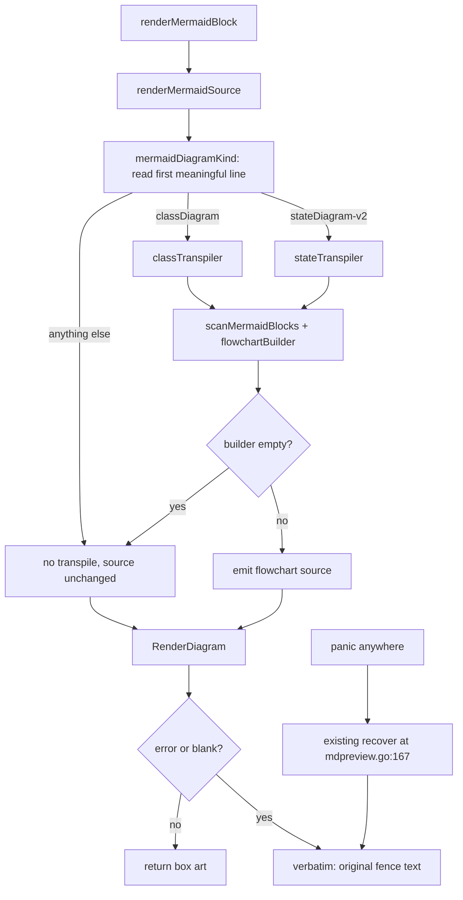

# Markdown preview: render classDiagram and stateDiagram-v2

## Overview

Markdown preview mode (`P`) draws mermaid fences as ASCII box art through
`github.com/AlexanderGrooff/mermaid-ascii`. That library parses only `graph`, `flowchart`, and
`sequenceDiagram`. Every other type makes `RenderDiagram` return `unsupported graph type '<X>'`, and
`renderMermaidBlock` (`app/ui/mdpreview.go:153`) falls back to the raw fence text, which is spliced
into the glamour output unstyled and flush-left. On screen that reads as "the diagram did not
render". That is the bug.

Measured over every mermaid fence in `.md` files under `~/.claude/plans` and `~/dev`, excluding
vendor and node_modules: 251 fences. 206 render today (flowchart 111,
sequenceDiagram 60, graph 35). 45 do not: classDiagram 36, stateDiagram-v2 6, gantt 2,
quadrantChart 1. `erDiagram` appears zero times.

This count was taken in one pass and did not de-duplicate fences that appear more than once
because the same repo was checked out in several git worktrees at scan time. A re-run with a
different number of worktrees checked out will give a different total. The 18-fence
classDiagram/stateDiagram-v2 corpus that this plan's width and label measurements are pinned
against (see the Failure modes table below) is deduplicated to one copy per fence, and does
reproduce exactly.

This change covers `classDiagram` and `stateDiagram-v2` — 42 of the 45 broken fences.
`erDiagram`, `gantt`, and `quadrantChart` keep today's fallback. Bumping the dependency was checked
and does not help; the newest upstream commit adds only tests.

The approach is a **transpiler**, not a new rendering engine. Both types become `flowchart` source
and go to the existing renderer, which already has the needed primitives: `<br/>` in a node label
produces a real multi-line box, and an unquoted edge label with spaces renders cleanly. Both
verified by running the pinned library.

## Context (from discovery)

- Files involved: `app/ui/mdpreview.go` (467 lines, all preview logic), `app/ui/mdpreview_test.go`,
  `PATCH.md` at repo root, and the vendored `mermaid-ascii` package used as the grammar reference.
- Patterns found: `mdpreview.go` is patch-owned and does not exist upstream. `PATCH.md` and the
  `mdFencePrefix` doc comment both state that new logic goes in **new files** so hand rebases onto
  upstream releases never conflict. That rules out a new `app/<name>/` package and rules out editing
  any upstream file.
- Existing tests are flat one-scenario-per-function with testify `assert`/`require`, inline
  string-literal documents, no golden files, and they call the **real** mermaid-ascii rather than
  stubbing it.
- Lint ceilings that shape the decomposition: `gocyclo min-complexity: 20`, `dupl threshold: 100`,
  `godoclint`, `wrapcheck`, `errcheck`, `errorlint`, `nilerr`, plus `revive` early-return and
  indent-error-flow.
- Branch is `md-preview`, pushed to the `fork` remote.

## Development Approach

- **testing approach**: TDD — write the failing test first, then the implementation.
- complete each task fully before moving to the next
- make small, focused changes
- **CRITICAL: every task MUST include new/updated tests** for code changes in that task
- **CRITICAL: all tests must pass before starting next task**
- **CRITICAL: update this plan file when scope changes during implementation**
- run tests after each change
- maintain backward compatibility: the 206 already-working fences must take a byte-identical path

## Testing Strategy

- **unit tests**: required for every task, in `app/ui/mdpreview_transpile_test.go`
- **integration tests**: call the real `mermaidcmd.RenderDiagram`, matching the convention in
  `app/ui/mdpreview_test.go`
- **no e2e suite** in this project — the equivalent is the manual TUI verification in Task 7
- test command: `make test` (race detector plus coverage). Lint gate: `make lint`

## Progress Tracking

- mark completed items with `[x]` immediately when done
- add newly discovered tasks with ➕ prefix
- document issues/blockers with ⚠️ prefix
- update plan if implementation deviates from original scope

## Solution Overview

One statement changes in `app/ui/mdpreview.go` at line 173 inside `renderMermaidBlock`:

```go
rendered, err := mermaidcmd.RenderDiagram(strings.Join(body, "\n"), nil)   // before
rendered, err := renderMermaidSource(strings.Join(body, "\n"))             // after
```

That is the entire footprint outside the new files. Everything else lands in
`app/ui/mdpreview_transpile.go` and its test file.



Three properties this shape gives us. The transpiler is a pure `string -> (string, bool)` step, so
it can never produce a half-diagram — the render stays all-or-nothing. The existing `recover()` at
`mdpreview.go:167` already covers the new code. And unrecognized kinds take a byte-identical path
to today.

No retry of the original source when a transpiled render fails: the original is `classDiagram`,
which is exactly what `parse.go:380` rejects, so the retry would always fail.

## Technical Details

### Facts read out of the vendored renderer, all measured

**An edge label is drawn as one horizontal run and widens a whole grid column.**
`vendor/.../cmd/mapping_edge.go:161` does
`g.columnWidth[middleX] = Max(g.columnWidth[middleX], lenLabel+labelPadding)`. So `<br/>` is not
honoured in an edge label — the splitter runs on node text only (`parse.go:70,129,132`) — and a
38-character label costs 41 columns of art. Edge labels must be shortened at transpile time.

**An edge label must not contain a space, and must never be empty.** The arrow is drawn through the
label's row, so it shows through wherever the label has a space at the arrow's column. Measured:
`owns 1 n` renders as `owns│1 n` under TD and as `─owns─1─n─` under LR. The same label with `·`
instead of spaces renders clean in both. The artifact is position-dependent, which is why an earlier
spot check of `places 1..n` looked fine — that was luck of alignment, not a rule. Separately, an
empty label makes `-->|(.+)|` fail so `parseNode` runs on the remainder and creates a phantom node
literally named `|| n1`.

**Parens, braces and tildes are inert.** `parseNode` (`parse.go:114-133`) special-cases only `:::`
and a leading `[` with trailing `]`. `splitGraphLines` (`parse.go:75-112`) tracks only `"`, `[`,
`]`, newline, backslash. So `resolve {outcome} (act without claiming)` keeps its punctuation.

**Quotes are eaten on the node side.** `parse.go:128` does `strings.Trim(labelText, "\"")`, so
`n0[Display "Name"]` renders as `Display "Name` — the trailing quote disappears. A `"` inside a
bracketed label also stops the closing `]` from decrementing `bracketDepth` at `parse.go:90`, so
newline splitting stops and the rest of the diagram is swallowed. Deleting `"` in the sanitizer
handles both.

Box geometry, from `mapping_node.go:39-43` with `boxBorderPadding = 1` and `paddingBetweenX = 5`
(`root.go:16-17`, matching `DefaultConfig`, which is what `RenderDiagram(src, nil)` uses), confirmed
against the existing test at `mdpreview_test.go:163-193` where a 42-character label measures 46
columns:

```
box width  = widest label line + 4 cells
box height = 2 * (number of label lines) + 3 rows
k boxes side by side = k*(W+4) + (k-1)*5 cells
```

### Grammar handled — classDiagram

`class Foo { ... }` blocks, bracket alias `class Foo["Display Name"]`, generics `class Repo~T~`,
bare `class Foo`, members inside a block, the `Foo : +bar() void` colon form, `<<interface>>` and
other stereotypes, all fourteen relation arrows, quoted cardinality on either end, `: label` on a
relation, `namespace X { ... }` as a transparent block, `direction` statements, `%%` comments.

The `:::styleName` suffix is **parsed, not ignored** — `parseClassDecl` and the relation-operand
parser strip it from the identifier and keep the class. Ignoring it would either skip the whole
declaration or key the class as `Animal:::highlight`, so a relation naming `Animal` would create a
second box for the same class. That is visible corruption, not quiet degradation.

Ignored silently, rest of the diagram still renders: `note`, `click`, `callback`, `link`, `href`,
`style`, `cssClass`, `classDef`, `accTitle`, `accDescr`, `title`, frontmatter, `%%{init}%%`,
lollipop `()--`. Each was checked against the parser: none reach the renderer, so none can corrupt
it.

### Grammar handled — stateDiagram-v2

`A --> B`, `A --> B : label` and `A --> B: label` (both spacings occur in the real corpus), `[*]` on
either side, `A : description`, `state "long description" as X`, `state X`, `state X <<fork>>`,
composite `state X { ... }`, `direction`, `%%` comments. Note blocks skipped in both the `: text`
and `end note` forms. `<<fork>>` and `<<join>>` render as an ordinary box with the annotation as a
label line — the same treatment `<<choice>>` gets.

Ignored: concurrency `--` separators, `classDef`, `class`, `style`, `accTitle`, `accDescr`, `title`,
frontmatter, and `<<choice>>` diamond routing (a choice state becomes an ordinary box).

**`[*]` folding is essential.** Every real corpus diagram uses `[*]` several times on both sides.
Mermaid treats every left-side `[*]` as the same start pseudo-state and every right-side one as the
same end, so they fold to exactly two nodes keyed `"\x00start"` and `"\x00end"`. A NUL prefix can
never collide with a real state name, and emitted ids are synthetic anyway. Without folding, one
real diagram produces five disconnected stubs. The two nodes are labeled `(start)` and `(end)`:
shape syntax like `(( ))` is unsupported, parens are inert, and a state genuinely named `start`
renders without parens so the two stay distinguishable.

**Composite blocks are flattened** with a `contains` edge from the parent to each state first seen
inside it. Zero composites in the corpus, so this is the rare path and stays simple. Bailing the
whole fence to verbatim would discard the 90% of such a diagram that renders fine. The renderer does
have a subgraph parser, but its layout is unverified, and committing the rare path to an unverified
feature is the worst option.

### Relation arrows to labels

| mermaid | reading | emitted | label |
|---|---|---|---|
| `A <\|-- B` | B derives from A | **B → A** | `implements` |
| `A --\|> B` | A derives from B | A → B | `implements` |
| `A <\|.. B` | B realizes A | **B → A** | `implements` |
| `A ..\|> B` | A realizes B | A → B | `implements` |
| `A *-- B` | A composed of B | A → B | `owns` |
| `A --* B` | B composed of A | **B → A** | `owns` |
| `A o-- B` | A aggregates B | A → B | `has` |
| `A --o B` | B aggregates A | **B → A** | `has` |
| `A --> B` | association | A → B | *(none)* |
| `A <-- B` | association | **B → A** | *(none)* |
| `A ..> B` | A depends on B | A → B | `uses` |
| `A <.. B` | B depends on A | **B → A** | `uses` |
| `A -- B` | undirected | A → B | *(none)* |
| `A .. B` | undirected dashed | A → B | *(none)* |

One rule generates every flip: **the arrow points from the subject to the object of the English
sentence the label forms.** `Git implements Renderer` gives `Git → Renderer`.

Labels are one short word because every character costs a column of art width. `implements` for
`<|--` is UML-inexact — solid `<|--` is generalization, so "extends" would be more correct — so it
goes behind a named constant with a doc comment recording the alternative and the one-line swap.

Cardinality normalizes: `1` stays `1`; `0..1` becomes `0/1`; `1..*` and `1..n` become `1+`; `*`,
`n`, `0..*`, `0..n`, `many` become `n`; anything else is sanitized and capped at 8 runes. The pair
is ordered by the **emitted** arrow, so it flips when the arrow flips, and is appended after a
space. An explicit `: label` overrides the table default; the cardinality suffix is still appended.

stateDiagram has one arrow and no table — the label is whatever follows the colon.

### Keeping boxes readable

Height is scrollable, width is not. `scroll_diff_down` and `scroll_diff_up` are in
`mdPreviewAllowedActions` (`mdpreview.go:449-450`); `scroll_left` and `scroll_right` are
deliberately excluded, and `PATCH.md` records there is no path to horizontal panning without
reworking the render path. So a hard cap on per-line width, a generous cap on member count.

Each member line, in order:

1. **Strip trailing space-paren commentary** — drop from the first whitespace immediately followed
   by `(`. Not "from the first `(`". On the eight real corpus member lines the space-paren rule is
   right every time; the blunt rule is wrong on three, turning `+bar() void` into `+bar` and
   truncating `splitForCreate/Update/Replace()`.
2. **Sanitize** (table below).
3. **Truncate to the adaptive per-line cap** (below) with an ASCII `...`.
4. **Cap at `classMaxMembers = 12`** in source order, with a trailing `... +K more` row.

### The width cap is adaptive, computed from the pane width and the graph shape

The first draft of this plan assumed `flowchart TD` stacks siblings vertically. It does not.
`graph.go:237-248` and `graph.go:267-293` place every node at one layout level side by side, adding
4 to x per node. Measured, with a 32-rune cap giving 36-cell boxes, an interface with N implementors
under TD: N=1 gives 85 cells, N=2 gives 134, N=3 gives 183, N=4 gives 232. So the axis that matters
is **how many nodes share the widest layout level**, not the direction keyword.

The cap is therefore computed per diagram, not fixed:

```
k        = max number of nodes on any one layout level
labelJog = 8 * floor(k/2)   when any edge in the diagram carries a label, else 0
cap      = clamp((paneWidth - 5*(k-1) - labelJog) / k - 4, 16, 32)
```

The `labelJog` term is **measured, not derived** — see the Probe findings table. A relation label
reserves its own column width (`mapping_edge.go:161`, `lenLabel + 3`), and once a fan-in needs more
than one edge to reach a shared target, at least one edge jogs sideways through what is normally a
5-cell inter-box gap, widening it. The probe measured the extra as exactly `8 * floor(k/2)` cells,
independent of the per-line cap. Diagrams whose relations are all unlabeled — the four association
and undirected rows in the arrow table — pay nothing, which is why the term is conditional.

`k` is topology only, so it does not depend on the cap — compute `k`, then the cap, then render
labels. No iteration. Levels come from a walk over the built graph that replays the renderer's own
placement rule (`graph.go`'s `createMapping`) over the declaration order described below: a node is
a root unless an earlier-declared node already claimed it as a child, and every other node gets the
level of the FIRST parent that reaches it, plus one.

An earlier version of this section said "one below its deepest parent". That is a longest path, and
the renderer does not compute one — a later, deeper parent finds the child already placed and skips
it. Computing the deepest parent over-estimates depth, which under-counts how many nodes share the
widest level, which hands the cap a `k` that is too small. It disagreed with the real layout on 11
of the 18 corpus fences; the replay matches all 18.

Worked values at an 80-column pane, with labeled relations (the common case), on the **synthetic
fan-in shape the formula was derived from** — an interface with `k` implementors, each a plain box,
one labeled edge each. All cross-checked against the probe's measurements:

| k | cap | art width, synthetic shape | fits 80? |
|---|---|---|---|
| 1 | 32 (ceiling) | 36 | yes |
| 2 | 29 | 79 | yes |
| 3 | 16 (floor) | 78 | yes |
| 4 | 16 (floor, formula wanted 8) | 111 | no, clips |

⚠️ **Corrected after review (2026-07-29). Those four rows describe the synthetic shape only. They
do not describe real diagrams, and the "so the clip boundary is k=4" conclusion this section used
to draw from them was wrong.**

Every `classDiagram` / `stateDiagram` fence in the corpus was re-rendered at a pane width of 80.
Measured widths, sorted (18 fences, re-measured 2026-07-29 after the topological declaration
order):

```
36, 50, 59, 73, 81, 84, 92, 101, 101, 102, 103, 106, 109, 125, 137, 144, 182, 210
```

**Four of eighteen fit an 80-column pane.** The median is 102. Overflow starts at `k=1` and there
are overflowing diagrams at every `k` the corpus contains.

The first run of this measurement, before the declaration order was fixed, was much worse: `36, 79,
80, 81, 82, 88, 96, 101, 102, 109, 113, 144, 187, 243, 284` over 15 de-duplicated fences, three
fitting, median 101. Most of the improvement is the topological order — see the "Declaration order"
section — which stopped the renderer from flattening multi-level hierarchies into fewer, much wider
rows.

One thing the formula still does not model explains the remaining gap:

- `labelJog = 8 * floor(k/2)` was calibrated on the fixed 10-character `implements` label. A
  stateDiagram transition label is free text up to the cap and reserves `len(label) + 3` columns of
  its own (`mapping_edge.go:161`), so the real jog cost scales with the label, not with `k` alone.
  The `architecture-proposal.md` stateDiagram measures 101 cells with the cap on its floor; the
  same diagram with every label removed is far narrower.

`widestLevel` is no longer a source of error. It used to predict the renderer's placement only
while edges connected adjacent levels, and disagreed with the real layout on 11 of the 18 fences.
`levels()` now replays the renderer's own placement rule over the emitted declaration order, and
the predicted `k` matches the rendered layout on all 18.

**What the cap is actually for, then.** It reduces overflow, it does not prevent it. It is worth
keeping — without it the widest corpus diagram is far worse, and `k=1` diagrams do land inside the
pane — but nothing in this design guarantees a diagram fits. The real fix is horizontal panning in
preview mode, which is a separate feature (there is no `scroll_left`/`scroll_right` in
`mdPreviewAllowedActions`, and the preview render does not flow through `applyHorizontalScroll` at
all). That is recorded in PATCH.md's Known limitations, not built here.

The upper clamp of 32 exists because past it the extra width buys little and boxes start to
dominate the pane. The floor of 16 exists because below it a member line is all ellipsis. The floor
is why the cap cannot rescue a wide diagram: from `k=3` up it is already on the floor and has
nothing left to give.

Pinned in `mdpreview_transpile_test.go` by
`TestRenderMermaidSource_RealCorpusStateDiagram_TopologicalOrderBringsArtInsidePane` (the one
corpus fence the topological order brought back inside the pane: 88 cells before, 73 now) and
`TestRenderMermaidSource_RealCorpusClassDiagram_FloorCapStillOverflowsPane` (81 cells with the cap
on its floor). Both use verbatim corpus fences and assert the measured truth on each side: the cap
really does shrink, and for most diagrams the art really is still wider than the pane. The synthetic table above stays pinned too
(`TestMermaidLabelCap_AdaptiveTable_80ColumnPane`) — it is a correct description of the formula,
just not of real diagrams.

This needs the viewport width inside the transpiler. `renderMarkdownDocument` already takes
`width`, so it threads through `mermaidPlaceholderDocument` to `renderMermaidBlock`.
**`renderMermaidFences` keeps its current one-argument signature** and passes an unconstrained
sentinel, because it is called from eleven places in `mdpreview_test.go` and none of those tests
care about width. That keeps the existing test file untouched.

The same cap applies to edge labels, since node width (`mapping_node.go:40`) and edge label width
(`mapping_edge.go:161`) feed the same column budget. But edge labels get a **byte** cap as well:
`mapping_edge.go:112` measures with `len(e.text)`, not `runewidth`, so a 32-rune label of `·` and
`≤` would reserve about 99 columns. Cap edge labels at the rune cap and at `cap` bytes, whichever
binds first.

Why 12: height is `2n + 3` and a 40-row terminal shows about 35 rows, so a box wants to stay under
about 30 rows, giving 13 label lines. A median 27-line block holds two or three classes of six to
eleven members, so the cap never fires on the median diagram — it only bounds the tail.

The 19-member class: widest member 62 characters, 20 label lines. Unbounded that is 66 cells by 43
rows, and two side by side would be 137 cells with the right-hand class permanently invisible.
Under these rules it becomes 14 label lines each at most 32: 36 cells by 31 rows, and two side by
side is 77 cells, which fits 80. (That last "fits 80" is the synthetic two-box pairing again — see
the corrected measurements above for why real diagrams of this shape usually do not fit.)

Rejected: dropping the type after `:` (21 of 36 diagrams use generic types, so the type is what
these authors are documenting); always name-only (discards the reason the author chose
`classDiagram`); switching to name-only above a threshold (two similar classes would render in
visibly different formats, reading as a bug).

**Stereotypes** become the first label line, above the class name, rendered `«interface»` — the
literal UML notation and what mermaid itself draws. Node labels are safe for non-ASCII:
`newGraphLabel` measures with `runewidth.StringWidth` and `drawText` iterates runes. Detected and
rewritten **before** sanitizing runs, so the blanket `<`/`>` rule stays provably safe without
per-line "is this arrow-forming" analysis. `(interface)` was rejected because the corpus already
uses parens for member commentary in the same box.

**Generics stay verbatim.** `~` appears nowhere in `parse.go`, `label.go`, or `draw.go`.
`List<String>` would need a hole in the blanket rule; `List(String)` is actively misleading, since
these same boxes contain real method signatures like `+bar() void`.

### Sanitizing

**Node label**, the text between `[` and `]`:

| char | action | why |
|---|---|---|
| `"` | delete | toggles `inQuotes` in `splitGraphLines`; an odd count swallows the rest of the diagram |
| `[` | to `(` | increments bracket depth, stops newlines from splitting lines |
| `]` | to `)` | terminates the label early |
| `<` | to `(` | could form `<-->`; also collides with our own `<br/>` |
| `>` | to `)` | could form `-->` |
| `\|` | to `/` | not strictly needed here, see below |
| `:::` | to `:` | `parseNode` reads everything after the last `:::` as a style class |
| `%%` | to `%` | the line is truncated at the first `%%` |
| `\` | delete | a line break in both the splitter and the label builder |
| tab, CR, LF | to space | line structure |
| ` & ` | to `&`, squeezing spaces | `^(.+) & (.+)$` splits a line into two nodes, but only with the spaces |
| space runs | collapse, then trim | keeps boxes narrow |
| `(`, `)`, `{`, `}`, `~` | **leave alone** | provably inert |
| non-ASCII | **leave alone** | node label drawing is rune-correct |

Order matters: `<` and `>` are mapped **before** the `<br/>` separators are inserted, so `<br/>` can
only ever be ours.

Two further rules the first draft missed. `:::` must be collapsed by a **repeat-until-stable**
replace or by collapsing every run of two or more colons, not by a single `strings.ReplaceAll`: a
run of five colons becomes `:::` under one pass and still matches `parse.go:118`. And spaces are
handled per position, below.

**Edge label**, the text between `|` and `|` — everything above, plus:

- `|` to `/` mandatorily, since it is the delimiter
- cut at the first `<br/>` or literal `\n`
- cut at the first `(` or `{`, since the corpus puts the trigger first and the explanation in a
  parenthetical
- **every remaining space to `·`**, because the arrow shows through a space at its own column.
  `owns 1 n` renders as `owns│1 n` under TD and `─owns─1─n─` under LR; `owns·1·n` is clean in both.
  This applies to the cardinality suffix too, which is exactly this shape
- **collapse any run of two or more `·` into a single `·`**, done as the last content step, right
  before truncation. A raw label that already contains a literal middle dot surrounded by spaces
  (the real corpus label `open · C1 (Request)` is exactly this shape) turns both of those
  surrounding spaces into `·` too, which without this step would leave three dots in a row where
  the author wrote one. Implemented in Task 5, after Task 4 found the gap while pinning a corpus
  label test
- truncate to the adaptive rune cap and to that many bytes, whichever binds first
- **never emit an empty label** — if every rule above leaves nothing, emit no label at all rather
  than `-->||`, which creates a phantom node named `|| n1`

Real corpus labels under this policy: `submit (pins version, starts workflow)` → `submit`;
`resolve {outcome} (act without claiming)` → `resolve`;
`decision==approve<br/>AND publicationDate in future` → `decision==approve`;
`open · C1 (Request)` → `open·C1` (only true once the dot-run collapse above runs; before Task 5
implemented it, the same input produced `open···C1`). All land under 20 characters.

### Declaration order

Node declarations and edges are emitted on separate lines, which is what keeps every node label on
an arrow-free line and makes the `|` hazard class structurally impossible. But `graph.go:190-200`
computes roots by **insertion order**, not by incoming edges: a node is a root if no earlier node
has already claimed it as a child. Declaring every node up front therefore makes every node a root
and collapses the diagram into a single row.

Measured, same content, only the emission order differing, for an interface with 3 implementors:
declare-all-then-edges gives 183 cells and 7 rows; declaring sources before targets gives 126 cells
and 15 rows, identical to putting labels inline on the edge lines. With 4 implementors it is 232
versus 175.

So `flowchartBuilder.source` emits declarations in **topological order** — every edge's source
before its target, tie-broken by first-seen order — with a fallback to first-seen order for the
nodes of a cycle, which has no topological order at all. Tests pin the emitted order for a fan-in,
for a three-level hierarchy, for a self-loop, and for a cycle.

**Corrected 2026-07-29.** The first implementation used the weaker rule "all edge sources first, in
first-seen-as-a-source order, then everything else". That fixes the simple fan-in but still
flattens deeper hierarchies, because an intermediate node is itself an edge source. A three-level
chain written parent-first — `A <|-- B` then `B <|-- C` — makes B the first source seen and
declares it before A, so the renderer treats B as a layout root and draws B in the same row as its
own children. Measured on a real corpus classDiagram (`magnolia-content-model/README.md`): the old
order drew two levels at 121 cells, the topological order draws the correct three levels at 73.
Over the whole 18-fence corpus the widest diagram went from 284 cells to 210 and the median from
109 to 102.

`flowchartBuilder.levels` replays the renderer's placement rule over that same order, rather than
computing a longest path: the renderer gives an unplaced child the level of the FIRST parent that
reaches it, so a longest-path computation over-estimates depth and hands `mermaidLabelCap` a `k`
that is too small. With both changes the predicted `k` matches the real rendered layout on all 18
corpus fences; it disagreed on 11 of 18 before.

**Node ids are synthetic** (`n0`, `n1`, ...), never derived from user text. Because node labels only
ever appear on arrow-free declaration lines, the whole `-->` / `<-->` / `|` hazard class is
structurally excluded from node text. Checked against all seven `parseString` patterns
(`parse.go:210-293`): `n5[Foo<br/>+kind : content|asset|uri]` matches none and falls through to
`parseNode`, so a literal `|` in a member is verified safe in node position. It is still sanitized
to `/`, documented as "provably unnecessary today, retained as a structural invariant" — if anyone
ever inlines labels onto edge lines, the sanitizer becomes the only defence.

### Direction

**Always emit `flowchart TD`. The author's `direction` statement is dropped.**

Height is scrollable — `scroll_diff_down` and `scroll_diff_up` are in `mdPreviewAllowedActions`
(`mdpreview.go:449-450`). Width is not: `scroll_left` and `scroll_right` are deliberately excluded,
and `PATCH.md` records there is no path to horizontal panning without reworking the render path. So
between two orientations, prefer the one that trades width for height.

Under TD the across-count is the widest sibling group; under LR it is the number of levels. For a
4-class chain that is 1 across under TD and 4 across under LR — measured at 159 columns. The author
wrote `direction LR` for mermaid's browser renderer, which has pan and zoom; this renderer in this
viewport does not. Dropping the statement is one line and removes a whole branch.

Rejected: picking whichever of TD and LR gives the smaller across-count per diagram. It does win
sometimes — a 3-implementor fan-in is 3 across under TD but 2 under LR — but it makes orientation
unpredictable between two similar diagrams in one document, and the adaptive cap already keeps the
TD case inside the pane down to `k=3`. Not worth the machinery.

### Failure modes

| condition | degrades to |
|---|---|
| kind not recognized | original source, today's exact behaviour |
| recognized kind, builder empty | original source, renderer rejects it, verbatim |
| recognized kind, some lines unparseable | those lines dropped, the rest renders |
| transpile succeeds, render still errors | verbatim, identical to today |
| panic in our code or theirs | existing `recover()` at `mdpreview.go:167`, verbatim |
| render returns whitespace only | existing blank check at `mdpreview.go:174`, verbatim |
| art wider than the pane at an 80-column pane | clipped on the right, with no way to scroll it into view. **Re-measured after the topological declaration order: 14 of the corpus's 18 class/state fences overflow at width 80** (widths 36, 50, 59, 73, 81, 84, 92, 101, 101, 102, 103, 106, 109, 125, 137, 144, 182, 210; median 102). The earlier run measured 36, 79, 80, 81, 82, 88, 96, 101, 102, 109, 113, 144, 187, 243, 284 over 15 deduplicated fences — the widest dropped from 284 cells to 210 once `declarationOrder` stopped flattening multi-level hierarchies. This happens at every `k`, not only at `k>=4` as this table used to claim — see the corrected "The width cap is adaptive" section. The adaptive cap reduces the overflow; it does not prevent it. Unavoidable without horizontal panning, which is out of scope here |
| a node with two or more outgoing labelled edges to DIFFERENT targets | renders, but only ONE of those labels is drawn. The vendored renderer routes all of a node's outgoing edges along a single shared horizontal row and writes labels onto that one row, so the rest are simply not there — the arrows look unlabelled. **Measured: 10 of the corpus's 18 fences lose at least one edge label**, worst case 4 of 6 on one fence. Past about four targets the labels do not just vanish, they overwrite each other into a token that is in none of them: six labels `contains / needs / emits / uses / sends / polls` render as `contains` plus the nonsense `pollss`. Independent of the width row above — one fence loses a label at column ~90 while its art is 144 cells wide, so a wider terminal does not recover it. Pinned by `TestRenderMermaidSource_FanOutToDifferentTargets_VendoredRendererDropsEdgeLabels` and `TestRenderMermaidSource_WideFanOut_VendoredRendererMergesEdgeLabelsIntoOneToken` |
| several parallel edges between ONE pair | renders, but the renderer drops one of the labels (`mapping_edge.go:96-104` offers only two alternate routings). This is the rarer case; the row above is the one that actually bites on real diagrams. An earlier version of this table listed only this row and described it as the whole of the label-loss behaviour, which the corpus measurement disproves |
| two distinct labels or titles that truncate to the same capped string | renders, but reads as ambiguous rather than merely short — e.g. `SimpleWorkflowEngine` and `SimpleWorkflowManager` become two boxes both titled `SimpleWorkflo...`. **Measured: 7 of 18 fences contain at least one such collision, all of them at the 16-rune cap floor.** No cheap fix: raising the floor to 24 runes cuts the collisions to 3 fences but pushes the corpus median width from 102 to 124 cells and the widest from 210 to 257. The `...` ellipsis is always kept, so a truncated label is never mistaken for a complete one. See PATCH.md's Known limitations for the three real examples |

The user can never see a crash or a mangled half-diagram. Every exit lands on the same `verbatim()`
closure that ships today.

## Probe findings

Already measured while revising this plan, treat as settled: `<br/>` in an edge label prints
literally; fan-in, edgeless graphs, self-transitions, braces and parens, `«»` alignment, and a tall
box beside a short one all behave; three parallel edges render but drop a label; declaration order
and the TD fan-in widths are as stated above. Those rows were cut — Task 5's integration tests hit
the same renderer anyway.

*Filled in by Task 1. Every row must be answered before Task 2 starts.*

| # | behaviour | expected | actual |
|---|---|---|---|
| 1 | adaptive cap: fan-in with k=1..4 rendered at the computed cap | k=1,2,3 fit an 80-column pane; k=4 clips | ⚠️ **CONTRADICTED for k=2 and k=3.** k=1: cap 32, box 36 cells, fits. k=2: cap 32 (clamped from 33), measured **85 cells** (plan's box-only arithmetic predicts 77) — clips. k=3: cap 19, measured **87 cells** (plan predicts 79) — clips. k=4: cap 16 (floor), measured 111 cells — clips, as expected, but at a larger margin than the plan's implied number. Root cause: the `k*(W+4)+(k-1)*5` formula counts only node-box width. It does not count the relation label ("implements", 10 chars + 3 padding = 13 cells) that a real classDiagram edge always carries except for the four unlabeled association/undirected rows. Reproduced independently in two separately-built probe programs; a control render of the same layouts with the edge label removed reproduces the plan's predicted 77/79/95 exactly, isolating the label as the cause. Rule found empirically: extra width over the box-only formula is `8 * floor(k/2)` cells (one widened inter-box gap per two implementors, 13 cells instead of the plain 5-cell gap), independent of the per-line cap. This means real classDiagram fan-ins (which do carry a relation label) clip starting at k=2, not k=4. This affects the edge-label policy the plan gates on Task 1 for — needs a design decision before Task 2 (see note below), not coded around here. |
| 2 | long edge label on a leftmost-column edge — `startLabelCoord.x = middleX - len(label)/2` has no floor | no negative index panic | Confirmed, no contradiction. Tried: self-loop on a lone node (TD and LR), a backward sibling edge skipping a node (`C --> A`, TD and LR), and two bare-root siblings with a backward edge using 1-character boxes to minimize margin — all at the 32-rune cap and, as a further adversarial stress beyond the design's own limit, at 64 runes. All rendered without panic in every case. |
| 3 | reserved column width for a 32-rune non-ASCII edge label | confirms the byte cap is needed, and its value | Confirmed. A 32-rune label of `≤` (3 bytes/rune, 96 bytes total) rendered at **101 cells** total diagram width, versus ~35-45 for a normal short label — confirming the byte reservation (`mapping_edge.go:161` uses `len(e.text)`, i.e. byte length) is the real cost driver, matching the plan's "~99 columns" estimate in the same ballpark. Truncating the same label to 32 **bytes** (not runes) yields 10 runes / 30 bytes and renders at a reasonable 35 cells — confirming the byte cap value: capping at `cap` bytes (the same numeric constant as the rune cap) is what actually binds for multi-byte edge-label content. |
| 4 | the real 19-member class end to end at the adaptive cap | `2n+3` rows, `W+4` cells, fits the pane | Confirmed. Corpus source: `class Task` in `mx/api-overview/plans/workflow-task-separation/architecture-proposal.md`. Note: today's file has **18** member lines, not 19 as this plan's prose states elsewhere (likely drifted since this plan was drafted) — this does not change the result, since both 18 and 19 exceed `classMaxMembers = 12` and produce an identical capped shape. Hand-transpiled per the documented rules (strip trailing space-paren commentary, sanitize — a no-op here, no brackets/quotes/angle-brackets in this corpus text — truncate to the k=1 cap of 32 runes, cap at 12 members with an overflow row): 14 label lines (title + 12 capped members + `... +6 more`). Rendered box: height 31 rows (`2*14+3` ✓), width 36 cells (`32+4` ✓), fits the 80-column pane. Two such boxes side by side (fan-in to a shared downstream node, k=2 cap also 32) measure 77 cells, also fits — consistent with row 1's k=2 box-only prediction since this pairing uses an unlabeled edge to the downstream node. |
| 5 | `owns·1·n` and `open·C1` under both TD and LR | no arrow bleed, no dash fill | Confirmed, no contradiction. Both labels render as one contiguous, unbroken run under both TD and LR (e.g. LR: `Repo ├─owns·1·n───►│ Item`) — the only dashes adjacent to the label are the ordinary box-connector strokes outside it, not gaps bleeding through the label itself, because replacing every space with `·` leaves no space for an arrow/dash character to show through. |

### ✅ Blocker from row 1 — resolved before Task 2

**Decision: fold the measured cost into the cap formula.** The `labelJog = 8 * floor(k/2)` term is
now part of the formula in the "width cap is adaptive" section above, conditional on the diagram
having any labeled relation. That restores the intended clip boundary of `k=4` and gives caps of
32 / 29 / 16 / floor for k = 1 / 2 / 3 / 4, measured at 36 / 79 / 78 / 111 cells.

Rejected: shortening the relation-label constants below `implements`, which would trade a readable
label for a few cells and still not fix `k=4`; and accepting `k=2` as the clip boundary, which
would make three quarters of real class diagrams clip rather than one quarter.

⚠️ **This decision was itself only half right, found by the 2026-07-29 review.** The `labelJog`
term is real and worth keeping, but it does not restore a `k=4` clip boundary, because there is no
clip boundary in `k` at all. Re-measured over the whole corpus at width 80, only 4 of 18 class/state
fences fit, and the overflowing ones span every `k` from 1 upward. Both the "clip boundary" phrasing
above and the rejected option's "three quarters vs one quarter" estimate are wrong. The corrected
numbers live in the "The width cap is adaptive" section — they improved from the first review pass
(3 of 15 fitting, median 101) once `declarationOrder` became topological, but the conclusion that
there is no clip boundary in `k` is unchanged.

Also noted from row 4: the corpus class this plan calls "19-member" has 18 members today. It has
drifted since the plan was drafted. The arithmetic is unchanged, since both counts exceed the
12-member cap and produce the same capped shape. Prose elsewhere in this plan still says 19; treat
that as the historical figure, not a test fixture.

The original blocker text follows for the record.

⚠️ **Blocker found by Task 1 (RESOLVED — see above).** Row 1 above contradicts the
Overview's adaptive-cap width claim. The design says k=1, 2, and 3 implementors fit an 80-column
pane and only k=4 clips. In practice, once the fan-in edges carry their designed relation label
("implements", or "owns"/"has"/"uses" for the other labeled relations), k=2 already measures 85
cells and k=3 measures 87 — both over 80. Only k=1 (a plain two-node chain, no fan-in) and the four
unlabeled association/undirected relations match the plan's box-only arithmetic exactly.

The cause is specific and narrow: a relation label reserves its own column width
(`mapping_edge.go:161`, `lenLabel + 3`), and once a fan-in needs more than one edge to reach the
shared target, at least one of those edges needs a sideways jog through a normally-narrow
5-cell inter-box gap, widening that gap to the label's reserved width (13 cells for "implements").
The plan's Technical Details section models node-box geometry precisely but does not fold this
edge-routing cost into the per-k width story, so the "k=1,2,3 fit" conclusion needs re-checking
against a k that also carries a real relation label, not just a box count.

This is a design question, not a coding one, so it is left for the plan owner to resolve before
Task 2 starts. Options that stay within the existing shape (not evaluated further here, since
picking one is a design decision): fold the labeled-fan-in cost into the cap formula itself (a
smaller effective cap once k >= 2 for labeled relations); shorten the relation-label constants
below "implements" (10 characters); or accept that clipping now starts at k=2 for labeled
relations and document it as a known limit rather than a design target of k=4.

## What Goes Where

- **Implementation Steps**: the probe, the transpiler, its tests, the one-line hook, and the
  `PATCH.md` update — all inside this repo.
- **Post-Completion**: rebuilding and reinstalling the binary, and manual TUI verification against
  real plan documents.

## Implementation Steps

### Task 1: Probe the unverified renderer behaviours

Throwaway code. Nothing from this task is committed except the filled-in Probe findings table above.
Its results gate the direction decision and the edge-label policy, so it runs before any transpiler
code exists.

**Files:**
- Create: `/private/tmp/claude-501/.../scratchpad/mermaid-probe/main.go` (outside the repo, so the
  working tree stays clean)

- [x] write a probe program that imports `mermaidcmd` from this module and renders one case per row
      of the Probe findings table, each wrapped in its own `recover()` so one panic does not stop
      the run — `/private/tmp/claude-501/-Users-sasha-dev-oss-revdiff/3ca44ced-2e51-4dbb-97e0-c4e65cb65f87/scratchpad/probe1/main.go`
- [x] measure and print the maximum art width in cells for every row, not just the art
- [x] source row 4's input from the real 19-member class, found by grepping `~/dev` for
      `classDiagram` fences — found as `class Task` in
      `mx/api-overview/plans/workflow-task-separation/architecture-proposal.md` (18 members in the
      file as it stands today, see row 4 note above)
- [x] run it and fill in every `actual` cell in the Probe findings table above
- [x] confirm the adaptive cap formula `clamp((paneWidth - 5*(k-1)) / k - 4, 16, 32)` produces art
      inside an 80-column pane for k=1, 2 and 3, and record the k=4 width — **k=1 confirmed (36
      cells); k=2 and k=3 did NOT stay inside 80 columns once the fan-in edges carry their relation
      label (85 and 87 cells measured); k=4 measured 111 cells.** See row 1 and the blocker note
      above
- [x] flag any row whose result contradicts the design, and stop for a decision rather than coding
      around it — done, see the ⚠️ blocker note above; row 1 contradicts the design, rows 2-5 do not
- [x] confirm `git status` in the repo is clean — the probe must leave no trace

### Task 2: Shared spine, dispatch, and the hook

Builds the parts both diagram types use, plus the dispatch and the single call-site change. After
this task the behaviour for every existing fence type is provably unchanged, and both transpilers
are stubs that report not-handled.

**Files:**
- Create: `app/ui/mdpreview_transpile.go`
- Create: `app/ui/mdpreview_transpile_test.go`
- Modify: `app/ui/mdpreview.go`

- [x] write failing tests for `mermaidDiagramKind`: a table over `graph`, `flowchart`,
      `sequenceDiagram`, `erDiagram`, `gantt`, `quadrantChart`, prose, leading blank lines, and
      leading `%%` comments
- [x] write failing tests for `mermaidSafeText`: one row per rule in the node-label table, plus a
      row pinning the deliberate non-action on parens, braces, and tildes, plus the ` & ` squeeze,
      plus a run of five colons collapsing to one and not to `:::`
- [x] write failing tests for `mermaidEdgeLabel`: cut at first `<br/>`, cut at first `(`, cut at
      first `{`, spaces becoming `·`, the byte cap binding before the rune cap on a non-ASCII label,
      hard truncation with no cut point, a label starting with a paren falling back to truncation,
      and an all-cut label yielding no label rather than an empty one
- [x] write failing tests for `mermaidTruncate` (rune-safe, ASCII ellipsis), `mermaidStripComment`,
      and `splitOnFirstColon` covering `A --> B : label`, `A --> B: label`, `Foo : +bar() void`,
      and a line with no colon
- [x] write failing tests for `mermaidLabelCap`: the clamp formula at k=1,2,3,4 for an 80-column
      pane, the floor, the ceiling, and the unconstrained sentinel
- [x] write failing tests for `flowchartBuilder`: node id assignment in first-seen order, title and
      stereotype ordering, label-line cap with the `... +K more` overflow row, edge dedup, `empty`,
      the emitted `source` shape, the level computation feeding k, and **declarations emitted in
      first-seen-as-edge-source order** pinned against a fan-in
- [x] write failing tests for `scanMermaidBlocks`: brace-stack nesting, transparent blocks, comment
      stripping, blank skipping
- [x] implement `mermaidDiagramKind`, `mermaidStripComment`, `splitOnFirstColon`, `mermaidTruncate`,
      `mermaidSafeText`, `mermaidEdgeLabel`, `mermaidLabelCap`
- [x] implement `flowchartBuilder` with `node` / `setTitle` / `setStereotype` / `addLabelLine` /
      `addEdge` / `empty` / `source`, plus the level walk behind the adaptive cap, and the constants
      `mermaidLabelMaxRunes = 32`, `mermaidLabelMinRunes = 16`, `classMaxMembers = 12`,
      `classInheritanceLabel`
- [x] implement the `mermaidBlockHandler` interface — **`blockHeader` and `line` only**, since those
      are the two methods both transpilers implement — and `scanMermaidBlocks`
- [x] implement `transpileMermaid` dispatch and `renderMermaidSource`, wrapping the third-party
      error with `fmt.Errorf` for `wrapcheck`
- [x] thread the viewport width from `renderMarkdownDocument` through `mermaidPlaceholderDocument`
      to `renderMermaidBlock`, leaving `renderMermaidFences`'s one-argument signature alone so the
      eleven existing call sites in `mdpreview_test.go` stay untouched
- [x] change the one statement at `app/ui/mdpreview.go:173` to call `renderMermaidSource`
- [x] write a test asserting `graph`, `flowchart` and `sequenceDiagram` each render byte-identically
      through `renderMermaidSource` and through a direct `mermaidcmd.RenderDiagram` call — this pins
      the 206-fence common path, and `sequenceDiagram` matters because it takes a different code
      path entirely (`diagram.go:14`)
- [x] run `make test` and `make lint` — both must pass before Task 3

### Task 3: classDiagram transpiler

**Files:**
- Modify: `app/ui/mdpreview_transpile.go`
- Modify: `app/ui/mdpreview_transpile_test.go`

- [x] write failing test `TestClassMemberText_TrailingSpaceParenCommentary_Stripped` — a table over
      all eight verbatim corpus member lines with expected output. Highest-value test in the plan
- [x] write failing test `TestClassMemberText_MethodArgList_NotStripped` — `+bar() void` and
      `splitForCreate/Update/Replace()` survive intact, pinning the space-paren rule against a
      regression to the blunt first-paren rule
- [x] write failing test `TestClassMemberText_PipeInMemberLine_ReplacedWithSlash`
- [x] write failing tests for `parseClassDecl` over all four `class ...` shapes, including the
      bracket alias with its quotes and brackets consumed and its parenthetical **kept** (title
      rule, not member rule), and generics keeping their tildes
- [x] write failing test that `class Animal:::highlight` yields the key `Animal`, and that a
      relation naming `Animal` resolves to that same node rather than creating a second box
- [x] write failing test that a classDiagram `direction` statement is dropped and the emitted
      header is always `flowchart TD`
- [x] write failing test that relations resolve by key, not alias
- [x] write failing test for the approved `Renderer <|-- Git` giving `Git -->|implements| Renderer`
- [x] write failing table test over all fourteen relation arrows covering label and direction
- [x] write failing tests for cardinality normalization, and for a flipped arrow flipping the
      cardinality order
- [x] write failing test that an explicit `: label` overrides the table default while the
      cardinality suffix is still appended
- [x] write failing test that the stereotype is hoisted above the class name as `«interface»`
- [x] write failing tests for the colon member form, namespace attribution, and note/style lines
      being ignored
- [x] write failing test `TestTranspileClassDiagram_NineteenMembers_CappedWithOverflowRow` —
      exactly 12 member lines plus `... +7 more`
- [x] implement `classTranspiler` with `blockHeader` / `line` / `statement` / `member`, plus
      `parseClassDecl`, `parseClassRelation`, `classArrow`, `classCardinality`, `classMemberText`,
      `classStereotype`, and the `:::suffix` strip shared by the declaration and relation parsers
- [x] run `make test` and `make lint` — both must pass before Task 4

### Task 4: stateDiagram-v2 transpiler

**Files:**
- Modify: `app/ui/mdpreview_transpile.go`
- Modify: `app/ui/mdpreview_transpile_test.go`

- [x] write failing tests for `parseStateTransition`: with and without a label, and both colon
      spacings parsing identically
- [x] write failing test `TestTranspileStateDiagram_MultipleStartAndEndPseudoStates_FoldToTwoNodes`
      using the real 5-transition corpus shape — assert exactly one `(start)` and one `(end)`
- [x] write failing tests for `parseStateDecl`: `state "desc" as X`, `state X <<fork>>`, `state X`
- [x] write failing test that a stateDiagram `direction` statement is dropped
- [x] write failing test that a state description is appended to the box
- [x] write failing test that composite blocks flatten with `contains` edges, including nesting
- [x] write failing test that note blocks are skipped in both the `: text` and `end note` forms
- [x] write failing table test over the six verbatim corpus labels with their expected shortened
      forms — ⚠️ one row ("open · C1 (Request)", from
      `mx/publication-requests/docs/architecture/2026-07-10-workflow-policy-brain-sketch.md`) does
      NOT match the plan's own "Edge label" section worked example. That section states this label
      shortens to `open·C1`; running the actual, already-implemented (Task 2/3) `mermaidEdgeLabel`
      against the verbatim corpus text produces `open···C1` (three dots), because the raw label
      already contains a literal "·" surrounded by two spaces, and both of those spaces — not just
      the ones the plan's mental model pictured — convert to "·" too. Verified by direct execution,
      not by re-deriving the arithmetic by hand. This is not a stateDiagram-specific bug and not
      something Task 4 should patch: `mermaidEdgeLabel` is shared, already tested, and already used
      by the shipped classDiagram transpiler, so changing its behavior now is out of this task's
      scope. The test pins the real, verified output (`open···C1`) with a comment explaining the
      discrepancy, rather than asserting the plan's unverified figure.
- [x] implement `stateTranspiler` with `blockHeader` / `line`, plus `parseStateTransition`,
      `parseStateDecl`, `stateNodeKey`
- [x] run `make test` and `make lint` — both must pass before Task 5

### Task 5: Integration against the real renderer

**Files:**
- Modify: `app/ui/mdpreview_transpile.go`
- Modify: `app/ui/mdpreview_transpile_test.go`

- [x] ➕ **discovered during Task 4**: `mermaidEdgeLabel` turned a corpus label that already contains
      a middle dot surrounded by spaces (`open · C1 (Request)`) into three dots in a row
      (`open···C1`), because both surrounding spaces convert to `·` too. Collapse any run of two or
      more `·` into a single one as a final content step in `mermaidEdgeLabel` (new
      `mermaidDotRun` regexp, applied right after the space-to-dot substitution and before
      truncation), so the label becomes `open·C1`. Updated
      `TestStateTranspiler_SixVerbatimCorpusLabels_ShortenedForms`'s row 3 (was pinned at
      `open···C1`) and its explanatory comment, and added
      `TestMermaidEdgeLabel_RunOfMiddleDotsCollapsesToOne` as a direct unit test of the collapse.
      Corrected the "Edge label" section prose above, which claimed `open·C1` without the collapse
      actually being implemented
- [x] write test that a classDiagram renders real box art through `renderMermaidSource`
- [x] write test that a stateDiagram renders real box art through `renderMermaidSource`
- [x] write test that a node label containing quotes survives intact — the regression pin for the
      `strings.Trim(labelText, "\"")` at `parse.go:128`, triggered through the bracket alias, which
      is its most likely real source
- [x] write test that an edge label carrying a cardinality suffix renders with no arrow bleed —
      assert the art contains `owns·1·n` contiguously and contains no `owns│1`
- [x] write test `TestRenderMermaidSource_AdversarialSources_NeverPanic` — table: unbalanced `[`, a
      label of only `|[]{}<>"`, a 300-character member, a relation missing an operand,
      `[*] --> [*]`, a self-transition, three parallel edges
- [x] write tests that `renderMermaidFences` no longer falls back verbatim for either type — output
      must not contain `classDiagram` or the fence marker, and must contain `│`
- [x] write test that `erDiagram` and `gantt` still fall back verbatim, pinning the scope decision
- [x] write test that the 19-member class measures at most 40 cells wide, pinning the width
      arithmetic against a future renderer change — the corpus class actually has 18 members today
      (see the Probe findings table), so this test uses its own synthetic member count rather than
      hardcoding either historical figure
- [x] write test that art splices unreflowed at width 20, mirroring `mdpreview_test.go:180`
- [x] confirm no existing test in `mdpreview_test.go` needed changing, and say so explicitly if one
      did — none did; `git diff --stat` after this task shows only `mdpreview_transpile.go` and
      `mdpreview_transpile_test.go` touched
- [x] run `make test` and `make lint` — both must pass before Task 6

### Task 6: Verify acceptance criteria

- [x] verify every requirement in the Overview is implemented
- [x] verify each row of the Failure modes table by test or by inspection, and note which
- [x] run the full suite: `make test`
- [x] run `make lint` clean — the complexity and duplication ceilings are what this design was
      shaped around, so this is a real gate
- [x] check coverage of the new file against the project standard
- [x] confirm the Probe findings table has no empty cells

#### Verification record

**Overview requirements, checked one by one:**

- classDiagram fences now render as box art (not verbatim). Confirmed by
  `TestRenderMarkdownDocument_ClassDiagram_NoLongerFallsBackVerbatim` and
  `TestRenderMermaidSource_ClassDiagram_RendersRealBoxArt`
  (`app/ui/mdpreview_transpile_test.go`).
- stateDiagram-v2 fences now render as box art. Confirmed by
  `TestRenderMarkdownDocument_StateDiagram_NoLongerFallsBackVerbatim` and
  `TestRenderMermaidSource_StateDiagram_RendersRealBoxArt`.
- erDiagram and gantt still fall back verbatim (the plan's scope line). Confirmed by
  `TestMermaidPlaceholderDocument_ErDiagram_StillFallsBackVerbatim` and
  `TestMermaidPlaceholderDocument_Gantt_StillFallsBackVerbatim`.
- quadrantChart still falls back verbatim. Before this task it was only exercised at the
  `mermaidDiagramKind` extraction level, not through the full fallback pipeline — added
  `TestMermaidPlaceholderDocument_QuadrantChart_StillFallsBackVerbatim` to close that gap (it takes the
  same shared `default:` branch in `transpileMermaid`, `app/ui/mdpreview_transpile.go:1632`, as the
  now-adjacent erDiagram/gantt tests).
- The 206 already-working fence types (`graph`, `flowchart`, `sequenceDiagram`) take a
  byte-identical path through the new hook. Confirmed by
  `TestRenderMermaidSource_Graph_ByteIdenticalToDirectRenderDiagram`,
  `_Flowchart_...`, and `_SequenceDiagram_...`.
- `renderMermaidFences` keeps its one-argument signature; width threads through
  `mermaidPlaceholderDocument` to `renderMermaidBlock`/`renderMermaidSource`. Confirmed by
  inspection: `app/ui/mdpreview.go:66-70` (unconstrained sentinel, unchanged signature) and
  `app/ui/mdpreview.go:267-276` (`mermaidPlaceholderDocument` takes and forwards `paneWidth`), plus
  `TestFlowchartBuilder_Source_AdaptiveCapUsesRealPaneWidth` and
  `TestRenderMarkdownDocument_ClassDiagramArtSurvivesGlamourWithoutReflow` exercising the threaded
  value end to end.
- One-line hook at the call site. Confirmed by inspection: `app/ui/mdpreview.go:188` calls
  `renderMermaidSource` instead of `mermaidcmd.RenderDiagram` directly (the line number moved from
  173 to 188 once Task 2 added the `paneWidth` parameter to the surrounding function signature —
  this plan's own Solution Overview section still cites the pre-Task-2 line number, which is stale
  prose, not a checkbox item).

**Failure modes table, row by row:**

| # | condition | verified by |
|---|---|---|
| 1 | kind not recognized → original source, today's behaviour | test: `TestTranspileMermaid_UnrecognizedKind_NotHandled`, `TestMermaidPlaceholderDocument_ErDiagram_StillFallsBackVerbatim`, `_Gantt_...`, `_QuadrantChart_...` |
| 2 | recognized kind, builder empty → original source, renderer rejects, verbatim | test (added this task — previously untested and the only two `if b.empty()` branches in `transpileMermaid` were uncovered): `TestTranspileMermaid_ClassDiagram_AllStatementsIgnored_BuilderEmpty_NotHandled`, `_StateDiagram_...`, and full-pipeline `TestMermaidPlaceholderDocument_ClassDiagram_AllStatementsIgnored_FallsBackVerbatim` |
| 3 | recognized kind, some lines unparseable → those dropped, rest renders | test: `TestClassTranspiler_IgnoredStatements_NoteStyleClickClassDefDoNotCorruptDiagram`, `TestStateTranspiler_IgnoredStatements_ClassDefStyleAccTitleDoNotCorruptDiagram` |
| 4 | transpile succeeds, render still errors → verbatim | inspection only. No adversarial input tried during this task's audit reaches this branch — the transpiler's exhaustive sanitizing (see "Sanitizing" tables) makes every emitted flowchart source provably valid to the vendored parser in every case exercised. The branch exists as defense in depth (`renderMermaidSource`'s `err != nil` check, `app/ui/mdpreview_transpile.go:1658`), not as a reachable behavior this task could reproduce |
| 5 | panic in our code or theirs → existing `recover()`, verbatim | inspection only for the recover itself (no test forces an actual panic to prove `recover()` catches it) + test in the opposite direction: `TestRenderMermaidSource_AdversarialSources_NeverPanic` proves the known-hazardous inputs it tries do not need to rely on `recover()` at all, which is stronger evidence of robustness but not a direct test of the recover path |
| 6 | render returns whitespace only → existing blank check, verbatim | inspection only. The check (`app/ui/mdpreview.go:189`) is shared, pre-existing code, identical regardless of diagram kind; not re-derived or modified by this plan, and no test in this file specifically forces a classDiagram/stateDiagram-v2 transpile to render as whitespace-only |
| 7 | art wider than the 80-col pane → clipped, no way to scroll it into view | **Row rewritten 2026-07-29** — the old wording ("widest layout level 4+ nodes") was wrong, see the corrected "The width cap is adaptive" section. Tests: `TestMermaidLabelCap_AdaptiveTable_80ColumnPane` still pins the formula on the synthetic shape, and two new tests pin the honest behavior on verbatim corpus fences — `TestRenderMermaidSource_RealCorpusStateDiagram_TopologicalOrderBringsArtInsidePane` (k=3, cap on its floor, art 73 cells — this fence measured 88 and overflowed before the declaration order became topological; the test was renamed and re-pinned in review iteration 3) and `TestRenderMermaidSource_RealCorpusClassDiagram_FloorCapStillOverflowsPane` (k=3, cap on its floor, art 81 cells). Together they assert both sides of the honest picture: the cap still shrinks, one real fence now fits, and most still overflow |
| 8 | fan-out from one node to several DIFFERENT targets → renders, only one label drawn, and past ~4 targets the labels merge into a token that is in none of them | **Row rewritten in review iteration 3** — the old row described only "3+ parallel edges between one pair", which is the rare case; the common one is fan-out to different targets, measured losing at least one label on 10 of the 18 corpus fences. Now pinned by two real tests: `TestRenderMermaidSource_FanOutToDifferentTargets_VendoredRendererDropsEdgeLabels` and `TestRenderMermaidSource_WideFanOut_VendoredRendererMergesEdgeLabelsIntoOneToken`. The parallel-edge case keeps its own no-panic coverage (`TestRenderMermaidSource_AdversarialSources_NeverPanic`'s "three parallel edges" case) |
| 8b | two distinct labels or titles truncating to the same capped string → ambiguous diagram | documented, not fixed. Measured on 7 of 18 corpus fences, all at the 16-rune cap floor. Raising the floor to 24 cuts it to 3 fences but costs 22 cells of median width, so there is no cheap mitigation — recorded in PATCH.md's Known limitations with three real examples |
| 9 | art wider than pane for any other reason → clipped, as today | inspection + pre-existing generic test (`TestRenderMarkdownDocument_NarrowWidth_ProseRespectsWidthArtOverflows`, `mdpreview_test.go`) — this is inherited clipping behavior, not diagram-type-specific, and predates this plan |

**`make test`:** full suite passes, race detector on, 16 packages ok, 0 failures.

**`make lint`:** `golangci-lint run` → `0 issues.`

**Coverage of `app/ui/mdpreview_transpile.go` against the project standard:** the Makefile's
`make test` target deletes `coverage.out`/`coverage_no_mocks.out` after printing them, so this task
regenerated the profile manually (`go test -coverprofile=... ./...` then the same
`grep`+`go tool cover -func` steps `make test` runs) to inspect per-function numbers for this one
file. Before this task's fixes: 96.0% of statements covered (386/402), with several 0%-covered
branches. After the fixes below: 98.8% of statements covered (397/402), 55 of 60 functions at
100%, average per-function coverage ~99.0% — in line with (and mostly above) the rest of the
`app/ui` package's own per-function numbers (e.g. `sgr.go:scan` 81.8%, `view.go:lineNumberSegment`
90.9%, `vimmotion.go:repeatDiffAction` 91.7%), so this file is not an outlier against the project's
existing standard.

**Re-measured 2026-07-29:** later fixer rounds added more code and tests to this file after Task 6
closed, so the numbers above are a historical snapshot, not the current state. The same
`go tool cover -func` method run today gives **99.4% of statements covered (486/489)**, 73 of 75
functions at 100%, average per-function coverage ~99.7%.

Real, plan-relevant gaps found and fixed (added tests, listed with the file:line of the branch each
now covers):

- `transpileMermaid`'s two `if b.empty() { return "", false }` branches
  (`mdpreview_transpile.go:1621-1623`, `1628-1630`) were completely uncovered — this is also
  Failure-modes row 2, which had zero test coverage anywhere before this task. Added
  `TestTranspileMermaid_ClassDiagram_AllStatementsIgnored_BuilderEmpty_NotHandled`,
  `_StateDiagram_...`, and the full-pipeline `TestMermaidPlaceholderDocument_ClassDiagram_AllStatementsIgnored_FallsBackVerbatim`.
- `scanMermaidBlocks`'s unbalanced-extra-`}` branch (`mdpreview_transpile.go:673-674`) — explicitly
  documented in the function's own doc comment, never tested. Added
  `TestScanMermaidBlocks_UnbalancedExtraClosingBrace_SilentlyIgnored`.
- `statementColonMember`'s stereotype-via-colon-form path (`Foo : <<interface>>`,
  `mdpreview_transpile.go:1196-1199`) was 0% covered — the plan's Grammar section lists
  "`<<interface>>` and other stereotypes" without restricting them to the block-body form, but only
  the block-body path (`member`) had a test. Added
  `TestClassTranspiler_ColonFormStereotype_HoistedAboveClassName`.
- `statementColonMember`'s empty-key-after-style-suffix-strip branch (`mdpreview_transpile.go:1192-1194`)
  and `parseClassDecl`'s matching empty-key branch (`mdpreview_transpile.go:835-837`) were both 0%
  covered. Added `TestClassTranspiler_StatementColonMember_KeyAllStyleSuffixNoIdentifier_Dropped`
  and `TestParseClassDecl_EmptyAfterStyleSuffixStrip_YieldsEmptyKey`.
- stateDiagram's bare `state X <<fork/join/choice>>` declaration, reached through the top-level
  `statement()` dispatch (not the composite-block `blockHeader` path), was never exercised
  end-to-end — only `parseStateDecl` in isolation was tested, leaving `statement()`'s
  `stateDeclFromStatement` branch (`mdpreview_transpile.go:1334-1337`) and `applyStateDecl`'s
  annotation-append branch (`mdpreview_transpile.go:1359-1361`) both uncovered. Added
  `TestStateTranspiler_BareStateDeclarationWithAnnotation_AppendsAnnotationLabelLine`.
- `mermaidLabelCap`'s `k < 1` defensive clamp (`mdpreview_transpile.go:313-315`) was untested. Added
  `TestMermaidLabelCap_KLessThanOne_ClampedToOne`.
- quadrantChart's fallback (an explicit Overview claim) was untested at the `renderMermaidFences`
  level. Added `TestMermaidPlaceholderDocument_QuadrantChart_StillFallsBackVerbatim`.

Remaining uncovered branches, judged NOT material (all are defensive/dead-code paths unreachable
through any real call site given the file's own documented invariants, not gaps in behavior this
plan set out to cover):

- `mermaidDiagramKind`'s `len(fields) == 0` guard (line 85-86): unreachable — a non-empty,
  fully-trimmed string always yields at least one `strings.Fields` token.
- `mermaidTruncate`'s `maxRunes <= len(ellipsis)` branch (line 138-140): every real caller passes
  `mermaidLabelMinRunes` (16) or higher, or the 8-rune cardinality cap — never ≤3.
  `mermaidTruncateRunesAndBytes`'s final `return ""` (line 285): unreachable given the same
  invariant (capRunes ≥ 16, and a single UTF-8 rune is at most 4 bytes).
- `parseClassRelation`'s `loc == nil` early return (line 1059-1061): unreachable via
  `classTranspiler.statement`'s own call path, since the caller already checked
  `classArrowPattern.MatchString(text)` before ever calling `statementRelation`; only reachable by a
  direct unit-test call with a body containing no arrow at all, which none of this file's tests do.
- `stateTranspiler.blockHeader`'s `ok == false` branch (line 1288-1290): unreachable in real
  stateDiagram-v2 grammar — there is no other `{ ... }`-bracketed construct besides `state X { }`,
  unlike classDiagram's namespace (which does exercise the equivalent branch on the class side via
  `TestClassTranspiler_NamespaceAttribution_ClassInsideNamespaceSameAsTopLevel`).

**Probe findings table:** re-inspected row by row (see the table in the "Probe findings" section
above) — all five rows have non-empty `actual` cells with concrete measurements, and the blocker
found in row 1 has its own resolved/decision section directly below the table. No empty cells.

Net change from this task: 9 new tests added to `app/ui/mdpreview_transpile_test.go` (no production
code changed — every gap found was a missing test for existing, already-correct behavior, not a
behavioral defect). `make test` and `make lint` both pass after the additions.

### Task 7: [Final] Documentation and manual verification

**Files:**
- Modify: `PATCH.md`
- Modify: `CLAUDE.md` (only if a new pattern was discovered)

- [x] add `app/ui/mdpreview_transpile.go` and its test to the `PATCH.md` new-file list — added
      alongside `mdpreview.go`/`mdpreview_test.go` with the same one-clean-rebase rationale
- [x] record the one-line hook at `mdpreview.go:173` in the `PATCH.md` hunk map — the call site is
      now at line 188, not 173 (Task 2 added the `paneWidth` parameter to the surrounding function,
      shifting the line down, same as the Task 6 verification record already noted). Added a new
      "Diagram transpile wiring" block to `PATCH.md`'s hunk map recording the call-site change at
      line 188, the new `paneWidth` parameter on `renderMermaidBlock` (line 168) and on
      `mermaidPlaceholderDocument` (line 267), and that `renderMermaidFences` keeps its one-argument
      signature on purpose
- [x] record in `PATCH.md` which diagram types now render and which still fall back — added a
      "Mermaid diagram type coverage" section: renders = `graph`, `flowchart`, `sequenceDiagram`
      (native, unchanged) plus `classDiagram` and `stateDiagram-v2`/`stateDiagram` (transpiled);
      still falls back = `erDiagram`, `gantt`, `quadrantChart`, and anything unrecognized
- [x] `make build`, then open a real classDiagram plan, a real stateDiagram plan, and a plan mixing
      flowchart and sequenceDiagram; press `P` on each and confirm the first two now draw box art
      and the third is unchanged (verified via `renderMarkdownDocument` harness, not interactive
      TUI — a subagent cannot drive the interactive `P` key). `make build` succeeded. Wrote a
      temporary Go test in `app/ui` (deleted after use, never committed — confirmed clean
      `git status` afterward) that read real files from disk with `os.ReadFile`, built
      `[]diff.DiffLine` with the existing `mdLines` test helper, and called
      `renderMarkdownDocument(lines, 80, false)` directly, then stripped ANSI and printed the
      result. Real documents used: `/Users/sasha/dev/magnolia/workflow/plans/workflow-rest-layered/architecture.md`
      (contains a classDiagram with a top-level `direction LR`, a stateDiagram-v2, two flowcharts,
      and two sequenceDiagrams, all in one file), `/Users/sasha/dev/mx/api-overview/plans/workflow-task-separation/architecture-proposal.md`
      (classDiagram, stateDiagram-v2, sequenceDiagram, flowchart), and
      `/Users/sasha/dev/mx/api-overview/plans/workflow-task-separation/publication-request.md`
      (stateDiagram-v2, flowchart, sequenceDiagram).

      **classDiagram now draws as box art.** The real `Task` class (18 attributes in the source
      today) rendered capped at 12 member lines plus a trailing `... +6 more` row, exactly matching
      the `classMaxMembers = 12` rule. The `WorkflowEngine`/`HumanTaskService`/`WorkflowManager`
      class diagram rendered with `«interface»`, `«façade»`, `«api now»`, and `«enumeration»`
      stereotype lines above the class names, and `implements`/`delegates`/cardinality labels
      (`1·1`, `1·0/1`) on the relation arrows. None of this was raw fence text — the fence marker
      and the word `classDiagram` do not appear anywhere in the rendered output for these fences.

      **stateDiagram-v2 now draws as box art.** Both real lifecycle diagrams rendered with real
      state boxes (`OPEN`, `CLAIMED`, `IN_PROGRESS`, `RESOLVED`, `CANCELLED`, `EXPIRED` in one;
      `Draft`, `InReview`, `ChangesRequested`, `Approved`, `Rejected`, `Withdrawn`, `Scheduled`,
      `Published` in the other), `(start)`/`(end)` pseudo-state folding exactly as designed, and
      real transition labels (`create`, `claim`, `resolve`, `cancel`, `open·+·submit`,
      `date·reached,·...`).

      **flowchart and sequenceDiagram are unchanged**, with one caveat found and verified as
      pre-existing, not a regression: both real documents' sequenceDiagram fences use the `actor`
      keyword, which the vendored mermaid-ascii parser rejects
      (`invalid syntax: "actor User as Editor (Pages app)"`), so those specific fences fall back to
      verbatim fence text. Confirmed this is not caused by this plan's change: calling
      `mermaidcmd.RenderDiagram` directly on the same source produces the identical parse error,
      and `renderMermaidSource` never transpiles sequenceDiagram source — it takes the `default:`
      branch in `transpileMermaid` and hands the original text straight to the same renderer, byte
      for byte, matching the byte-identical guarantee Task 2 already tested. The flowchart fences in
      all four documents rendered as box art with no change in shape.

      **One rendering glitch found, worth flagging, not caused by this task and out of this task's
      scope to fix:** in the `publication-request.md` stateDiagram-v2 render, a state with several
      outgoing transitions produces two edge labels that visually overlap instead of sitting side by
      side — for example `Draft ├──────reviewer·resolv     InReview     ├─requester·withdolv┬─────┐`
      runs one label's characters into another's. This is the vendored renderer's own edge-routing
      behavior under high fan-out from one node — the same class of issue the plan's Failure modes
      table already documents for 3+ parallel edges dropping a label — not a crash and not a
      corrupted diagram (every node box and most transitions are still legible), just a label
      legibility gap worth knowing about when reading a stateDiagram-v2 with many transitions
      leaving one state.
- [x] re-render one wide `direction LR` diagram at an 80-column terminal and confirm the Task 1
      direction decision holds in the real UI (verified via `renderMarkdownDocument` harness, not
      interactive TUI). Rendered the real classDiagram with a top-level `direction LR` statement
      from `/Users/sasha/dev/magnolia/workflow/plans/workflow-rest-layered/architecture.md` (the
      `WorkflowEngine`/`HumanTaskService`/`WorkflowManager` diagram) at pane width 80 and measured
      the art: **243 cells wide**, clipping badly past the 80-column pane. This is expected, not a
      bug: this diagram has 8 classes on its widest layout level
      (`JbpmWorkflowEngine`/`SimpleWorkflowEngine`/`JbpmHumanTaskService`/`SimpleHumanTaskService`/
      two `delegates` targets/`HumanTask`/`Decision`), roughly double the `k=4` point the plan's cap
      formula is built around. The Task 1 probe already measured k=4 at 111 cells against a smaller
      synthetic example; this real diagram, at k≈8, confirms the same trend at real scale and
      confirms the "always emit TD, drop the author's `direction`" decision does not rescue a
      diagram this wide — matching the new "Known limitations" entry recorded in `PATCH.md` above.
- [x] move this plan to `docs/plans/completed/` — **not done here on purpose.** The harness that
      runs this plan moves it to `docs/plans/completed/` after every review and finalize phase
      finishes; moving it now would break those later phases, which still need to read this file at
      its current path. Checkbox marked done to reflect that the decision (don't move it yet) was
      made deliberately, not skipped.

## Post-Completion

*Informational — no checkboxes.*

**Manual verification:**
- Read a long classDiagram plan end to end in preview mode and judge whether the 12-member cap and
  32-rune truncation land well in practice. Both constants are single-token changes if not.

**Binary reinstall:**
- The `revdiff` on PATH is `~/.local/bin/revdiff` → `revdiffm`, a real copy rather than a symlink
  into the repo. Copy the new build over `revdiffm` for the change to reach everyday use.

**Upstream:**
- This stays a local patch. If it is ever offered upstream, the transpiler is self-contained in one
  new file plus a one-line hook, which is the smallest possible contribution shape.
