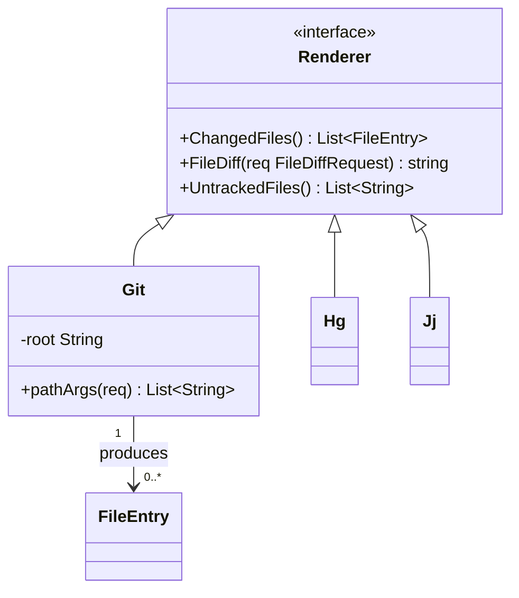
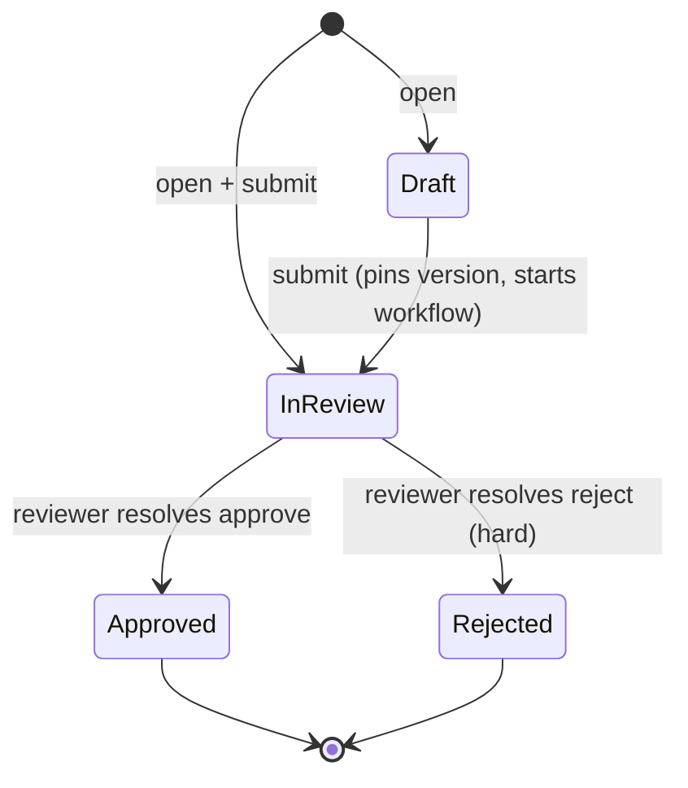
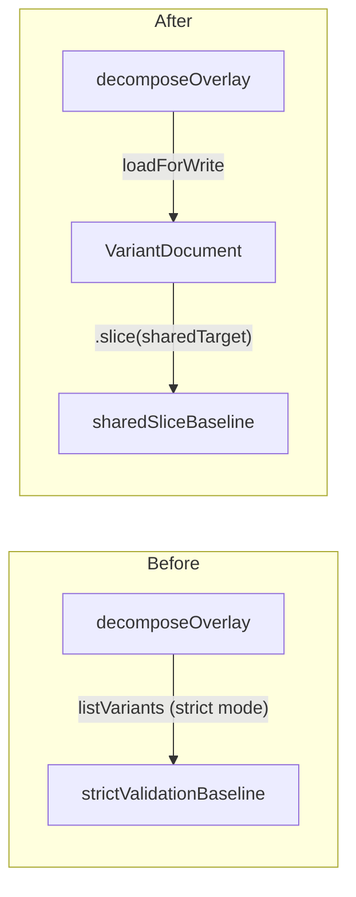
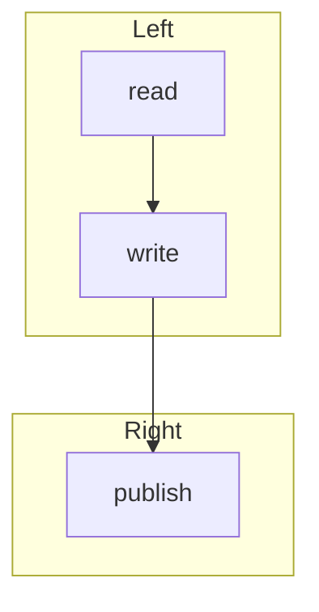
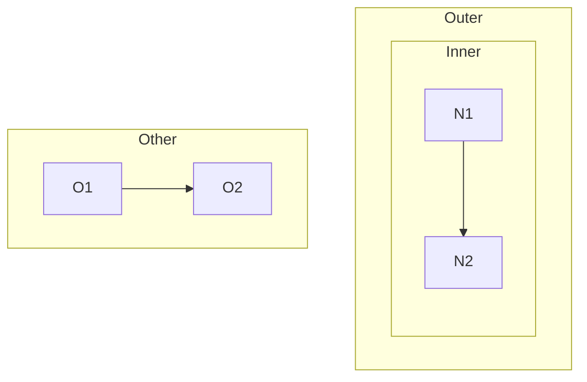
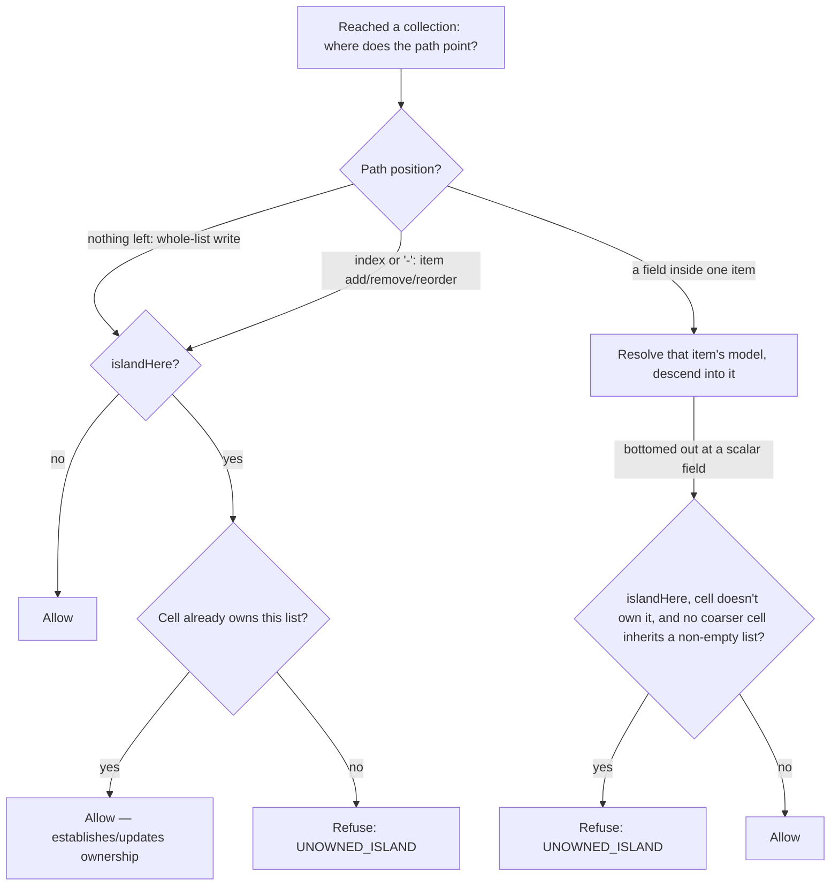
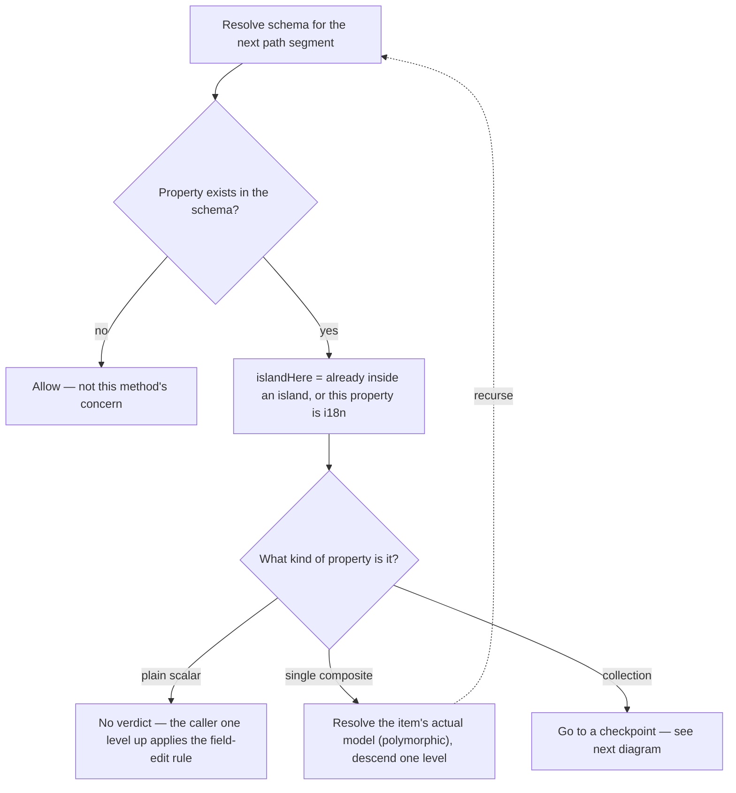

# Manual test plan — markdown preview

Everything below is checked by hand, in the real TUI. The automated suite already covers the
parsing and the geometry; what it cannot check is whether the result is readable.

This document is its own fixture. The diagrams further down contain exactly the constructs that
were fixed, so pressing `P` on this file exercises the work while you read the plan.

Build under test: `md-preview-ef903b1`. Open with `revdiff docs/plans/20260730-preview-manual-test-plan.md`.

## 1. The gate

`P` is silently inert unless the displayed file is full-context markdown — every line of it
present, not a partial diff. The review may hold any number of other files. If `P` appears dead,
this is the first thing to check, not the keymap.

- [ ] `P` on this file turns preview on — prose becomes styled, headings gain colour
- [ ] `P` again returns to source view, and the cursor is where you left it
- [ ] the `▤` icon appears in the status bar while preview is on
- [ ] in a review holding this file plus other files (e.g. `revdiff --all-files`), `P` on this
      file turns preview on, and the left pane still shows the file tree, not a table of contents
- [ ] `P` on a markdown file shown as a real diff (added/removed lines) does nothing, with no error
- [ ] `P` on a non-markdown file does nothing, with no error
- [ ] with preview on, `n` / `p` still do nothing — leave preview with `P` before changing file

## 2. classDiagram

Renders as box art. Members are capped at 12 with a `... +K more` row, each line cut to the
adaptive width. Stereotypes sit above the class name in guillemets.



- [ ] four boxes plus `FileEntry`, not eight — a class declared with `<<interface>>` must not split
- [ ] `«interface»` appears above `Renderer`, not beside it
- [ ] the three inheritance arrows read `implements` and point from `Git`/`Hg`/`Jj` **to** `Renderer`
- [ ] the association carries `produces·1·n` with middle dots, no spaces, no arrow bleeding through
- [ ] `List~FileEntry~` keeps its tildes

## 3. stateDiagram-v2

Every `[*]` on the left folds to one `(start)`; every `[*]` on the right folds to one `(end)`.



- [ ] exactly one `(start)` box and one `(end)` box, not five
- [ ] `submit (pins version, starts workflow)` is shortened to `submit` — the parenthetical is cut
- [ ] no transition label is empty, and none has a box-drawing line running through it

## 4. flowchart — the constructs that used to break


- [ ] `B` is **one** diamond-shaped node, not a box `B` plus a box `B{touchesLocalizablePath}`
- [ ] same for `C` and `D` — a shape suffix must never split a node in two
- [ ] `E --- F` is drawn as an arrow, not as a box labelled `E --- F`
- [ ] the `style` and `classDef` lines draw **no** boxes at all
- [ ] `mode=with|without` is one intact box; no raw text spills into the middle of the art

## 5. Horizontal panning

New in `ef903b1`. Height was always scrollable; width was not, which made wide art unreachable.

- [ ] left/right arrows pan the preview
- [ ] `»` appears at the right edge when there is more art off-pane
- [ ] `«` appears at the left edge once panned
- [ ] panning stops at the widest line — it cannot run off into blank space
- [ ] prose rows go blank when panned past their end; they do not show garbage
- [ ] toggling `P` off and on resets the pan to the left edge
- [ ] right-arrow does **not** move focus into the TOC pane

## 6. Subgraph splitting

The vendored renderer does not lay out `subgraph` blocks — it draws one node grid and puts a
rectangle around the cells it guessed, so two rectangles overlap and nodes land in the wrong one.
A fence whose subgraphs do not reference each other is now drawn one diagram per subgraph,
stacked, each under its own title and a rule the same width. A fence that does reference across
its subgraphs keeps the old single render, on purpose.

Two independent blocks — this one must stack:



- [ ] two blocks, one above the other, `Before` first and `After` second
- [ ] each title has a `─` rule under it, exactly as wide as the title
- [ ] there is **no** rectangle drawn around either group any more — only node boxes
- [ ] no row carries two node labels side by side, and no label is drawn twice
- [ ] the edge labels show no quote marks (`listVariants (strict mode)`, not `"listVariants ..."`)
- [ ] each block is narrower than the pane, so neither needs panning

A crossing edge — this one must look exactly as it did before the split existed:



- [ ] one combined render, with both group rectangles still drawn
- [ ] no `Left` / `Right` heading with a rule under it appears anywhere

A nested subgraph — also unchanged:



- [ ] one combined render, no stacked headings

## 7. Edge labels: no-break spaces and the LR collision retry

New in this change. Two independent defects, both on the arrow-line rendering path: a space
inside an edge label used to let the arrow's `─` or a crossing edge's `│` bleed through, and a
decision node with three or more labeled out-edges could put two labels butted together with no
way to tell which arrow either belongs to.

Fixture one — the label bleed, a crossing edge cutting through a label:



- [ ] `index or '-': item add/remove/reorder` reads intact — no `│` cutting through the middle
- [ ] no other label anywhere in this diagram has a box-drawing character running through it

Fixture two — the label collision, a decision node with three labeled out-edges:



- [ ] `single composite` and `collection` each read as one clean label, not butted together
- [ ] the diagram renders wider than a narrow `single composite`/`collection` collision would —
      that is the LR retry trading a narrower, broken picture for a wider, readable one, not a
      regression. That fence's top-down render is 207 columns, so it needed panning before the
      flip too
- [ ] a diagram whose top-down render already FITS the pane is never flipped, even when two
      short labels sit close on one row. The Solution Overview diagram in
      `docs/plans/20260805-mermaid-edge-label-rendering.md` is the case to check: it must stay
      on one screen rather than turning into a wide render you have to pan

## 8. What is still not fixed

None is a regression; all are limits of the vendored renderer, recorded in `PATCH.md`.

- [ ] a node fanning out to several targets loses all but one edge label — confirm this still
      happens rather than silently producing something worse (a different failure mode from the
      collision retry above: here a label is dropped or merged, not merely crowded)
- [ ] `erDiagram`, `gantt` and `quadrantChart` still show their raw fence text

## 9. Regression — the paths that must be untouched

- [ ] a plain `flowchart` with no shapes, no `---` and no directives renders as it always did
- [ ] a `sequenceDiagram` renders as it always did
- [ ] a fence with no colliding labels renders byte-identical to before this change — the LR
      retry never fires on it
- [ ] preview off is byte-identical to before any of this work

## 9. Annotating in preview

New: preview is no longer read-only. Reading a document and commenting on it now happens in one
view — a cursor you steer with `j`/`k` highlights what you are on, `a` annotates it, a click
annotates a different one, and existing annotations are painted under the block they belong to. See
`docs/plans/20260811-preview-annotations.md` for the annotation design. The highlight used to follow
the scroll position instead; it is now driven by the reader, which is what section 9.1 below tests.
The cursor also stops on the annotations themselves, so one can be edited or deleted without
leaving preview — section 9.7. `--no-colors` is a whole-mode exception: none of this section applies
there — see item 9.6.

### 9.1 Driveable cursor

(The cursor steps over *stops*: every rendered block, plus every annotation painted under one. With
no annotations on screen every stop is a block, which is what the checks below start from — section
9.7 covers what changes once annotations are there.)

- [ ] press `P` on this file; NOTHING is highlighted yet — no background bar anywhere on screen
- [ ] press `j` once — a highlight appears on a block around the MIDDLE of the pane, not at its top
      edge, and the page does not jump
- [ ] press `j` a few more times — the highlight steps one block per press, and the page scrolls
      only when the next block would otherwise be off the bottom (it must not re-center on every
      press)
- [ ] press `k` back up — one block per press, and near the top the page scrolls up only as far as
      the block's own first row
- [ ] hold `j` to the end of the document — the highlight stops on the last block, it does not wrap
      round to the first; same with `k` at the first block
- [ ] with a block highlighted, scroll away from it with `J`/`K`, page up/down, `end`, or the wheel
      — once the block is entirely off screen the highlight disappears (you never have a highlight
      you cannot see); a small scroll that leaves part of it on screen keeps it
- [ ] a fast wheel flick (several notches quickly) still feels immediate — the highlight clears
      once at the end of the flick, not once per notch
- [ ] the highlight is a background color, not a border or an icon — confirm it is legible against
      both a heading and a plain paragraph
- [ ] press `P` off and on again — nothing is highlighted again; same after `R` reload
- [ ] open a document whose preview cannot be anchored (`README.md` is one) and press `j` — the
      view still scrolls one row per press rather than doing nothing

### 9.2 Keyboard aim (`a`)

- [ ] with a bullet list item highlighted, press `a` — the annotation input opens under THAT item,
      not the top of the file or the previously-focused line
- [ ] type a short note and confirm it — the annotation appears painted directly under the bullet
      it was aimed at
- [ ] press `P` to leave preview — the same annotation is visible in source view, on the same
      source line the bullet came from (confirms the anchor is a real `(Line, Type)` pair, not a
      preview-only side note)
- [ ] press `P` and then `a` straight away, with no `j`/`k` in between — it aims at the block around
      the middle of the pane rather than doing nothing, and leaves the highlight there
- [ ] steer to the very last block in the document and press `a` — it anchors there, not past the
      end

### 9.3 Two annotations in one tight list

- [ ] find (or add) a tight bullet list with at least two items close together
- [ ] annotate the first item, then steer with `j`/`k` and annotate the second item
- [ ] confirm both painted annotations are on screen at once, each under its own bullet — two
      distinct comments, not one overwriting the other
- [ ] press `P` to leave preview, then open the annotation list popup (`@`) — both entries are
      listed with different line numbers. `@` is a no-op while preview is on, so the popup has to
      be opened from source view

### 9.4 Click aim

- [ ] click directly on a bullet or paragraph — the annotation input opens anchored to that block,
      and the highlight moves to the block you clicked (a following `j` continues from there)
- [ ] click on a different block — a second annotation anchors to the new one, not the first
- [ ] click below the last block in the document (into the empty space under the content) — it
      resolves to the last block rather than doing nothing
- [ ] click inside a table — the annotation anchors to the table as a whole (confirm the comment
      reads as "on this table", not on a specific row — see the PATCH.md limitation)

### 9.5 File-level annotation and flush

- [ ] press `A` in preview — a file-level annotation input opens at the top of the document, above
      row 0
- [ ] confirm it, then press `O` (with `-o`/`--output` set) — the output file updates without
      exiting preview
- [ ] `@` and `}`/`{` are still blocked in preview — press `P` first to use them
- [ ] move focus to the file-tree/TOC pane FIRST, then press `P` and press `a` — the first press
      does not annotate, it hands focus to the diff pane; press `a` again and the input opens. This
      is the only way back to diff focus while previewing, since `tab`, `h` and `l` are all blocked
- [ ] do the same in a MULTI-FILE review that contains a markdown file (open the review, move to the
      markdown file, press `P` without touching focus) — `a` must reach an input in two presses.
      A multi-file review starts with the tree focused, so this is the ordinary path, not a corner
- [ ] press `a` on a document that cannot be anchored (README.md is one) — the status bar says so
      rather than the key doing nothing visible

### 9.6 `--no-colors`

- [ ] relaunch with `--no-colors` on this same file, press `P` — preview renders exactly as it did
      before this feature (no highlight, no click-to-annotate)
- [ ] confirm `a` and a click are silent no-ops in this mode — this is expected, not a bug (see
      PATCH.md's `--no-colors` limitation)

### 9.7 Selecting, editing and deleting an annotation

Start from a document that already carries two annotations on the same block plus one on another
block (section 9.3's list is a good starting point; add a second comment to the first item).

- [ ] steer with `j` onto the block that carries the comments, then press `j` again — the highlight
      moves DOWN ONTO the painted comment, not past it to the next block. Press `j` again — the
      second comment. Once more — the following block
- [ ] `k` walks the same stops back up, in reverse
- [ ] with a comment highlighted, press `a` — the input opens pre-filled with THAT comment's current
      text. Change it and confirm — the comment is replaced in place, there is now no second comment
      beside it
- [ ] press `a` on a comment, then Esc — the comment is unchanged
- [ ] make a multi-line comment (press `a`, then the editor key, write two lines, save), highlight
      it, press `a` and confirm with the input left EMPTY — the two lines survive intact. Clearing
      the input is not how you delete
- [ ] with a comment highlighted, press `d` — that comment disappears and the highlight lands on the
      block it belonged to. The other comment on the same block is still there, and so is the one on
      the other block
- [ ] press `d` again straight away (highlight now on a block) — nothing is deleted, and the status
      bar says to select an annotation with `j`/`k` first
- [ ] press `P` off then on, then press `d` before touching `j`/`k` — nothing is deleted, same
      message (nothing is selected yet)
- [ ] delete the LAST comment in the document (steer to the bottom) — the highlight lands on the
      last block, and `j` there still clamps rather than going nowhere
- [ ] press `A` for a file-level note, confirm it, then press `k` repeatedly from the first block —
      the highlight reaches the note above the document body. Press `a` there — it opens the
      file-level input pre-filled; press `d` there — the file-level note is deleted and the
      highlight lands on the first block
- [ ] after all of this press `P` to leave preview — source view shows exactly the comments that
      survived, on the same lines, and `-o` output (press `O`) matches

### 9.8 Raw source expansion (`r`)

Press `r` on the block the preview cursor marks and that block is redrawn as its raw markdown
source, one rendered row per source line. `j`/`k` then step between those source lines, `a`
annotates the exact line, and `r` again (or `esc`) puts the block back.

Open `revdiff --only docs/plans/completed/20260811-preview-raw-block-expansion.md` and press `P`.
These steps were never run by hand — the implementation run was unattended — so treat every one of
them as unverified until it is ticked here.

- [ ] press `j` a few times to place the cursor on that file's own tasks table
- [ ] press `r` — the table becomes its markdown source, one row per line, and the rows below it
      move by the height difference with nothing else on the document changing
- [ ] the highlighted source line's bar spans the whole pane, not just the width of its text
- [ ] `j` down a few source lines, `a`, type something, Enter — the input appears UNDER the line you
      selected, not at the bottom of the table, and the saved comment stays there
- [ ] `j` at the LAST source line of the block stays there rather than stepping onto the next block,
      and `k` at the first does the same
- [ ] press `right` / `left` — the raw rows pan and show `«` / `»`, and the pan reaches the end of
      the longest raw line
- [ ] press `esc` — the table is rendered again and the comment is back under the block
- [ ] press `r` on a code fence — a hint appears in the status bar and nothing changes on screen
- [ ] press `r` on a mermaid diagram (this file has several — see sections 1 to 6 above) — the box
      art is replaced by the fence source, from ` ```mermaid ` down to the closing ` ``` `, one row
      per line, and the rest of the document only moves by the height difference. `j` down to an
      edge line, `a`, type something, Enter — the comment sits under that exact line. `esc` — the
      art is drawn again exactly as it was, and the comment is back under the diagram
- [ ] press `r` on a bullet-list item that contains a fenced code block (this plan file has one) —
      the item's own lines up to the fence show as source, the fence body is NOT drawn twice, and
      nothing below the item is duplicated
- [ ] press `O` to flush and check the output file — the line number is the source line you
      selected, and the entry is indistinguishable from one made with `P` off
- [ ] with a block expanded, scroll with `J`/`K` past the block's own rows while part of the block
      is still visible — the block stays expanded and the highlight re-seats inside it. Scroll until
      the whole block is off screen — the expansion ends
- [ ] press `r` with preview OFF (press `P` first) — nothing happens

## Notes

Anything you want changed, annotate on the line. The two open questions I would most like an
opinion on:

1. The pan step is 4 columns, so crossing a 206-cell diagram at 120 columns takes 22 presses.
   Worth adding a jump-to-edge key, or is holding the arrow fine?
2. The member cap is 12 and the per-line cap floors at 16 runes. On a three-implementor interface
   that floor makes two class names truncate to the same string. Raising the floor costs width.
