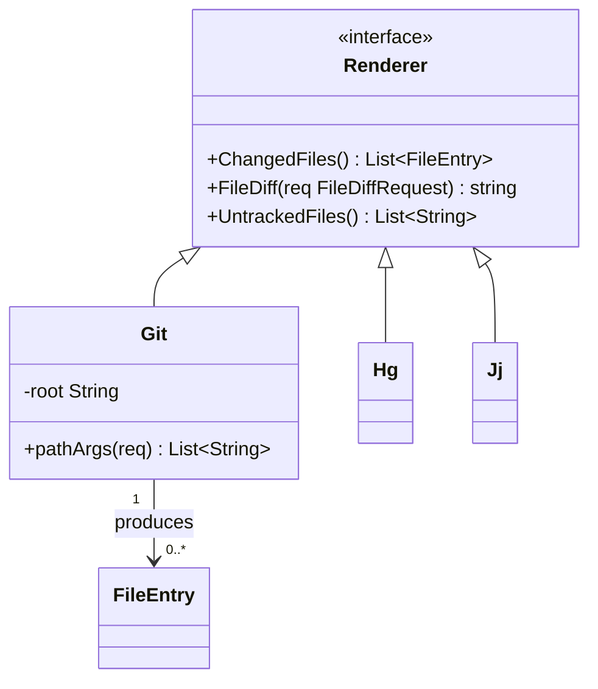
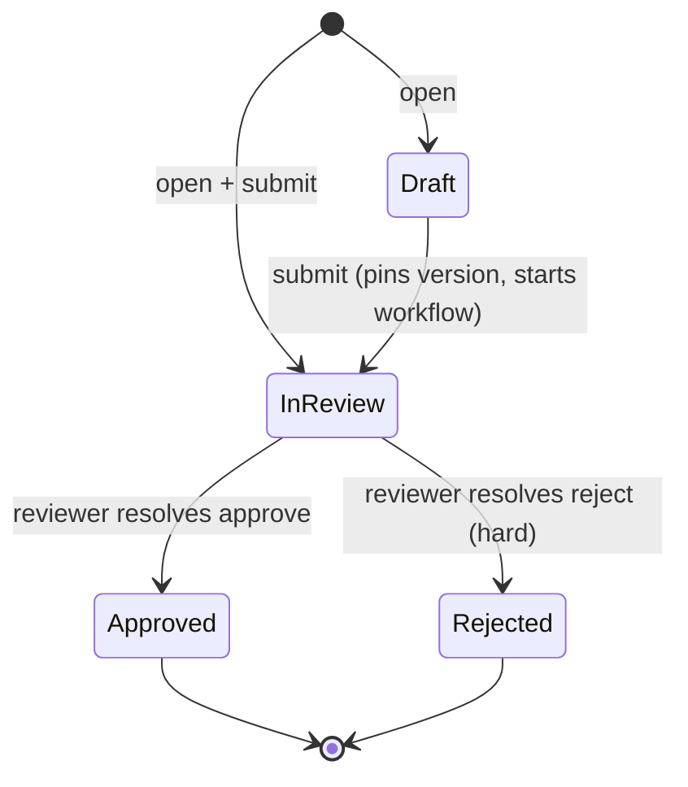
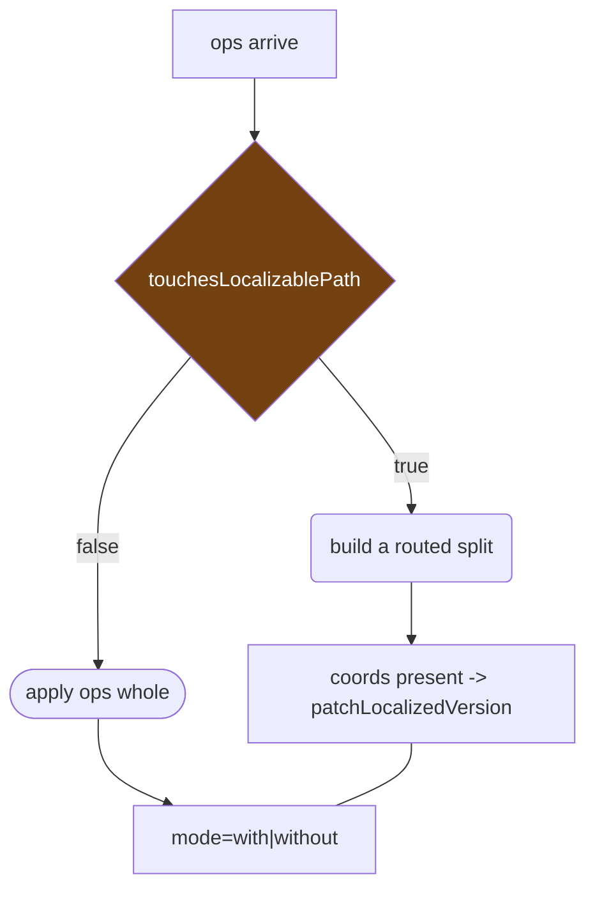
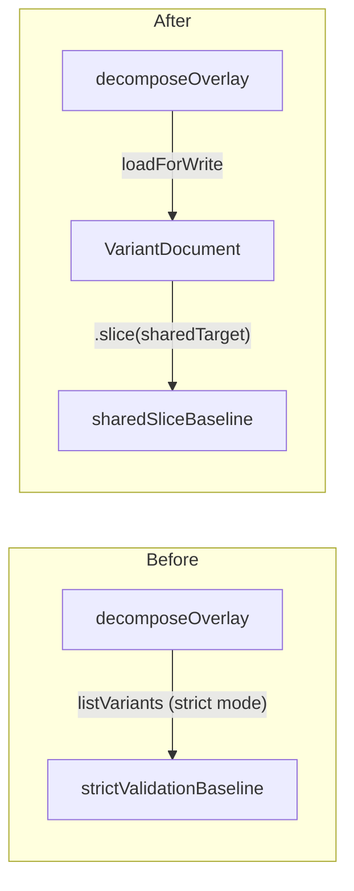
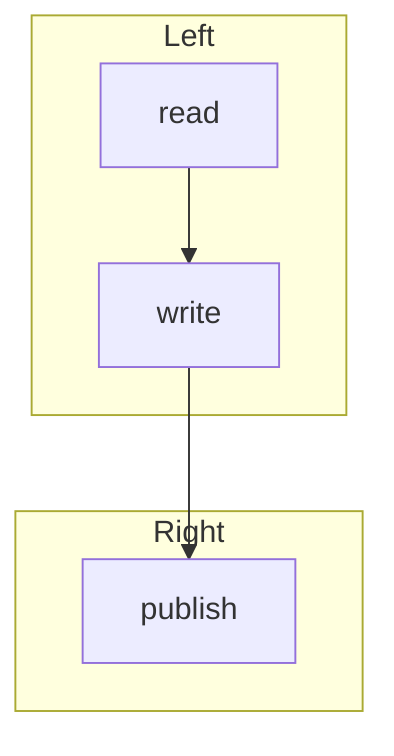
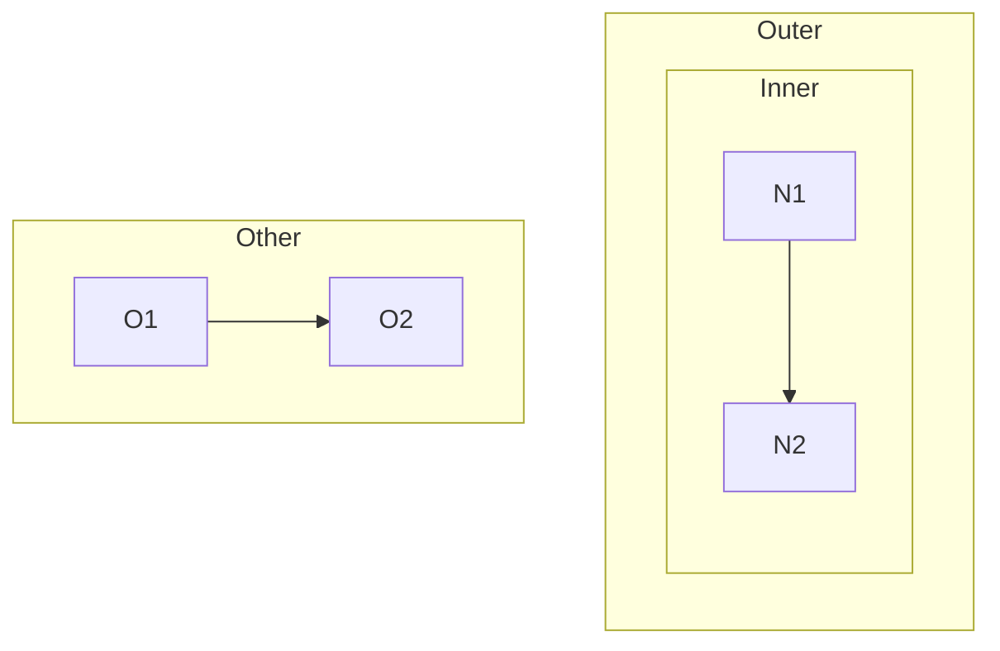

# Manual test plan — markdown preview

Everything below is checked by hand, in the real TUI. The automated suite already covers the
parsing and the geometry; what it cannot check is whether the result is readable.

This document is its own fixture. The diagrams further down contain exactly the constructs that
were fixed, so pressing `P` on this file exercises the work while you read the plan.

Build under test: `md-preview-ef903b1`. Open with `revdiff docs/plans/20260730-preview-manual-test-plan.md`.

## 1. The gate

`P` is silently inert unless the displayed file is full-context markdown — every line of it
present, not a partial diff. The review may hold any number of other files. If `P` appears dead,
this is the first thing to check, not the keymap.

- [ ] `P` on this file turns preview on — prose becomes styled, headings gain colour
- [ ] `P` again returns to source view, and the cursor is where you left it
- [ ] the `▤` icon appears in the status bar while preview is on
- [ ] in a review holding this file plus other files (e.g. `revdiff --all-files`), `P` on this
      file turns preview on, and the left pane still shows the file tree, not a table of contents
- [ ] `P` on a markdown file shown as a real diff (added/removed lines) does nothing, with no error
- [ ] `P` on a non-markdown file does nothing, with no error
- [ ] with preview on, `n` / `p` still do nothing — leave preview with `P` before changing file

## 2. classDiagram

Renders as box art. Members are capped at 12 with a `... +K more` row, each line cut to the
adaptive width. Stereotypes sit above the class name in guillemets.

- [ ] four boxes plus `FileEntry`, not eight — a class declared with `<<interface>>` must not split
- [ ] `«interface»` appears above `Renderer`, not beside it
- [ ] the three inheritance arrows read `implements` and point from `Git`/`Hg`/`Jj` **to** `Renderer`
- [ ] the association carries `produces·1·n` with middle dots, no spaces, no arrow bleeding through
- [ ] `List~FileEntry~` keeps its tildes

## 3. stateDiagram-v2

Every `[*]` on the left folds to one `(start)`; every `[*]` on the right folds to one `(end)`.

- [ ] exactly one `(start)` box and one `(end)` box, not five
- [ ] `submit (pins version, starts workflow)` is shortened to `submit` — the parenthetical is cut
- [ ] no transition label is empty, and none has a box-drawing line running through it

## 4. flowchart — the constructs that used to break

- [ ] `B` is **one** diamond-shaped node, not a box `B` plus a box `B{touchesLocalizablePath}`
- [ ] same for `C` and `D` — a shape suffix must never split a node in two
- [ ] `E --- F` is drawn as an arrow, not as a box labelled `E --- F`
- [ ] the `style` and `classDef` lines draw **no** boxes at all
- [ ] `mode=with|without` is one intact box; no raw text spills into the middle of the art

## 5. Horizontal panning

New in `ef903b1`. Height was always scrollable; width was not, which made wide art unreachable.

- [ ] left/right arrows pan the preview
- [ ] `»` appears at the right edge when there is more art off-pane
- [ ] `«` appears at the left edge once panned
- [ ] panning stops at the widest line — it cannot run off into blank space
- [ ] prose rows go blank when panned past their end; they do not show garbage
- [ ] toggling `P` off and on resets the pan to the left edge
- [ ] right-arrow does **not** move focus into the TOC pane

## 6. Subgraph splitting

The vendored renderer does not lay out `subgraph` blocks — it draws one node grid and puts a
rectangle around the cells it guessed, so two rectangles overlap and nodes land in the wrong one.
A fence whose subgraphs do not reference each other is now drawn one diagram per subgraph,
stacked, each under its own title and a rule the same width. A fence that does reference across
its subgraphs keeps the old single render, on purpose.

Two independent blocks — this one must stack:

- [ ] two blocks, one above the other, `Before` first and `After` second
- [ ] each title has a `─` rule under it, exactly as wide as the title
- [ ] there is **no** rectangle drawn around either group any more — only node boxes
- [ ] no row carries two node labels side by side, and no label is drawn twice
- [ ] the edge labels show no quote marks (`listVariants (strict mode)`, not `"listVariants ..."`)
- [ ] each block is narrower than the pane, so neither needs panning

A crossing edge — this one must look exactly as it did before the split existed:

- [ ] one combined render, with both group rectangles still drawn
- [ ] no `Left` / `Right` heading with a rule under it appears anywhere

A nested subgraph — also unchanged:

- [ ] one combined render, no stacked headings

## 7. What is still not fixed

None is a regression; all are limits of the vendored renderer, recorded in `PATCH.md`.

- [ ] a node fanning out to several targets loses all but one edge label — confirm this still
      happens rather than silently producing something worse
- [ ] a space inside a label drawn on top of an arrow line shows as `─`, so
      `listVariants (strict mode)` reads as `listVariants─(strict─mode)` — the arrow line shows
      through where the space should be
- [ ] `erDiagram`, `gantt` and `quadrantChart` still show their raw fence text

## 8. Regression — the paths that must be untouched

- [ ] a plain `flowchart` with no shapes, no `---` and no directives renders as it always did
- [ ] a `sequenceDiagram` renders as it always did
- [ ] preview off is byte-identical to before any of this work

## Notes

Anything you want changed, annotate on the line. The two open questions I would most like an
opinion on:

1. The pan step is 4 columns, so crossing a 206-cell diagram at 120 columns takes 22 presses.
   Worth adding a jump-to-edge key, or is holding the arrow fine?
2. The member cap is 12 and the per-line cap floors at 16 runes. On a three-implementor interface
   that floor makes two class names truncate to the same string. Raising the floor costs width.
