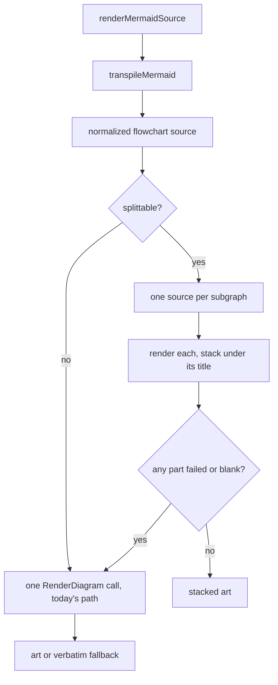

# Render each subgraph as its own diagram in markdown preview

## The problem

`mermaid-ascii` does not lay out `subgraph` blocks. It builds the node grid without looking at
which subgraph a node belongs to, then draws a rectangle around the cells it guessed. Two things
go wrong at once, and both are visible in
`docs/plans/2026-07-31-variant-document-full-adoption.md` in the `magnolia-content-api` worktree:

- The rectangles overlap. Two subgraph titles print on the same row and one border runs through
  the other.
- Nodes are placed in the wrong rectangle. In that diagram `A1` and `A3` belong to the `after`
  block but are drawn inside the `before` block, so two labels appear twice and the picture says
  something untrue.

This is not a cosmetic problem. A reader cannot tell which node belongs to which group, which is
the only reason the author wrote a subgraph.

Measured over every `.md` file under `~/.claude/plans` and `~/dev`, skipping vendor,
node_modules and worktree copies: **300 mermaid fences, 89 of them use `subgraph`.** So this
affects about 30% of all diagrams, not a rare corner.

## The fix

When a flowchart is made of separate subgraphs that do not reference each other, render each
subgraph as its own diagram and stack them, each under its own title. This is what IntelliJ
shows and it is what the author meant.

Rendering the two blocks of the example above separately was tried by hand before writing this
plan. Both come out correct and readable, and each is narrower than the broken combined render.

The alternative — deleting the `subgraph` and `end` lines to get a flat graph — also renders
correctly, but it throws away the grouping. For a before/after diagram the grouping is the whole
message. So that option is rejected.

## When we are allowed to split

Splitting is only safe when the subgraphs are truly independent. All of the following must hold.
If any one fails, the fence renders exactly as it does today.

1. The diagram is a `graph` or a `flowchart`. No other kind has subgraphs.
2. There are at least two top-level subgraphs. With one subgraph the renderer draws a single
   rectangle and nothing overlaps, so there is nothing to fix.
3. No subgraph is nested inside another.
4. Nothing but the header, comments, blank lines and `direction` statements sits outside a
   subgraph. A node declared outside would simply be dropped by splitting.
5. No node id is mentioned by more than one subgraph.

Rule 5 is the important one and it is deliberately strict. It catches an edge that crosses from
one subgraph to another, and it also catches a node that two subgraphs both point at. Both cases
would either lose an edge or silently duplicate a box. One rule covers both, and it is easy to
check: walk the subgraphs, record which one first mentions each id, and bail the moment an id
turns up again under a different one.

Counts from the same corpus scan, over the 89 fences that use `subgraph`: 23 have an edge
crossing between two subgraphs and 30 nest subgraphs. So a meaningful share keeps today's
behavior, which is why the fallback has to be clean rather than an afterthought.

## Where it goes



The split happens in `renderMermaidSource`, not inside `transpileMermaid`. `transpileMermaid`
returns one source string and cannot return several. `renderMermaidSource` returns the finished
art, so it is the first place that can hold more than one render.

Order matters: normalize first, split second. Normalization already leaves `subgraph` and `end`
alone by design, so the split sees clean, canonical source.

New logic goes in a new file, `app/ui/mdpreview_subgraph.go`, per the rule in `PATCH.md` that
keeps rebases conflict-free. Its test file sits beside it.

## What the output looks like

Each block gets its title, a rule under it the same width as the title, then its art, then a
blank line. Plain text, no color: the art is spliced into the glamour output after rendering and
is plain itself, so a styled title would be the odd one out.

```
Before
──────
<art for the before block>

After
─────
<art for the after block>
```

The title comes from the subgraph header. Mermaid writes it three ways and all three appear in
the corpus: `subgraph before["Before"]`, `subgraph before [Before]`, and bare `subgraph before`.
The first two give the label, the third gives the id.

## Failure

The whole split is all-or-nothing. If any single block fails to render, or comes back blank, the
fence falls back to one render of the whole source — today's behavior. A reader never sees a
half-stacked result with one block missing.

Everything already downstream stays as it is. A render error or a blank result still lands on
the existing verbatim fallback in `renderMermaidBlock`, and the existing `recover()` still covers
a panic anywhere in here.

## The second, smaller bug

Edge labels keep their quotes. The example renders `"listVariants (strict mode)"` with the quote
marks visible.

`flowchartLinkText` already strips surrounding quotes, but it only runs on links the normalizer
rewrites. `flowchartLinkPattern` has two branches: one matches the `-- label -->` form, the other
matches a bare arrow. A label written the common way, `-->|"label"|`, is not part of either
match — the arrow matches the bare-arrow branch and the `|...|` that follows is copied through
untouched. So its quotes survive.

Fix: after the link rewrite, strip surrounding double quotes from a `|...|` label that directly
follows an arrow. Small and independent of the split work.

Not fixed, and out of scope: spaces inside a label drawn on top of an arrow line show as `─`
(`"listVariants─(segment─coords)"`). That is the vendored `drawText` not painting space
characters, so the arrow shows through underneath. It needs a change in vendored drawing code.
Record it in `PATCH.md` under the known limitations instead.

## Tests

Split decision, one test per rule, each pinning a refusal: single subgraph, nested subgraphs, an
edge crossing two subgraphs, a node id shared by two subgraphs, a node declared outside every
subgraph. Plus the positive case, two independent subgraphs.

Title parsing: all three header spellings.

Stacking: titles present, in source order, each above its own art; the rule under each title
matches the title width.

Fallback: a part that fails to render sends the whole fence back to the single-render path.

Integration against the real renderer: the before/after diagram from the plan named at the top
renders as two blocks; no line of the output contains two block borders side by side, which is
the signature of the overlap being fixed.

Quotes: `-->|"a b"|` normalizes to `-->|a b|`; the `-- a b -->` form still works, as a guard
against fixing one branch by breaking the other.

Existing tests must not change. The subgraph tests in `mdpreview_flowchart_test.go` all use a
single subgraph, so they take the not-splittable path and are unaffected.

## Verification

1. `make lint` clean and `make test` green with the race detector.
2. `make build`, then open the `magnolia-content-api` plan that started this and press `P`.
   Confirm two clean blocks.
3. Re-render a fence that is not splittable (nested subgraphs) and confirm it is unchanged from
   the current build.
4. Install as `~/.local/bin/revdiffm` following the versioned-build procedure, including the
   re-codesign.
5. Update `PATCH.md`: the new file, the split rule, and the space-in-label limitation.
