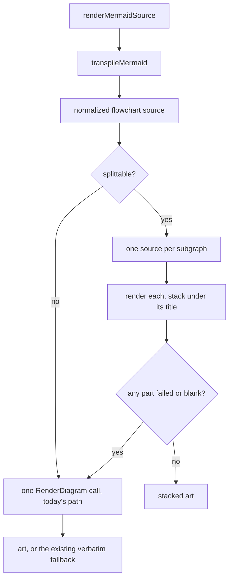

# Render each subgraph as its own diagram in markdown preview

## Overview

`mermaid-ascii` does not lay out `subgraph` blocks. It builds the node grid without looking at
which subgraph a node belongs to, then draws a rectangle around the cells it guessed. Two things
go wrong at once, both visible in `docs/plans/2026-07-31-variant-document-full-adoption.md` in
the `magnolia-content-api` worktree:

- The rectangles overlap. Two subgraph titles print on the same row and one border runs through
  the other.
- Nodes land in the wrong rectangle. `A1` and `A3` belong to the `after` block but are drawn
  inside the `before` block, so two labels appear twice and the picture says something untrue.

A reader cannot tell which node belongs to which group, which is the only reason the author wrote
a subgraph at all.

The fix: when a flowchart is made of separate subgraphs that do not reference each other, render
each subgraph as its own diagram and stack them, each under its own title. This was tried by hand
before writing this plan — both blocks of the example come out correct and readable, and each is
narrower than the broken combined render.

A second, unrelated bug is fixed here too: edge labels keep their quotes, so
`-->|"listVariants (strict mode)"|` draws with the quote marks visible.

Measured over every `.md` file under `~/.claude/plans` and `~/dev`, skipping vendor,
node_modules and worktree copies: **300 mermaid fences, 89 use `subgraph`** — about 30% of all
diagrams, not a rare corner.

## Context (from discovery)

- Files involved:
  - `app/ui/mdpreview_transpile.go` — holds `renderMermaidSource`, the only place that can hold
    more than one render because it returns the finished art rather than a source string.
  - `app/ui/mdpreview_flowchart.go` — holds `normalizeFlowchartLine` and `flowchartLinkText`,
    where the quote bug lives.
  - `app/ui/mdpreview.go` — `renderMermaidBlock` calls `renderMermaidSource`. Unchanged by this
    plan; listed because it owns the verbatim fallback and the `recover()` that still cover us.
- Related patterns found: `normalizeFlowchartSource` already leaves `subgraph` and `end` alone by
  design (`flowchartStructuralKeywords`), so the split can run after it on clean source.
- Dependencies: none new. The vendored `mermaid-ascii` is called exactly as it is today, just
  more than once per fence.
- All files touched are patch-owned (they do not exist upstream), so none of this adds a rebase
  conflict site. New logic still goes in a new file per `PATCH.md`.

## Development Approach

- **testing approach**: TDD — the split decision is a set of rules, and each rule is a test.
- complete each task fully before moving to the next
- make small, focused changes
- **CRITICAL: every task MUST include new/updated tests** for code changes in that task
- **CRITICAL: all tests must pass before starting next task** - no exceptions
- **CRITICAL: update this plan file when scope changes during implementation**
- run tests after each change, using the narrow per-task command; the full suite runs once in the
  verify task
- maintain backward compatibility: a fence that is not splittable must render byte-identically to
  the current build

## Testing Strategy

- **unit tests**: required for every task
- **e2e tests**: none — this project has no UI e2e suite. The equivalent here is the integration
  test that calls the real vendored renderer, which this plan requires in Task 4.

## Progress Tracking

- mark completed items with `[x]` immediately when done
- add newly discovered tasks with ➕ prefix
- document issues/blockers with ⚠️ prefix
- keep plan in sync with actual work done

## Solution Overview



The split happens in `renderMermaidSource`, not inside `transpileMermaid`. `transpileMermaid`
returns one source string and cannot return several.

Order matters: normalize first, split second.

### When we are allowed to split

All of the following must hold. If any one fails, the fence renders exactly as it does today.

1. The diagram is a `graph` or a `flowchart`. No other kind has subgraphs.
2. There are at least two top-level subgraphs. With one subgraph the renderer draws a single
   rectangle and nothing overlaps, so there is nothing to fix.
3. No subgraph is nested inside another.
4. Nothing but the header, comments, blank lines and `direction` statements sits outside a
   subgraph. A node declared outside would simply be dropped by splitting.
5. No node id is mentioned by more than one subgraph. A subgraph's own id counts as a node id
   here, because an edge may point straight at a whole block (`A --> groupB`).

The last rule is the important one and it is deliberately strict. It catches an edge crossing
from one subgraph to another, and it also catches a node that two subgraphs both point at. Both
cases would either lose an edge or silently duplicate a box. One rule covers both, and it is easy
to check: claim every block's own id first, then walk the bodies recording which block mentions
each id, and bail the moment an id turns up again under a different one.

These rules are about structure only. A fence that passes them is split even when the combined
render happens to come out correct — stacked, separately titled blocks are the wanted output, and
each block is narrower than the combined render. Gating on a detected overlap would mean
rendering every fence twice just to decide.

From the same corpus scan, over the 89 fences using `subgraph`: 23 have an edge crossing between
two subgraphs and 30 nest subgraphs. A meaningful share keeps today's behavior, so the fallback
has to be clean rather than an afterthought.

### Why not just delete the subgraph lines

Deleting `subgraph` and `end` gives a flat graph that also renders correctly, but it throws away
the grouping. For a before/after diagram the grouping is the whole message. Rejected.

## Technical Details

### Output shape

Each block gets its title, a rule under it the same width as the title, then its art, then a
blank line:

```
Before
──────
<art for the before block>

After
─────
<art for the after block>
```

Plain text, no color. The art is spliced into the glamour output after rendering and is plain
itself, so a styled title would be the odd one out.

The title comes from the subgraph header. Mermaid writes it three ways and all three appear in
the corpus: `subgraph before["Before"]`, `subgraph before [Before]`, and bare `subgraph before`.
The first two give the label, the third gives the id.

### Failure

All-or-nothing. If any single block fails to render, or comes back blank, the fence falls back to
one render of the whole source — today's behavior. A reader never sees a half-stacked result with
one block missing. A render error or blank result still lands on the existing verbatim fallback in
`renderMermaidBlock`, and the existing `recover()` still covers a panic anywhere in here.

### The quote bug

`flowchartLinkText` already strips surrounding quotes, but it only runs on links the normalizer
rewrites. `flowchartLinkPattern` has two branches: one matches the `-- label -->` form, the other
matches a bare arrow. A label written the common way, `-->|"label"|`, is not part of either match
— the arrow matches the bare-arrow branch and the `|...|` that follows is copied through
untouched. So its quotes survive.

Fix: after the link rewrite, strip surrounding double quotes from a `|...|` label that directly
follows an arrow.

### Out of scope

Spaces inside a label drawn on top of an arrow line show as `─`
(`"listVariants─(segment─coords)"`). That is the vendored `drawText` not painting space
characters, so the arrow line shows through underneath. Fixing it means changing vendored drawing
code. Record it in `PATCH.md` under known limitations instead.

## What Goes Where

- **Implementation Steps**: all code, tests, and in-repo documentation.
- **Post-Completion**: installing the rebuilt binary and looking at the real document.

## Implementation Steps

### Task 1: Strip surrounding quotes from a pipe-delimited edge label

**Files:**
- Modify: `app/ui/mdpreview_flowchart.go` (`normalizeFlowchartLine`, after the
  `normalizeFlowchartLinks(body)` call; reuse the quote-trimming already done in
  `flowchartLinkText`)
- Modify: `app/ui/mdpreview_flowchart_test.go` (beside the existing link-normalization tests)

- [x] write a failing test: `A -->|"listVariants (strict mode)"| B` must normalize to
      `A -->|listVariants (strict mode)| B`
- [x] add a pass over the line that finds a `|...|` region directly following an arrow and trims
      one layer of surrounding double quotes from it
- [x] make it a fixed point — running it twice must give the same result as running it once
- [x] write tests for the cases that must NOT change: the `-- label -->` form still works, a
      label with an interior quote is left alone, a `|` inside a node label is untouched
- [x] run `go test ./app/ui/ -run 'Flowchart' -count=1` - must pass before task 2

### Task 2: Parse top-level subgraphs and decide whether a fence may be split

**Files:**
- Create: `app/ui/mdpreview_subgraph.go`
- Create: `app/ui/mdpreview_subgraph_test.go`

- [x] create `app/ui/mdpreview_subgraph.go` with a type holding one subgraph's title and body
      lines, and a function that walks normalized flowchart source and returns the header line
      plus the top-level subgraphs it found
- [x] extract the title from all three header spellings: `subgraph id["Label"]`,
      `subgraph id [Label]`, bare `subgraph id`
- [x] implement the five-rule split decision from the Solution Overview, returning "not
      splittable" rather than an error for every refusal
- [x] write one test per refusal rule: single subgraph, nested subgraphs, an edge crossing two
      subgraphs, a node id shared by two subgraphs, a node declared outside every subgraph
- [x] write tests for the positive case and for all three title spellings
- [x] run `go test ./app/ui/ -run 'Subgraph' -count=1` - must pass before task 3

### Task 3: Render each subgraph separately and stack the results

**Files:**
- Modify: `app/ui/mdpreview_subgraph.go` (add the stacking function beside the split decision)
- Modify: `app/ui/mdpreview_transpile.go` (`renderMermaidSource`, between the `transpileMermaid`
  call and the `mermaidcmd.RenderDiagram` call)
- Modify: `app/ui/mdpreview_subgraph_test.go`

- [x] add a function that renders each subgraph at the given pane width and stacks the results,
      each under its title and a rule of the same width
- [x] make it all-or-nothing: if any part errors or renders blank, report failure so the caller
      falls back to the single whole-source render
- [x] wire it into `renderMermaidSource` after transpiling, keeping the existing single-render
      path as the fallback and leaving the return signature unchanged
- [x] write tests for the stacked output: titles present, in source order, each above its own
      art, and each rule matching its title width
- [x] write tests for the fallback: a part that cannot render sends the whole fence back to the
      single-render path
- [x] run `go test ./app/ui/ -run 'Subgraph|Mermaid' -count=1` - must pass before task 4

### Task 4: Pin the real diagram end to end

**Files:**
- Modify: `app/ui/mdpreview_subgraph_test.go` (integration tests, calling the real vendored
  renderer the way the existing tests in `mdpreview_transpile_test.go` do)

- [x] write an integration test using the before/after diagram from the Overview: it must render
      as two blocks, both titles present
- [x] assert the overlap is gone — no output line may contain two block borders side by side,
      which is the signature of the broken layout
- [x] write an integration test that a fence with nested subgraphs renders byte-identically to a
      direct `renderMermaidSource` call on the same source, pinning the no-change guarantee
- [x] write an adversarial test that never panics: an unterminated `subgraph`, a stray `end`, an
      empty subgraph body, a subgraph whose title is only punctuation
- [x] run `go test ./app/ui/ -run 'Subgraph|Mermaid|MdPreview' -count=1` - must pass before task 5

### Task 5: Verify acceptance criteria

- [x] verify all requirements from the Overview are implemented — the split runs in
      `renderMermaidSource` (`mdpreview_transpile.go:2365`) with the single-render fallback intact,
      and the quote bug is fixed by `normalizeFlowchartEdgeLabelQuotes`
      (`mdpreview_flowchart.go:396`, called from `normalizeFlowchartLine`)
- [x] verify edge cases are handled — all five refusal rules, both malformed shapes (unterminated
      `subgraph`, stray `end`), all three title spellings, the blank/erroring/panicking block, and
      the adversarial no-panic fences each have a test
- [x] run full test suite: `make test` — passed, 91.3% total statements
- [x] run `make lint` - must report 0 issues — 0 issues
- [x] run `make build`
- [x] verify test coverage for `app/ui` has not dropped — 95.6% at the pre-plan commit `5a6c5ca`,
      95.7% now

### Task 6: [Final] Update documentation

**Files:**
- Modify: `PATCH.md` (the new-files list, and the known-limitations section)

**Model:** haiku

- [x] add `app/ui/mdpreview_subgraph.go` and its test to the new-files list in `PATCH.md`
- [x] record the split rule and its five conditions in `PATCH.md`
- [x] record the space-in-label limitation (spaces drawn as `─` on an arrow) under known
      limitations
- [x] move this plan to `docs/plans/completed/` — moved after phase completion by the harness

## Post-Completion

**Manual verification:**
- Install the rebuilt binary as `~/.local/bin/revdiffm` using the versioned-build procedure,
  including the re-codesign step — copying over a running binary leaves a stale signature and
  macOS kills it with no output.
- Open `docs/plans/2026-07-31-variant-document-full-adoption.md` in the `magnolia-content-api`
  worktree and press `P`. Confirm two clean blocks.
- Open a document whose flowchart has nested subgraphs and confirm it looks the same as before.
