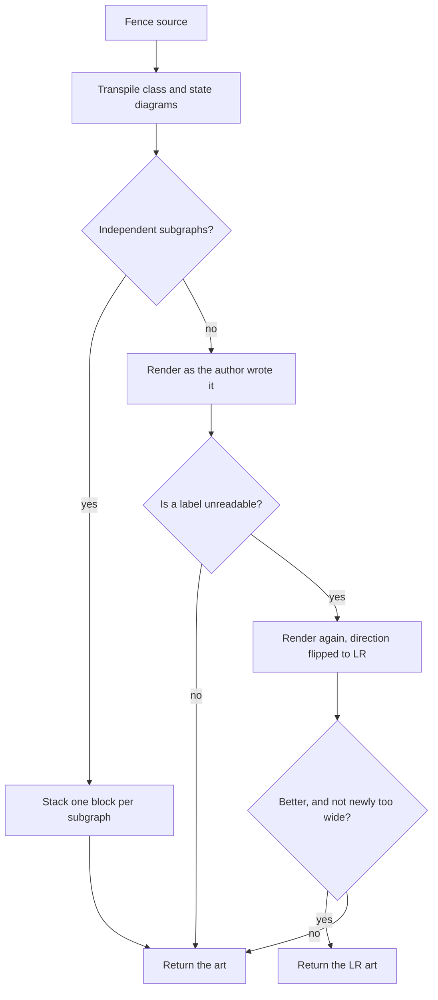

# Mermaid edge-label rendering: no-break spaces and collision retry

## Contents

1. [Overview](#overview)
2. [Context (from discovery)](#context-from-discovery)
3. [Development Approach](#development-approach)
4. [Testing Strategy](#testing-strategy)
5. [Progress Tracking](#progress-tracking)
6. [Solution Overview](#solution-overview)
7. [Technical Details](#technical-details)
8. [What Goes Where](#what-goes-where)
9. [Implementation Steps](#implementation-steps)
10. [Post-Completion](#post-completion)

## Overview

Two independent defects in how mermaid edge labels render in markdown preview mode (`P` key).

**The space bleed.** A space inside an edge label is transparent to the vendored renderer's
layer merge, so whatever lies underneath the label shows through at that column. On the label's
own arrow line the thing underneath is `─`, so `read as fallback` renders as `read─as─fallback`
and looks like part of the connector. Where another edge crosses, the thing underneath is `│`,
so `index or '-': item add/remove/reorder` renders as `index or '-': item│add/remove/reorder` —
a corrupted label. Measured across 229 unique mermaid fences from the user's corpus: 40 fences
have multi-word edge labels and show the dashes today, and 11 of those have a non-dash
character cutting through a label.

**The label collision.** A decision node with three or more labeled out-edges puts two of the
labels on the same output row, so the reader cannot tell which arrow either belongs to. A real
example renders as:

```
│   What kind of property is it?   ├◄───collection────single─composite───────┤
```

`collection` and `single composite` belong to two different arrows. Measured on the same
corpus: 94 fences are top-down flowcharts and 3 of them collide.

Fixing both means a hand-written flowchart with multi-word branch labels reads correctly
without the author restructuring the diagram.

## Context (from discovery)

Files and components involved:

- `app/ui/mdpreview_transpile.go` — `renderMermaidSource` (line 2359) is the single render
  hook, and `mermaidEdgeLabel` (line 300) holds the existing space substitution for the
  transpiled diagram types.
- `app/ui/mdpreview_flowchart.go` — `unquoteFlowchartEdgeLabel` (line 407) is the last
  function to touch a plain flowchart's edge label before it reaches the renderer.
- `app/ui/mdpreview_subgraph.go` — the shape to copy for a new gated transform: measure,
  gate on explicit conditions, fall back to today's render when any condition fails.
- `vendor/github.com/AlexanderGrooff/mermaid-ascii/cmd/draw.go` — `mergeDrawings` composites
  layers with `if c != " "`, which is the whole cause of the space bleed.
- `vendor/github.com/AlexanderGrooff/mermaid-ascii/cmd/arrow.go` — `drawTextOnLine` places
  each label at its own line's midpoint with no check for occupied cells, which is the cause
  of the collision.

Patterns found:

- The fork keeps new logic in new files so hand rebases against upstream never conflict.
  `PATCH.md` is the playbook and lists every added file.
- Every transform in this area declines by returning `ok == false` rather than an error, and
  declining lands on the unchanged render below it.
- `mdpreview.go` already wraps the render in a `recover()`, so a panic in new code lands on
  the verbatim fence text rather than reaching the user.

Dependencies identified:

- `normalizeFlowchartLine` runs `normalizeFlowchartLinks` first and `normalizeFlowchartNodes`
  second. That ordering means an inline `-- yes -->` label has already become `-->|yes|` by the
  time `normalizeFlowchartNodes` walks the line. So `unquoteFlowchartEdgeLabel` sees **both**
  edge-label spellings and is a single chokepoint, not two.
- `mermaidEdgeLabel`'s cap is a hard **byte** cap as well as a rune cap, because the vendored
  `mapping_edge.go` reserves column width with `len()`. U+00A0 and `·` are both 2 bytes in
  UTF-8, so swapping one for the other moves no width arithmetic and no cap test.

## Development Approach

- **parallel waves**: `labels (tasks 2-3)` — the two label call sites live in different files
  with different test files and share only the helper built in task 1. Everything else is
  sequential.
- **testing approach**: TDD — write the failing test first in each task, then the code. Both
  changes are pure text-to-text transforms with exactly checkable output, which is the case
  where test-first costs nothing and pins the behaviour precisely.
- complete each task fully before moving to the next
- make small, focused changes
- **CRITICAL: every task MUST include new/updated tests** for code changes in that task
  - tests are not optional - they are a required part of the checklist
  - write unit tests for new functions/methods
  - write unit tests for modified functions/methods
  - add new test cases for new code paths
  - update existing test cases if behavior changes
  - tests cover both success and error scenarios
- **CRITICAL: all tests must pass before starting next task** - no exceptions
- **CRITICAL: update this plan file when scope changes during implementation**
- run tests after each change, using the narrow per-task command; the full suite runs once in
  the verify task
- maintain backward compatibility

## Testing Strategy

- **unit tests**: required for every task (see Development Approach above)
- **e2e tests**: this project has no UI-based e2e suite. The equivalent here is the
  differential corpus render in task 7, which is a required deliverable and not optional.
- **golden tests**: `app/ui` carries a render golden. Neither change touches diff rendering,
  so the golden must come out unchanged; if it does not, that is a real finding, not a
  fixture to update.

## Progress Tracking

- mark completed items with `[x]` immediately when done
- add newly discovered tasks with ➕ prefix
- document issues/blockers with ⚠️ prefix
- update plan if implementation deviates from original scope
- keep plan in sync with actual work done

### Corpus verification result (task 7, re-run 2026-08-05 after the review fixes)

Base `3187fc5` (the tip after task 1, which only added an unused helper) against the finished
change **including the review fixes to the detector and the retry gate**. 15254 markdown files,
231 distinct mermaid fences, rendered at pane width 120 on both builds. The fence count is 231
rather than the 229 of the first run because the corpus now also contains this repo's own new
fixture and plan documents.

Every number here was measured after the review fixes landed. The first run's numbers are gone
rather than annotated: they were taken with the first version of the detector, and that version
both over-counted (readable adjacency) and under-counted (the overwriting shape), so they cannot
be repaired by reasoning about direction.

| measure | pre-change | post-change |
|---|---|---|
| fences rendered | 231 | 231 |
| panics | 0 | 0 |
| timeouts / hangs | 0 | 0 |
| blank renders | 0 | 0 |
| render errors (unsupported diagram types) | 23 | 23 |
| fences with a colliding label | 15 | 6 |

Both collision counts are measured with the SAME (current) detector, run over the dumped
normalized source and art of each build, so the difference is the change and not the detector.

Art differences, all attributed:

| cause | fences |
|---|---|
| art byte-identical | 139 |
| the normalized source changed (space or `·` became a no-break space) | 83 |
| the LR retry kept a different render | 9 |
| **unexplained** | **0** |

The retry fires and is kept on 9 fences. Their widths in columns, first render → flipped render:

| first | flipped |
|---|---|
| 137 | 79 |
| 135 | 111 |
| 121 | 112 |
| 155 | 159 |
| 57 | 86 |
| 151 | 260 |
| 148 | 279 |
| 207 | 281 |
| 136 | 286 |

Three come out narrower and one is within four columns. Of the five that get materially wider,
four were already past the 120-column pane before the flip, so the reader was panning either
way; the fifth goes 57 → 86 and still fits. That is the width guard doing its job — see "The
retry gate" below.

Six fences still carry a collision after the change, and each has a recorded reason:

- four are declined by the width guard, which is the accepted trade rather than a miss: their
  first renders are 103, 100, 115 and 59 columns and all fit the pane, while their flips are
  150, 121, 328 and 170
- two take the subgraph-stacked path, which returns before the retry by design

One fence collides on the post-change build and not on the pre-change one, and it is not a
regression: it is the same overwritten row on both sides (`sparse FIELD edit inside an item`
painted over `sparse item MEMBERSHIP change`). On the pre-change build the bleed had corrupted
the surviving label into `sparse─FIELDredit─inside<an/itemd`, so no label matched and the
detector could not see the collision that was there. The no-break space fix restores the label,
which is what makes the collision visible to the detector. That fence is one of the two on the
stacked path, so nothing retries it.

How the attribution was made airtight rather than eyeballed. `git diff 3187fc5 HEAD -- vendor/`
is empty, so the renderer is the same code on both sides. Both builds then dumped the
*normalized* source — the string `renderMermaidSource` actually hands to that renderer — and
those two dumps were compared rune by rune. Every differing rune is a plain space or a `·` on
the old side and a no-break space on the new side, with one documented exception below. So a
fence whose normalized source is unchanged and which is not in the retry's own list must render
identically, and all 139 do.

The one exception is the fence whose label is written `open · C1`, with a middle dot the author
typed. The old substitution turned its two spaces into middle dots as well, and the run-collapse
rule then squashed all three into one, so the label reached the art as `open·C1` and the author's
own dot was lost. It now reads `open · C1` with no-break spaces around the real dot. This is the
behaviour change task 2 recorded, and it is an improvement, not a regression.

Two counts came out higher than the pre-implementation estimate of "about 40, and 3". Both
gaps are in the estimate, not in the change:

- **83 rather than 40.** The estimate counted fences with a multi-word label in the `|label|`
  spelling *in the raw fence source*. Re-running exactly that count gives 40, so the estimate is
  reproduced — but it misses two whole spellings that the fix also reaches: the inline
  `A -- label --> B` form, which only becomes piped during normalization, and class and state
  diagram labels, which are not piped in the source at all.
- **9 rather than 3.** The estimate flipped the direction on the raw source, so a class or state
  diagram was never a candidate: its header reads `stateDiagram-v2`, not `flowchart TD`. It also
  read labels from the raw source, so a flowchart written entirely in the inline spelling looked
  like it had fewer than two labels. Several of the 9 are fences the estimate could not have seen
  at all (transpiled state diagrams and inline-spelling flowcharts).
  The estimate's third fence needs no retry any more: the no-break space fix alone resolved its
  collision, so the first render no longer collides and the retry never fires.

## Solution Overview

Both fixes sit on the existing render path and both degrade to today's output when anything
about them does not hold.



Three properties this shape gives us:

- A fence that renders cleanly today never reaches the retry, so its bytes are unchanged.
- The second render only ever happens for a fence that is already broken, so the cost lands
  where there is something to gain.
- The no-break space substitution runs before any of this, so by the time the detector looks
  for a label in the art, that label appears verbatim rather than with its spaces bled through.

**Why the flip is to LR and not something cleverer.** The collision is a layout failure, and
the only lever that changes layout without changing the graph is the direction. Padding does
not work: `diagram.Config` exposes `PaddingBetweenX` and `PaddingBetweenY`, and across seven
settings from 5,5 to 15,15 the colliding row comes out byte-identical. Reordering the branch
declarations only changes which two labels collide. Removing the back edge does not help.

**What is deliberately not done.** The complete fix is in `drawTextOnLine`, which would need
to reserve occupied cells and nudge the label along its line. That means forking
`mermaid-ascii` and carrying a `replace` directive — a second fork to maintain, for 3 fences
in 229. The retry is the cheap fix that covers the measured cases; the limitation gets written
down instead.

**Trade-off, stated plainly.** Flipping to LR usually makes the art wider — on the 9 corpus
fences the retry keeps, the widths go 137 → 79, 135 → 111, 121 → 112, 155 → 159, 57 → 86,
151 → 260, 148 → 279, 207 → 281 and 136 → 286. So a broken-but-narrow picture can become a
correct-but-much-wider one, and that trade is only worth taking when the narrow one was not
fitting on the screen anyway. Preview mode does have horizontal panning (`scroll_left` /
`scroll_right` are both in `mdPreviewAllowedActions`), so a wide render is reachable — but
reachable is not free, and a diagram that fitted on one screen and now needs two screens of
panning is a real loss to the reader. So the gate declines exactly one trade: a first render
that fits the pane being replaced by a flipped render that does not. When the first render
already overflows, the flip costs nothing that was not already being paid.

## Technical Details

### The substitution character

U+00A0 NO-BREAK SPACE. It is not the byte `" "`, so `mergeDrawings` keeps it instead of
letting the layer underneath through, and terminals draw it as a blank. Verified by probe
against the real renderer:

| label as written | renders today | renders after |
|---|---|---|
| `read as fallback` | `read─as─fallback` | `read as fallback` |
| `index or '-': item add/remove/reorder` | `index or '-': item│add/remove/reorder` | intact |

Two known costs, both accepted: art copied out of the terminal carries no-break spaces rather
than plain ones, and a small number of fonts draw U+00A0 visibly.

### Where the substitution goes

One shared helper in a new file, called from exactly two places:

- `mermaidEdgeLabel` in `mdpreview_transpile.go`, replacing the existing `" "` to `·`
  substitution. The neighbouring `mermaidDotRun` collapse (`·{2,}` to one dot) exists because a
  source label containing a literal `·` turned its surrounding spaces into dots too, leaving a
  run of three. The same thing happens with no-break spaces around a literal one, so the
  collapse rule moves to the new character with it.
- `unquoteFlowchartEdgeLabel` in `mdpreview_flowchart.go`, which today returns the segment
  untouched whenever the label is absent, unquoted, or carries an inner quote. The
  substitution has to run in all of those cases, so the function becomes "normalize this edge
  label segment" — unquote when quotable, then substitute — rather than "unquote or bail".
  Its name and doc comment change to match.

### The collision detector

Input is the fence source and the rendered art. Output is a count. There are two collision
shapes and the detector counts both.

1. Pull every edge label out of the source.
2. Sort them longest first, so a short label cannot match inside a longer one.
3. For each row of the art, find each label, marking the columns it consumes so a later
   (shorter) label cannot claim the same cells.
4. Classify each match by the letters immediately outside it that no label claimed. Nothing
   outside it, or only another label's cells, means the label is drawn as a word of its own.
   Leftover letters that spell part of a **different** label mean this label was painted over
   that one — the **overwriting shape**, counted straight away. Leftover letters belonging to
   no label mean the match is node text that happens to spell a label, and it is dropped.
5. Over the surviving hits, flag each adjacent pair on one row that are **distinct labels** and
   closer together than the smaller of either label's own length and 8 columns — the
   **crowded shape**.

Why the threshold has a label's own length in it. "Too close to tell apart" is relative to how
big the words are. `collection` and `single composite` four columns apart read as one run of
text; `no` and `yes` five columns apart read as two plainly separate words. A fixed 8 columns
called the second one a collision, which sent a perfectly readable 80-column diagram off to a
273-column LR render. The 8 stays as a cap on top, so two long labels in different regions of a
wide diagram with a node box between them are still not "close".

Why the overwriting shape needs its own rule. When two labels land on the same columns the
vendored layer merge paints one over the other and neither survives as a word:
`collection` over `single composite` leaves `sincollectionite`. The crowded rule cannot see
that — there is one match on the row, not two — so without the overwrite rule the detector was
blind to the worse of the two shapes. The wreckage is what identifies it: `sin` and `ite` are
pieces of `single composite` sitting against a `collection` that no longer has a word boundary.

**Correction, added after ship.** This example generalizes only when the wreckage sits inside a
single word of the overwritten label. Post-ship review reproduced two failure modes this
description does not cover: a short overwritten label (2 leftover runes or fewer) never meets
`mermaidLabelFragmentMinRunes` and reads as clean, and a MULTI-WORD overwritten label has its own
no-break spaces treated as word boundaries by `mermaidNeighborRun`, which chops the leftover run
into fragments too short to recognize at every tested offset — the exact case `single composite`
is meant to represent, once the target label is not this one lucky example. The same review found
the detector can also invent collisions on plain node text that happens to share a substring with
some unrelated edge label. See PATCH.md's "Known limitations" for the full, measured writeup;
none of it was found to require touching the shipped code, since the retry only ever fires on a
fence the detector already believes collides.

A working prototype of both the detector and the corpus harness is at
`/private/tmp/claude-501/-Users-sasha-dev-oss-revdiff/3ca44ced-2e51-4dbb-97e0-c4e65cb65f87/scratchpad/corpus_harness.go.txt`.
Read it before writing task 4 — it is the measured version, not a sketch.

### The retry gate

Flip only when all of these hold, and keep the flipped render only when the last two do:

- the fence has a header the flip understands: `TD`, `TB`, or a bare `flowchart` / `graph` with
  no direction at all, which the renderer lays out top-down anyway
- the first render flags at least one collision
- the flipped render succeeds and is non-blank
- the flip does not take a diagram that fitted the pane and make it not fit
- the flipped render flags **strictly fewer** collisions than the first

Any failure returns the first render. A fence with no collisions never renders twice. A panic
inside the second render is caught and also returns the first render — the retry exists to
improve on art we already have, and letting the panic out would lose that art to the outer
recover in `renderMermaidBlock`, whose fallback is the fence's raw source text.

## What Goes Where

- **Implementation Steps** (`[ ]` checkboxes): code, tests, and in-repo documentation.
- **Post-Completion** (no checkboxes): visual confirmation in the real TUI and the binary
  reinstall, which need a terminal and a person.

## Implementation Steps

### Task 1: Add the shared no-break space helper

**Files:**
- Create: `app/ui/mdpreview_nbsp.go`
- Create: `app/ui/mdpreview_nbsp_test.go`

**Model:** sonnet

- [x] create `app/ui/mdpreview_nbsp.go` with a `mermaidNBSP` constant (U+00A0) and a function
      that replaces every space in an edge label with it, then collapses any run of two or
      more into one
- [x] document in the doc comment why the substitution exists: `mergeDrawings` in
      `vendor/.../cmd/draw.go` treats `" "` as transparent, so a space lets the arrow line or a
      crossing edge show through
- [x] document why a run can appear at all (a source label already containing the substitution
      character has its neighbouring spaces converted too) and why collapsing is safe
- [x] write tests for the substitution: single space, several spaces, leading and trailing
      spaces, a label with no spaces at all, the empty string
- [x] write tests for the run collapse, including a label that already contains a literal
      no-break space
- [x] run `go test ./app/ui -run TestMermaidNBSP` - must pass before task 2

### Task 2: Use no-break spaces on the transpiled path

**Files:**
- Modify: `app/ui/mdpreview_transpile.go` (`mermaidEdgeLabel`'s `strings.ReplaceAll(s, " ", "·")`
  and the `mermaidDotRun` variable above it)
- Modify: `app/ui/mdpreview_transpile_test.go` (every assertion carrying a literal `·`, around
  lines 89, 105, 112-115, 144-182)

**Model:** sonnet
**Wave:** labels

- [x] replace the `·` substitution and the `mermaidDotRun` collapse in `mermaidEdgeLabel` with
      a call to the task 1 helper
- [x] remove `mermaidDotRun` if it has no remaining caller, and update `mermaidEdgeLabel`'s doc
      comment where it explains the middle dot
- [x] update the existing tests that assert `·` literals to assert the no-break space instead
- [x] verify the byte-cap tests still hold unchanged — U+00A0 and `·` are both 2 bytes, so a
      changed expectation here means something else moved and must be understood, not adjusted
- [x] write a test that a class or state diagram edge label with spaces reaches the art with
      its spaces intact
- [x] run `go test ./app/ui -run 'TestMermaidEdgeLabel|TestMermaid|TestTranspile'` - must pass
      before the next task

### Task 3: Use no-break spaces on the plain flowchart path

**Files:**
- Modify: `app/ui/mdpreview_flowchart.go` (`unquoteFlowchartEdgeLabel` and its doc comment,
  plus the reference to it in `normalizeFlowchartNodes`' doc comment)
- Modify: `app/ui/mdpreview_flowchart_test.go` (the `unquoteFlowchartEdgeLabel` tests)

**Model:** sonnet
**Wave:** labels

- [x] rename `unquoteFlowchartEdgeLabel` to reflect that it now normalizes rather than only
      unquotes, and restructure it so the substitution runs on every path with a label — not
      only when the label was quoted
- [x] keep the existing bail-outs intact for the cases that must stay untouched: a segment with
      no label at all, and a label carrying an inner quote
- [x] update the doc comment to record that this is the single chokepoint for both edge-label
      spellings, because `normalizeFlowchartLine` normalizes links before nodes
- [x] write tests covering both spellings: the inline `A -- read as fallback --> B` form and the
      piped `A -->|"read as fallback"| B` form, each reaching the renderer with spaces intact
- [x] write tests for the unchanged cases: bare arrow with no label, a label with an inner quote,
      a label with no spaces
- [x] run `go test ./app/ui -run TestFlowchart` - must pass before task 4

### Task 4: Add the collision detector

**Files:**
- Create: `app/ui/mdpreview_collision.go`
- Create: `app/ui/mdpreview_collision_test.go`

**Model:** opus

- [x] read the prototype at
      `/private/tmp/claude-501/-Users-sasha-dev-oss-revdiff/3ca44ced-2e51-4dbb-97e0-c4e65cb65f87/scratchpad/corpus_harness.go.txt`
      first — it is the version the corpus numbers came from
- [x] create `app/ui/mdpreview_collision.go` with a function taking the fence source and the
      rendered art and returning a collision count
- [x] implement label extraction, longest-first matching with consumed-column marking, and the
      adjacent-distinct-pair test with the 8-column threshold as a named constant
- [x] document why longest-first plus column marking is required (a short label matching inside
      a longer one would count a collision that is not there) and why the threshold is 8
- [x] write tests for a real collision, for two labels far apart on one row, for the same label
      appearing twice on a row, for a fence with fewer than two distinct labels, and for empty
      art
- [x] write a test using the real colliding fence added in task 6 as the positive case
      (embedded as the `collisionThreeBranchFence` literal — task 6 has not run yet, so the
      fence is copied from the same source document the fixture will come from)
- [x] run `go test ./app/ui -run TestCollision` - must pass before task 5

### Task 5: Retry in LR when the first render collides

**Files:**
- Modify: `app/ui/mdpreview_transpile.go` (`renderMermaidSource`, at its
  `mermaidcmd.RenderDiagram(toRender, nil)` call and the `return rendered, nil` after it)
- Modify: `app/ui/mdpreview_collision.go` (add the direction flip and the retry decision)
- Modify: `app/ui/mdpreview_collision_test.go`

**Model:** sonnet

- [x] add a direction-flip function that rewrites a `TD` or `TB` header to `LR` and reports
      false for any other direction, a missing header, or a malformed one
- [x] add the retry decision: given the first render and its collision count, return the LR
      render only when it succeeds, is non-blank, and flags strictly fewer collisions
- [x] wire it into `renderMermaidSource` after the existing `RenderDiagram` call, leaving the
      transpile and subgraph-split paths above it untouched
- [x] update `renderMermaidSource`'s doc comment to record the retry and its gate
- [x] write a test that a fence with no collisions renders byte-identically to a direct
      `RenderDiagram` call, pinning that the common path is unchanged
- [x] write tests for each gate condition failing: an `LR` fence, a fence with no header, a
      flipped render that is worse, a flipped render that errors
- [x] run `go test ./app/ui -run 'TestCollision|TestRenderMermaidSource'` - must pass before
      task 6

### Task 6: Add the real-world fixtures end to end

**Files:**
- Create: `app/ui/testdata/mermaid/collision-three-branches.mmd`
- Create: `app/ui/testdata/mermaid/bleed-crossing-edge.mmd`
- Modify: `app/ui/mdpreview_test.go` (add the end-to-end cases next to the existing
  `renderMarkdownDocument` tests)

**Model:** sonnet

- [x] copy the two fences from
      `/var/folders/cf/v4dl10nn2c3g0l4l8qnmr8fc0000gn/T/agterm-annotate/0334DB93-A1F7-4EF4-AA3B-9AEE8925B21E.left/lae-finalisation.md`
      into the two fixture files — the first fence has the three-branch collision, the second
      has the crossing-edge bleed
- [x] write an end-to-end test that the collision fixture renders with zero collisions after
      the change
- [x] write an end-to-end test that the bleed fixture's `index or '-': item add/remove/reorder`
      label reaches the art without a `│` cutting through it
- [x] write an end-to-end test that neither fixture panics and neither renders blank
- [x] run `go test ./app/ui -run TestRenderMarkdownDocument` - must pass before task 7

### Task 7: Verify differentially against the whole corpus

**Files:**
- Create: `app/ui/mdpreview_corpus_test.go` (skipped unless a corpus path is set in the
  environment, so it never runs in CI)

**Model:** opus

- [x] port the corpus harness from the scratchpad into a test that is skipped when its
      environment variable is unset, so `make test` is unaffected
- [x] render all 229 unique corpus fences on the pre-change build (`git stash` or a worktree at
      the parent commit) and capture the output
- [x] render the same fences on the current build and diff the two sets
- [x] account for **every** difference: expected is about 40 fences changed by the space fix and
      3 by the LR retry, and **0 unexplained**
- [x] confirm 0 panics and 0 hangs on both builds
- [x] ⚠️ if any difference cannot be explained, stop and fix the cause — do not proceed with an
      unexplained diff
- [x] record the final counts in this plan file under Progress Tracking
- [x] run `go test ./app/ui` - must pass before task 8

### Task 8: Update PATCH.md and the manual test plan

**Files:**
- Modify: `PATCH.md` (the "New files added by the patch" list, and the known-limitations
  section)
- Modify: `docs/plans/20260730-preview-manual-test-plan.md` (add a new numbered section after
  the existing subgraph-splitting section)

**Model:** sonnet

- [x] add `mdpreview_nbsp.go` and `mdpreview_collision.go` to the new-files list in `PATCH.md`
- [x] record the no-break space substitution, why it exists, and the two accepted costs
      (copy-paste carries U+00A0, some fonts draw it visibly)
- [x] record the LR retry, its four gate conditions, and the measured corpus numbers
- [x] record the remaining limitation: the collision is a vendored `drawTextOnLine` defect, the
      retry only covers fences with a flippable direction, and a collided `LR` fence stays
      collided
- [x] add a manual test plan section with both fixtures and what to look for in each
- [x] run `go test ./app/ui` - must pass before task 9

### Task 9: Verify acceptance criteria

- [x] verify both defects from Overview are fixed on the real fixtures — confirmed via
      `TestRenderMarkdownDocument_CollisionFixture_RendersWithZeroCollisions` (PASS) and
      `TestRenderMarkdownDocument_BleedFixture_LabelReachesArtIntact` (PASS)
- [x] verify a fence that renders cleanly today is byte-identical after the change — confirmed
      via `TestRenderMermaidSource_NoCollision_MatchesDirectRenderDiagram`,
      `TestRenderMermaidSource_Graph_NothingToNormalize_ByteIdenticalToDirectRenderDiagram`, and
      `TestRenderMermaidSource_SequenceDiagram_ByteIdenticalToDirectRenderDiagram` (all PASS)
- [x] verify every failure path degrades to today's output — confirmed via
      `TestMermaidFlipDirectionToLR` (LR/RL/BT/missing-header/no-direction-keyword/empty-source
      all decline) and `TestMermaidRetryLRIfColliding` (no-collision skip, unflippable header,
      missing header, flipped-render error, blank flipped render, equal-or-more collisions all
      keep the first render) — all subtests PASS
- [x] run full test suite: `make test` — PASS, exit 0, `app/ui` coverage 95.9% of statements
- [x] run `make lint` - must report 0 issues — `0 issues.`
- [x] run `make build` — succeeded, `.bin/revdiff` produced (21M)
- [x] verify test coverage for `app/ui` has not dropped — baseline at pre-plan commit `ba6e258`
      (via a disposable worktree) is 95.9%; current is 95.9% — unchanged, not dropped

### Task 10: [Final] Update documentation

- [x] update `CLAUDE.md` or `.claude/rules/gotchas.md` if either change introduces a trap a
      future session would otherwise re-derive — no update made: task 8 already documented the
      nbsp substitution, the collision detector, the retry gate and its four conditions, and the
      known limitations in `PATCH.md`'s "Mermaid diagram type coverage" / "Known limitations"
      sections, which is this fork's dedicated durable doc for mermaid-preview patches (`gotchas.md`
      has no mermaid-preview entries at all today and cross-references `PATCH.md` for this kind of
      fork-local detail, e.g. the `P` key collision entry). The one subtle trap found during
      implementation — `mermaidNBSPSubstitute`'s run-collapse being dead code on the transpiled
      call path — is already recorded inline in `mermaidEdgeLabel`'s own comment in
      `mdpreview_transpile.go`, not left implicit.
- [x] confirm README.md and `site/` need no change — this is fork-local preview behaviour with
      no new flag or keybinding — confirmed: `grep -i mermaid README.md site/*.html` returns no
      matches, so there is nothing referencing this behavior to keep in sync.
- [x] move this plan to `docs/plans/completed/` (skipped - the harness moves completed plans
      after all phases finish; moving it mid-run would break later review/finalize/stats phases
      that still read this path)

## Post-Completion

*Items requiring manual intervention or external systems - no checkboxes, informational only*

**Manual verification:**

- open the two fixture documents in the real TUI, press `P`, and confirm the collision is gone
  and no label has a `│` through it
- confirm the flipped LR render is readable by panning with the left and right arrows
- check U+00A0 renders as a blank in the terminal actually in use, since this is font-dependent

**Binary reinstall:**

- rebuild and reinstall following the versioned-build layout: build, copy to
  `~/.local/bin/revdiff-builds/<sha>/revdiff`, `codesign --force --sign -`, then repoint the
  `revdiffm` symlink. Copying over a running binary in place leaves a stale signature and macOS
  kills it with no output.
