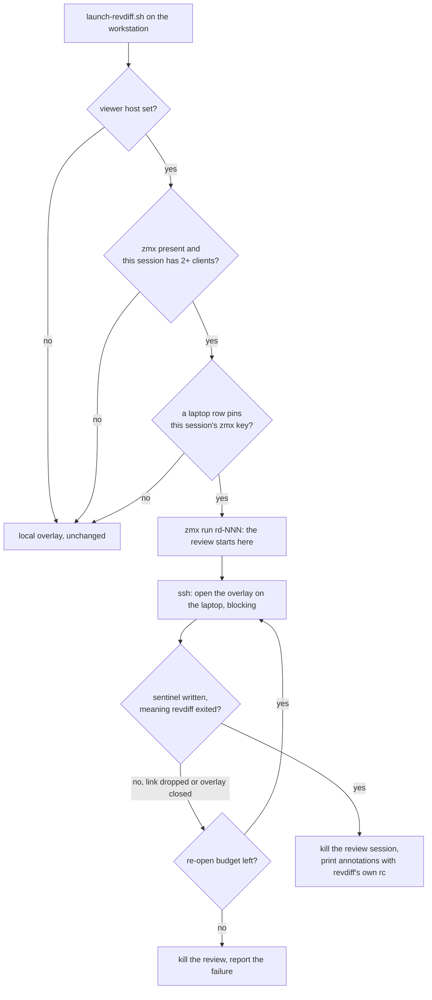

# Open the revdiff overlay on the remote viewer's machine

## Contents

1. [Overview](#overview)
2. [Context (from discovery)](#context-from-discovery)
3. [Development Approach](#development-approach)
4. [Testing Strategy](#testing-strategy)
5. [Progress Tracking](#progress-tracking)
6. [Solution Overview](#solution-overview)
7. [Technical Details](#technical-details)
8. [What Goes Where](#what-goes-where)
9. [Implementation Steps](#implementation-steps)
10. [Post-Completion](#post-completion)

## Overview

A claude session runs on the workstation. Sasha sometimes watches that same session from the laptop,
through a mirrored agterm row that attaches to the session's zmx key over mosh. A revdiff review
started from that session is invisible to him there, and the launcher blocks until someone closes an
overlay he cannot see.

An agterm overlay is a second, separate pty and libghostty surface drawn as a layer inside agterm's
own window. zmx and mosh carry the session's own pty and nothing else, so none of the overlay's bytes
ever reach the laptop. There is nothing to relay.

This change opens a **native overlay on the laptop's own agterm**, over the mirrored row that already
shows this session, and points that overlay at a review running back on the workstation through
`mosh` plus `zmx attach`. The review's picture is then local to the laptop, and the review's process
stays where the repo, git, `$EDITOR` and the `--output` file are.

Benefits:

- the review reaches the machine Sasha is actually looking at
- the review survives a dropped link, because it lives in a zmx session and the launcher re-opens the
  overlay when the link dies
- when nobody is watching remotely, today's local overlay runs unchanged

Approved design: `/Users/sasha/.claude-work/plans/prancy-singing-lake.md`. This plan supersedes it
where they disagree; a plan review found four mistakes in the design's exit-code and fall-through
handling, all corrected below.

## Context (from discovery)

- files involved: `.claude-plugin/skills/revdiff/scripts/launch-revdiff.sh` (the agterm branch at
  line 157), `app/plugin_exit_code_test.go`, `app/testdata/plugin-exit-code/fake-overlay-backend.sh`
- related patterns found: every backend is a detect-then-spawn-then-block branch; the sentinel
  backends (kitty, herdr, wezterm) get revdiff's real exit code through `write_rc_cmd` / `read_rc`
  (`launch-revdiff.sh:41-58`); the pane-refusal fallback (lines 215-220) shows how a refused call is
  retried without re-running the review
- external tooling read during planning: `~/dev/agterm-agents/bin/agterm-zmx`
  (`remote_attach_command()`, `parse_sessions()`, `row_keys()` and its UUID regex constants) and
  `bin/agterm-zmx-mirror`
- measured facts the implementation depends on:
  - `zmx run <name> -d` creates a real pty, and the session **survives its command exiting**
  - `zmx run` against an existing name sends into it rather than failing
  - `zmx attach` is documented as "Attach to session, **creating if needed**", so a name or socket-dir
    mismatch silently produces a fresh empty shell instead of an error
  - a locally created agterm row carries an **unexpanded template** in `restoreCommand`; the resolved
    key sits in the `foreground` argv
  - `agtermctl tree` reports the frontmost window only
  - `zmx list` marks the calling session's own row with a leading `→ ` and separates fields with tabs
  - the two launcher copies are byte-identical today apart from one `# source:` comment line

## Development Approach

- **parallel waves**: none - every task edits `launch-revdiff.sh`, `plugin_exit_code_test.go` or both
- **testing approach**: Regular (behaviour first, then the tests that pin it), matching how the
  existing launcher tests were built
- **branch**: `remote-viewer-overlay`, cut from `md-preview` (the fork trunk). This feature hardcodes
  a personal hostname and drives Sasha's own zmx tooling, so it is fork-only work and is not
  upstreamable. The unmerged `mermaid-edge-labels` work lands independently.
- complete each task fully before moving to the next
- run tests after each change with the narrow per-task command; the full suite runs once at the end
- run `shellcheck` on the launcher at the end of every task that edits it, not only at the end
- **CRITICAL: every task MUST include new/updated tests**
- **CRITICAL: all tests must pass before starting the next task**
- **CRITICAL: update this plan file when scope changes during implementation**

## Testing Strategy

- **unit tests**: required for every task. The launcher tests run the real script against fake
  binaries placed on `PATH`, so every case is end-to-end through the shell.
- **e2e tests**: the project has none. The parts needing two real machines are in Post-Completion.
- ⚠️ **`fakeLauncherEnv` installs exactly one fake binary today** (`app/plugin_exit_code_test.go:1203`)
  and then appends the **real** `PATH` (line 1210). The new branch needs `agtermctl`, `zmx` and `ssh`
  faked at once, and any command left unfaked resolves to the real binary on this machine. Task 1
  fixes that before anything else runs.
- ⚠️ The fake `ssh` must **never execute** the overlay command string it is handed. That string is
  `zsh -lc '… mosh … zmx attach …'`, and running it would dial a real host from the test suite.
- ⚠️ Do **not** add a second launcher-wide matrix pass. `launcherBackends()` already sits at the edge
  of the `-timeout=60s` in `make race`.
- ⚠️ Every `EXIT` trap in `launch-revdiff.sh` must list `$ERR_FILE`, or
  `TestShellLaunchersPreserveAnnotationExitCode` fails on a leaked `revdiff-err-*`. `trap … EXIT`
  **replaces**, it never appends, so a later branch installing its own trap discards the earlier one.
- **What this harness cannot observe**, to be written into the test file as comments rather than
  counted as coverage: the real `zmx attach` exit status, mosh, a dropped link, and the ordering
  between the detached review and the overlay call. All four are in Post-Completion.

## Progress Tracking

- mark completed items with `[x]` immediately when done
- add newly discovered tasks with ➕ prefix
- document issues/blockers with ⚠️ prefix
- keep this plan in sync with the actual work

## Solution Overview



Key design decisions:

- **The review runs on the workstation, not the laptop.** The repo and the `--output` file claude
  reads are there. Only the picture travels.
- **A zmx session wraps the review** rather than `ssh -t` straight to revdiff, so a dropped link does
  not take the review down.
- **revdiff's exit code comes from a sentinel file, never from ssh.** The chain is ssh → remote
  `agtermctl --block` → `zsh -lc` → mosh → `zmx attach`, and `zmx attach`'s status is the *client's*.
  A detach or a dropped link returns 0 with the review still running. Exit code 10 is the launcher's
  whole contract, so it uses the same `write_rc_cmd` / `read_rc` pair every sentinel backend uses.
- **All gating happens before the review starts.** Once `zmx run` has fired there is no fall-through
  to the local overlay, ever — a second revdiff against the same `$OUTPUT_FILE` would overwrite the
  first one's annotations wholesale, because the write is atomic rather than merged.
- **Detection is automatic.** No label, no config beyond the host. The laptop row that mirrors this
  session pins the session's zmx key, so finding that row is the signal.

## Technical Details

**The key.** `"${AGTERM_SESSION_ID}-${AGTERM_PANE:-left}"`, the same string the whole zmx tooling uses.

**Gate order, cheapest first.** `REVDIFF_REMOTE_VIEWER_HOST` non-empty → `AGTERM_SESSION_ID` set and
`agtermctl` and `zmx` on PATH → client count 2 or more → the remote row lookup. The env check first
means no machine but Sasha's ever spawns a subprocess for this, including inside the launcher matrix
test that already sits near the `make race` timeout.

**Reading the client count.** Parse this session's row out of `zmx list` output. Not `zmx get`, which
printed nothing for a labelled session during planning, and not `zmx list --where`, which returned
every session instead of the one match. The parse must tolerate the leading `→ ` marker on the calling
session's own row and tab-separated fields.

**How often the pre-gate passes.** Measured on the workstation with the laptop asleep: 9 of 43 live
zmx sessions report `clients=2`. So roughly one review in five reaches the ssh step and pays the
timeout before falling through. `ConnectTimeout=2` keeps that under two seconds; the claim that the
check is free is wrong and is not made anywhere in this plan.

**Finding the row.** Two ssh round trips, all parsing on the workstation with the jq the launcher
already depends on:

1. `agtermctl window list --json` → keep ids where `open` is true
2. `for w in <ids>; do agtermctl tree --json --window $w; done`

⚠️ Union every open window. `agtermctl tree` defaults to the **frontmost** window and the mirrored row
can be in any of them. `agterm-zmx-sync`'s header comment records this as a real incident.

Match the key against `restoreCommand`, `splitRestoreCommand` and the joined `foreground` argv. Which
of the three actually carries it on the laptop is the plan's one unverified assumption — the laptop
was asleep during planning. Task 3 checks it first and drops the unused fields if the answer is
narrower than feared.

⚠️ The matched row id is remote JSON interpolated into a remote shell command. Validate it against
the UUID pattern `row_keys()` already uses and reject anything else, or it is a command-injection
surface:

```bash
UUID_RE='[0-9A-Fa-f]{8}-[0-9A-Fa-f]{4}-[0-9A-Fa-f]{4}-[0-9A-Fa-f]{4}-[0-9A-Fa-f]{12}'
```

**Shell safety.** The file runs `set -euo pipefail` (line 7). A command substitution whose `grep`
finds nothing exits the whole launcher; `agterm_session_split` guards this three times with
`|| { printf '0'; return 0; }` (lines 136-144). Both new helpers must return a value on every path.

**Quoting layers.** Four of them, and `sq` (line 24) exists for exactly this: local bash → the remote
login shell ssh hands its argument to → agtermctl's argv → `zsh -lc`. One `sq` per level, spelled out
in the code comment.

**Remote command shape.** Every path absolute, because a non-interactive ssh command lands with
`PATH=/usr/bin:/bin:/usr/sbin:/sbin`:

```
zsh -lc '/opt/homebrew/bin/mosh --server=/opt/homebrew/bin/mosh-server "<workstation>" \
  -- /usr/bin/env ZMX_DIR="<workstation socket dir>" /opt/homebrew/bin/zmx attach "rd-NNN"'
```

Read the socket dir from `zmx version` (its `socket_dir` field) rather than guessing. ⚠️ A wrong
`ZMX_DIR`, a wrong name, or an attach that races ahead of `zmx run` all produce the same silent
failure: `zmx attach` creates a brand new empty session and neither end reports anything. Confirm the
review session exists in `zmx list` before making the overlay call.

**Exit codes and the re-open loop.** The sentinel carries revdiff's rc. The ssh call means only "the
overlay opened and has now closed". When it returns and the sentinel is absent, the review is still
alive — the link dropped, or the overlay was closed by hand — so re-open the overlay, up to a small
fixed budget. Killing the review there would destroy the one property the zmx layer was added for.
When the budget runs out, kill the review and report the failure.

**Failure after the review starts.** Never fall through to the local overlay. Kill the review session
and report through `print_output_and_exit` with the ssh stderr replayed. A user who sees an error can
re-run; a silent second review cannot be undone.

**Config.** `REVDIFF_REMOTE_VIEWER_HOST`. Use `${REVDIFF_REMOTE_VIEWER_HOST-<default>}` with **no
colon**, so an explicitly empty value disables the branch while an unset one gets the default. The
colon form has no off state at all, which would leave the negative path untestable.
⚠️ The default is a personal Tailscale hostname in a tracked file of a public fork, and this launcher
is what the marketplace plugin ships. Shipping the constant empty and setting the var in `~/.zprofile`
costs one line and avoids that. Implemented with the default as chosen; the tradeoff is recorded here
because a second, independent reason to drop it turned up in review.

## What Goes Where

- **Implementation Steps**: the launcher branch, the test harness, the tests, the docs
- **Post-Completion**: everything needing the laptop awake and a real mirrored row

## Implementation Steps

### Task 1: Multi-fake test harness

**Files:**
- Modify: `app/plugin_exit_code_test.go` (`fakeLauncherEnv`, line 1198; `cleanOverlayEnv`, line 1215)
- Modify: `app/testdata/plugin-exit-code/fake-overlay-backend.sh` (add `zmx)` and `ssh)` to the
  `case "$cmd_name" in` dispatch, beside the existing `herdr)` and `agtermctl)` cases)

**Model:** sonnet

- [ ] confirm the working branch is `remote-viewer-overlay`, cut from `md-preview`
- [ ] extend `fakeLauncherEnv` so a case can install several fake commands into `binDir`, keeping the
      existing single-command callers working unchanged
- [ ] add a `zmx)` case serving `list` (a row for `$ZMX_SESSION` with a leading `→ ` and tab-separated
      fields, `clients=` taken from `FAKE_ZMX_CLIENTS` defaulting to 1), `version` (a `socket_dir`
      line), `run` (records, then evaluates the `sh -c` string the way the `herdr` `pane run` case
      does) and `kill` (records and succeeds)
- [ ] add an `ssh)` case serving `window list --json` from `FAKE_SSH_WINDOWS` and the per-window tree
      dumps from `FAKE_SSH_TREE`, recording every invocation to `FAKE_SSH_ARGS_FILE`; ⚠️ for
      `session overlay open` it records the command string and returns `FAKE_SSH_RC` — it must never
      execute it
- [ ] add `REVDIFF_REMOTE_VIEWER_HOST` and `ZMX_SESSION` to `cleanOverlayEnv`, and add a
      `leftoverOutputCaptures` helper globbing `revdiff-output-*` beside `leftoverStderrCaptures`
      (line 1252), which covers `revdiff-err-*` only
- [ ] write a test that the agterm overlay path still returns the same exit code, the same stdout, the
      same agterm args and no leaked temp files when none of the new env vars are set
- [ ] run `go test -race -run 'TestAgtermPaneOverlayOptIn|TestShellLaunchersPreserveAnnotationExitCode' ./app/` - must pass before task 2

### Task 2: The branch gate and the client-count pre-gate

**Files:**
- Modify: `.claude-plugin/skills/revdiff/scripts/launch-revdiff.sh` (add one helper beside
  `agterm_session_split`, line 134, and the gate of a new branch inserted directly above the
  `if [ -n "${AGTERM_SESSION_ID:-}" ] && command -v agtermctl` line at 157)
- Modify: `app/plugin_exit_code_test.go` (new `TestRemoteViewerOverlay` beside
  `TestAgtermPaneOverlayOptIn`, line 180)

**Model:** opus

- [ ] add a helper printing this session's zmx client count, parsed from the `zmx list` row for
      `$ZMX_SESSION`, tolerating the `→ ` prefix and tab fields; print 0 when zmx is missing, when
      `ZMX_SESSION` is empty, or when the row is absent, and never trip `set -e`
- [ ] add the gate in cost order: `REVDIFF_REMOTE_VIEWER_HOST` non-empty via the no-colon default,
      then `AGTERM_SESSION_ID` plus `agtermctl` and `zmx` on PATH, then a client count of 2 or more
- [ ] make every negative result fall through to the untouched local overlay branch below
- [ ] write tests: an empty host makes no `zmx` call and no ssh call; a one-client session makes no
      ssh call; both still run the local overlay and preserve exit codes 0 and 10
- [ ] write a test that the helper survives a `zmx list` that prints nothing at all
- [ ] run `go test -race -run TestRemoteViewerOverlay ./app/` and `shellcheck` the launcher - must pass before task 3

### Task 3: The remote row lookup

**Files:**
- Modify: `.claude-plugin/skills/revdiff/scripts/launch-revdiff.sh` (a second helper beside the one
  from task 2, called from the gate)
- Modify: `app/plugin_exit_code_test.go` (extend `TestRemoteViewerOverlay`)

**Model:** opus

- [ ] ⚠️ first, with the laptop awake: mirror or pick a throwaway workstation session and read the
      laptop row's `restoreCommand`, `splitRestoreCommand` and `foreground` directly. Implement only
      the fields that actually carry the key, and record the finding in this plan. If the laptop
      cannot be woken, implement all three and say so here.
- [ ] build the key from `AGTERM_SESSION_ID` and `AGTERM_PANE`, defaulting the pane to `left`
- [ ] ssh for the window list with `-n -o BatchMode=yes -o ConnectTimeout=2`, keep the open ids, then
      ssh once more for a tree per open window; use absolute paths for the remote `agtermctl`
- [ ] match the key per session with jq and print the first matching row id; print nothing when jq is
      missing, when ssh fails, or when no row matches, and never trip `set -e`
- [ ] validate the row id against the UUID pattern before it is used anywhere, rejecting anything else
- [ ] write tests: a match in `restoreCommand`, a match in `foreground`, no match, a failing ssh with
      its stderr replayed, and a row id that fails validation — all five fall through to the local
      overlay except the two matches
- [ ] write a test that trees from **two** windows are both searched
- [ ] run `go test -race -run TestRemoteViewerOverlay ./app/` and `shellcheck` the launcher - must pass before task 4

### Task 4: Start the review and drive the overlay

**Files:**
- Modify: `.claude-plugin/skills/revdiff/scripts/launch-revdiff.sh` (the body of the branch from
  task 2, between its gate and the local overlay branch)
- Modify: `app/plugin_exit_code_test.go` (extend `TestRemoteViewerOverlay`)

**Model:** opus

- [ ] set this session's agterm status to `blocked --blink` and restore it on exit, copying the
      `AGTERM_TARGET` / `AGTERM_STATUS` / trap block at lines 159-175; the `EXIT` trap must remove
      `$OUTPUT_FILE`, `$ERR_FILE` and the sentinel, and kill the review session
- [ ] start the review with `zmx run "rd-$$-<stamp>" -d sh -c "$(write_rc_cmd "$SENTINEL")"`, using a
      name unique per review because `zmx run` against an existing name sends into it instead of
      failing; confirm the session exists in `zmx list` before going further
- [ ] build the mosh attach command with absolute paths and the `ZMX_DIR` read from `zmx version`,
      with one `sq` per quoting layer and a comment naming the four layers
- [ ] open the overlay over ssh with `--target <row id> --block` and no `--follow`, capturing
      agtermctl's stderr apart from revdiff's exactly as lines 203-208 do
- [ ] when the ssh call returns with no sentinel present, re-open the overlay up to a small fixed
      budget; take the rc from `read_rc` only, never from ssh
- [ ] kill the review session once the sentinel exists, then `print_output_and_exit "$rc"`
- [ ] write tests: exit codes 0 and 10 come from the sentinel and survive; the review session is
      killed exactly once; the ssh command carries `--block`, no `--follow`, and the review session
      name; a first ssh return with no sentinel re-opens the overlay
- [ ] add a comment in the test file naming what this harness cannot observe: the real `zmx attach`
      status, mosh, a dropped link, and the review-versus-overlay ordering
- [ ] run `go test -race -run TestRemoteViewerOverlay ./app/` and `shellcheck` the launcher - must pass before task 5

### Task 5: Failure policy after the review has started

**Files:**
- Modify: `.claude-plugin/skills/revdiff/scripts/launch-revdiff.sh` (the failure paths of the branch
  from task 4)
- Modify: `app/plugin_exit_code_test.go` (extend `TestRemoteViewerOverlay`)

**Model:** opus

- [ ] on a failed overlay open, kill the review session and report through `print_output_and_exit`
      with the ssh stderr replayed — never fall through to the local overlay
- [ ] on the re-open budget running out, do the same
- [ ] make sure no path can start a second revdiff against the same `$OUTPUT_FILE`
- [ ] write a test that a failed overlay open produces no second overlay of any kind, kills the review
      session, and exits nonzero with the stderr replayed
- [ ] write a test that no `revdiff-err-*`, `revdiff-output-*` or sentinel file survives any path,
      using both leftover helpers
- [ ] run `go test -race -run 'TestRemoteViewerOverlay|TestShellLaunchersPreserveAnnotationExitCode' ./app/` and `shellcheck` the launcher - must pass before task 6

### Task 6: Verify acceptance criteria

- [ ] verify every requirement in the Overview is implemented
- [ ] verify the edge cases in Technical Details: gate order, the union of all open windows, the
      matched fields, the UUID validation, the unique review session name, the sentinel-only rc, and
      the never-fall-through-after-start rule
- [ ] run `shellcheck .claude-plugin/skills/revdiff/scripts/launch-revdiff.sh`
- [ ] run the full suite: `make test`
- [ ] run `make lint`
- [ ] confirm `make race` still finishes inside its 60 second timeout

### Task 7: [Final] Update documentation

**Files:**
- Modify: `CLAUDE.md` (a new bullet in the gotchas list, beside the agterm pane-scoped overlay entry)
- Modify: `.claude-plugin/skills/revdiff/references/config.md` (the environment variable table)
- Modify: `.claude-plugin/skills/revdiff/SKILL.md` (the launcher behaviour section)
- Modify: `README.md` and `site/docs.html` (the environment variable list in both, kept in sync)

**Model:** sonnet

- [ ] add the gotchas entry: why a relay is impossible, the gate order and the measured one-in-five
      pre-gate pass rate, the matched fields, the union-all-windows rule, the unique-name rule for
      `zmx run`, the sentinel-only exit code, and the never-fall-through-after-start rule
- [ ] update the existing "Overlay stderr relay" bullet in `CLAUDE.md`: it says "All ten `EXIT` traps
      in `launch-revdiff.sh` list `$ERR_FILE`" and this branch adds an eleventh
- [ ] document `REVDIFF_REMOTE_VIEWER_HOST` in `config.md`, `README.md` and `site/docs.html`,
      including that an explicitly empty value disables the branch
- [ ] add one line to `SKILL.md`: the launcher handles this by itself and needs no different arguments
- [ ] confirm no `plugin.json`, `marketplace.json` or `package.json` version bump is made — launcher
      change, no new binary feature, and bumps happen at release only
- [ ] record in `CLAUDE.md` that the Codex launcher copy now differs from the Claude one by more than
      its `# source:` comment, so the keep-in-sync rule is knowingly open
- [ ] move this plan to `docs/plans/completed/`

## Post-Completion

*Items requiring manual intervention or external systems - no checkboxes, informational only*

**Manual verification** (needs the laptop awake; use a throwaway session pair, never one in real use):

- open a **second window** on the laptop and put the mirrored row there, so the union-all-windows step
  is exercised for real rather than in its easy single-window form
- run a review from the workstation session: the overlay opens on the laptop, over the right row, and
  does not steal focus
- use it over the link: scrolling, the annotation input, `P` preview, mouse
- quit: annotations reach the agent with exit code 10, and `zmx list` shows no leftover `rd-*` session
- negative case: use a session nothing is mirroring and confirm a normal local overlay opens
- drop the link mid-review (turn off wifi on the laptop, then reattach) and confirm the review is
  still there and the overlay comes back — that is the whole reason for the zmx layer
- close the laptop overlay by hand without quitting revdiff, and confirm the overlay re-opens rather
  than the review being killed
- start a second review from another mirrored session while the first is up, and see what agterm does
  with two overlays; the launcher reports the failure rather than falling through, so the worst case
  is a failed review, not a duplicated one
- confirm the remote `agtermctl` resolves its control socket under a non-interactive ssh, which reads
  no login shell; if it does not, the overlay call needs an explicit `--socket`

**External system updates**:

- `plugins/codex/skills/revdiff/scripts/launch-revdiff.sh` stays as it is by choice. The two files are
  byte-identical today apart from one comment line, so porting the branch is a copy — the debt is
  cheap to clear whenever you want it cleared.
- `plugins/revdiff-planning/scripts/launch-plan-review.sh` is untouched, so a plan review from the
  laptop still opens on the workstation. The same mechanism would port.
- a second viewer machine would need a host list and a rule for what to do when two rows match
