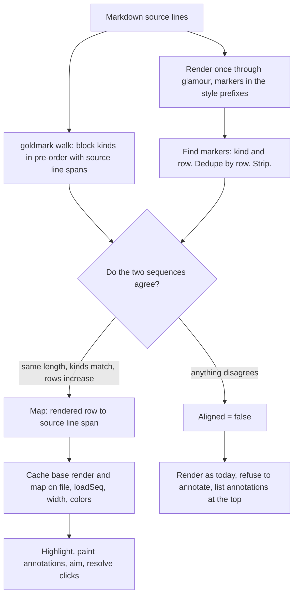

# Annotations inside markdown preview

## Contents

1. [Overview](#overview)
2. [Context (from discovery)](#context-from-discovery)
3. [Development Approach](#development-approach)
4. [Testing Strategy](#testing-strategy)
5. [Progress Tracking](#progress-tracking)
6. [Solution Overview](#solution-overview)
7. [Technical Details](#technical-details)
8. [What Goes Where](#what-goes-where)
9. [Implementation Steps](#implementation-steps)
10. [Post-Completion](#post-completion)

## Overview

Markdown preview (`P`) is read-only. You cannot see existing annotations while previewing, and you
cannot add one. To comment on a rendered table or diagram you leave preview, find the source line by
eye, annotate, and go back to check you hit the right thing.

The reason is in the code, on `mdPreviewAllowedActions`: every blocked action "would create, edit,
delete, or navigate to an annotation, or move/reposition `m.nav.diffCursor` — all meaningless once
the diff pane shows one whole-document glamour render instead of one row per source line".

So the feature is one question: **which source line did this rendered row come from?** Build that map
and the gate opens.

After this, reading a plan document and commenting on it happens in one view: the current block is
highlighted as you scroll, `a` annotates it, a click annotates a different one, and existing
annotations are painted under the block they belong to. The annotation produced is indistinguishable
from one made in source view — same `annotation.Annotation`, same output file, same agent handoff.

## Context (from discovery)

Files and components involved:

- `app/ui/mdpreview.go` — `renderMarkdownPreview` (480), `renderMarkdownDocument` (398),
  `mermaidPlaceholderDocument` (274), `spliceMermaidArt` (302), `handleMdPreviewAction` (706),
  `mdPreviewAllowedActions` (842), `panMarkdownPreview` (659), `applyMdPreviewScroll` (545).
- `app/annotation/store.go:12` — `Annotation{File, Line, EndLine, Type, Comment}`, identified within
  a file by `(Line, Type)`. `Add` (32) **replaces** on a key collision.
- `app/ui/annotate.go:462` — `annotationVisualRows`, the single source of truth for how an annotation
  paints; `wrappedAnnotationLineCount` (514) is the height half reading the same function.
- `app/ui/diffview.go:741` — `renderAnnotationOrInput`; `renderFileAnnotationHeader` nearby.
- `app/ui/mouse.go:384` — `scrollDiffViewportBy`; `pinDiffCursorTo` (463) bails in preview.
- `app/ui/model.go:1102` — `dispatchAction`'s preview guard.

Related patterns found:

- `spliceMermaidArt` is a working precedent for locating a source construct in rendered output.
- `wheelState` (`gen` / `renderPending` / `tickInFlight`) already solves "a burst of scroll events
  must not cause a repaint per event" — see `.claude/rules/gotchas.md`.
- `globalRenderKey` already uses `loadSeq` as a cache-key component, which is the precedent for
  keying the preview render cache safely.

Dependencies identified:

- `goldmark` becomes a direct dependency (already present transitively via glamour).
- The spike harness at
  `/private/tmp/claude-501/-Users-sasha-dev-oss-revdiff/3ca44ced-2e51-4dbb-97e0-c4e65cb65f87/scratchpad/marker_spike_harness.go.txt`
  contains working versions of the marker encoding (`zzMarker`), the kind table with its style-field
  appliers (`zzKinds`, `zzStyleWith`), stripping (`zzStripMarkers`, `zzDropEmptySGRPairs`) and row
  extraction with clean/dirty classification (`zzRowsWithMarker`, `zzChromeRe`). **Lift from it
  rather than rewriting.**

## Development Approach

- **parallel waves**: `map (tasks 1-2)` — marker injection and the goldmark walk are independent
  (different files, different test files, neither compiles against the other) and similar in size.
  Everything from task 3 on is sequential, because each consumes the previous.
- **testing approach**: TDD — write the failing test first. Every unit here is a pure function with
  exactly checkable output, which is where test-first costs nothing.
- complete each task fully before moving to the next
- make small, focused changes
- **CRITICAL: every task MUST include new/updated tests** for code changes in that task
  - tests are not optional - they are a required part of the checklist
  - write unit tests for new functions/methods
  - write unit tests for modified functions/methods
  - add new test cases for new code paths
  - update existing test cases if behavior changes
  - tests cover both success and error scenarios
- **CRITICAL: all tests must pass before starting next task** - no exceptions
- **CRITICAL: update this plan file when scope changes during implementation**
- run tests after each change, using the narrow per-task command; the full suite runs once in the
  verify task
- maintain backward compatibility

⚠️ **Narrow test commands must actually cover what the task touches.** An earlier run in this repo
validated a task with `-run TestFlowchart`, which does not match `TestNormalizeFlowchartSource*` by
substring, so the worktree looked green while the full gate was red. Where a task edits shared
behaviour the task text says so and requires the wider `go test ./app/ui` before commit.

## Testing Strategy

- **unit tests**: required for every task.
- **the visual-identity assertion**: wherever a test would compare rendered bytes, it asserts all
  three of `ansi.Strip` equality, row-count equality, and per-row `ansi.StringWidth` equality. See
  Technical Details for why byte comparison is not available.
- **two named tests carry the design**, and both must exist by name:
  - *every annotation painted exactly once* — an invisible annotation is the one unacceptable
    outcome.
  - *two annotations in one tight bullet list both survive* — this is the case that rejected the
    alternative design, so it is the case that proves this one.
- **corpus measurement** in the final task, env-gated so `make test` and CI are unaffected, following
  `mdpreview_corpus_test.go`.

## Progress Tracking

- mark completed items with `[x]` immediately when done
- add newly discovered tasks with ➕ prefix
- document issues/blockers with ⚠️ prefix
- update plan if implementation deviates from original scope
- keep plan in sync with actual work done

**Task 4 repaint-cost measurement** (`BenchmarkMdPreviewRepaint`, `app/ui/mdpreview_cache_test.go`,
run on the fence-heavy corpus document `docs/plans/completed/20260722-markdown-preview-mode.md`, 3
mermaid fences, 810 lines, Apple M2 Max, `go test ./app/ui -run '^$' -bench
'BenchmarkMdPreviewRepaint' -benchtime=50x -benchmem`):

| repaint path | ns/op | B/op | allocs/op |
|---|---|---|---|
| before (fresh `mdPreviewRenderWithMap` every repaint) | 112,619,951 | 42,911,769 | 415,342 |
| after (cached, warm) | 523.3 | 0 | 0 |

A repeat repaint at an unchanged file/width/color state drops from ~113ms to ~0.5us — about a
215,000x reduction, and markdown rendering (all 415k allocations) is fully absent from the warm
path. This is a clear pass: the cache removes markdown rendering from the repaint path, which is
exactly what task 6's scroll-following highlight needs to be affordable.

## Solution Overview

`mdPreviewStyle` is a copy of glamour's `DarkStyleConfig` — a plain data struct this fork owns, and
every block element writes its style's prefix into the render stream. That is the seam: clone the
style, prepend a zero-width ANSI marker per block kind, render once, and read back where each block
landed.

Three things the picture cannot say:

- **The mechanism is measured, not assumed.** A spike ran it over 59 real documents at four widths
  before any feature code existed. Results are in Technical Details.
- **The alignment check is the safety net.** Two independently produced sequences either agree or
  they do not. Disagreement degrades; nothing is silently misplaced.
- **The cache is what makes the highlight affordable.** Scrolling deliberately does not re-render
  today, so without it a highlight would cost a full glamour plus mermaid pass per keypress.

## Technical Details

### Established by the spike — treat as fact, do not re-derive

Over 59 real documents at widths 40/60/80/100:

| check | result |
|---|---|
| `ansi.Strip` equal | 59/59 |
| row count equal | 59/59 |
| per-row `ansi.StringWidth` equal | 59/59 |
| byte-identical | 0/59 |
| byte-identical after the empty-SGR pass | ~39/59 |

**Per-list-item granularity is confirmed** — a tight 4-item list yields markers on 4 distinct rows, a
nested 6-item list on 6, ordered lists likewise. This is what keeps the `(Line, Type)` key
collision-free and is the entire reason this mechanism was chosen over content matching, under which
a tight list is one block and a second comment on it would silently replace the first.

⚠️ **Byte-identity is not an available acceptance criterion, and not because of markers.** The spike
rendered the same document twice with the *unmodified* style config and **15 of 59 documents produced
different bytes between the two runs**. Today's preview render is already nondeterministic for a
quarter of the corpus; the variation is ANSI-only (strip-equal, same row count) and is not
mermaid-related. A byte-identity test on this path would have been flaky from its first run,
independently of this feature. Everywhere a byte comparison was intended, assert visual identity
instead: `ansi.Strip` equality, row-count equality, per-row width equality.

### Decided by the spike, not open questions

- **Tables are one target each.** One real document produced 561 markers for 6 tables, 73 landing
  mid-row. A comment on a table means "this table", not "this row". Recorded as a limitation.
- **Task-list items** (`- [ ]` / `- [x]`) put the marker after the checkbox, mid-row, every time.
  Fold them into their enclosing list item, which still gives them an anchor.
- **The generic `heading` prefix never emits.** Use `h1`..`h6`.
- **Markers repeat roughly 3x per block** for several kinds, always on the same row. Extraction
  dedupes by row.

### Anchoring

On save, `Line` and `Type` come from the same `diffLineNum(dl)` / `dl.ChangeType` the source view
uses, so a preview annotation is indistinguishable from a source one. `EndLine` stays zero — it means
hunk expansion today, and populating it differently would break that promise.

## What Goes Where

- **Implementation Steps**: code, tests, and in-repo documentation.
- **Post-Completion**: visual confirmation in the real TUI and the binary reinstall, which need a
  terminal and a person.

## Implementation Steps

### Task 1: Marker injection, extraction and stripping

**Files:**
- Create: `app/ui/mdpreview_marker.go`
- Create: `app/ui/mdpreview_marker_test.go`

**Model:** sonnet
**Wave:** map

- [x] read the spike harness at `/private/tmp/claude-501/-Users-sasha-dev-oss-revdiff/3ca44ced-2e51-4dbb-97e0-c4e65cb65f87/scratchpad/marker_spike_harness.go.txt` first and lift `zzMarker`, `zzKinds`, `zzStyleWith`, `zzStripMarkers`, `zzDropEmptySGRPairs`, `zzRowsWithMarker`, `zzChromeRe` rather than rewriting them
- [x] create the marker encoding (a single-parameter SGR sequence outside every defined range, so it is inert and zero-width) with a doc comment giving the rationale the harness records
- [x] create the kind table covering `paragraph`, `h1`..`h6`, `item`, `enumeration`, `code_block`, `block_quote`, `table`, `hr`, `html_block` — **not** the generic `heading`, which never emits — each with the style field it prepends to
- [x] implement style cloning that prepends markers without discarding an existing prefix (`item`'s block prefix is `"• "`)
- [x] implement extraction returning kind and row per marker, **deduped by row**, and classifying a marker as row-start or mid-row against the chrome pattern
- [x] implement stripping by exact byte match plus the empty-SGR post-pass
- [x] write tests: marker is zero-width under `ansi.StringWidth`; stripping is exact and total; an existing prefix survives; dedupe collapses the 3x repeat; mid-row markers are classified as such
- [x] run `go test ./app/ui -run 'TestMdPreviewMarker|TestMarker'` — must pass before the next task

### Task 2: goldmark block walk

**Files:**
- Create: `app/ui/mdpreview_blocks.go`
- Create: `app/ui/mdpreview_blocks_test.go`

**Model:** sonnet
**Wave:** map

- [x] parse the placeholder document with goldmark configured to match glamour's extension set (the table extension in particular, or block boundaries will disagree with the render)
- [x] walk the AST in pre-order emitting one entry per tracked kind with its source line span, derived from each node's `Lines()` byte segments
- [x] fold task-list items into their enclosing list item, and emit a table as one entry covering the whole table
- [x] implement target selection: the deepest block owning a start line wins, targets are non-overlapping and in document order
- [x] write tests for tight list, loose list, nested list, ordered list, table, fenced code, blockquote, headings of every level, and a document mixing them
- [x] write tests for the folding rules: a task item resolves to its list item; a table yields exactly one target
- [x] run `go test ./app/ui -run 'TestMdPreviewBlocks|TestBlockWalk'` — must pass before the next task

### Task 3: Alignment and the source map

**Files:**
- Create: `app/ui/mdpreview_srcmap.go`
- Create: `app/ui/mdpreview_srcmap_test.go`

**Model:** opus

- [x] align the extracted marker sequence against the goldmark sequence and verify: equal length, kind-for-kind match, monotonically increasing rows
- [x] on agreement, build the map with `rowToLine` and `lineToRow` queries; on any disagreement set `Aligned = false` and expose no targets
- [x] adjust the map for mermaid art, whose splice shifts row numbers — `spliceMermaidArt` must report its insertions so the adjustment happens in the same pipeline step
- [x] handle the `--no-colors` path: markers are escape sequences and that mode promises none, so strip and then run `ansi.Strip` over the result as a net
- [x] write tests for a clean alignment, a length mismatch, a kind mismatch, a non-monotonic row sequence, an empty document, and a document of only a table
- [x] write tests that `rowToLine` and `lineToRow` are consistent inverses over a real document
- [x] run `go test ./app/ui -run 'TestMdPreviewSrcMap|TestAlign'` — must pass before the next task

### Task 4: Render cache

**Files:**
- Create: `app/ui/mdpreview_cache.go`
- Create: `app/ui/mdpreview_cache_test.go`
- Modify: `app/ui/mdpreview.go` (`renderMarkdownPreview` and `panMarkdownPreview` route through the cached entry point)

**Model:** sonnet

- [x] cache the base render and its map on `(file.name, file.loadSeq, viewport.Width, noColors)`
- [x] update `renderMarkdownPreview`'s doc comment, which currently declines a cache because a
      file-plus-width key could survive an `R` reload — `loadSeq` closes that, as `globalRenderKey`
      already relies on
- [x] write a test proving staleness is impossible: an `R` reload at the same width must miss the cache
- [x] write a test that a width change misses the cache and a repeat at the same width hits it
- [x] **measure repaint cost before and after** on a fence-heavy plan document and record both numbers in this plan's Progress Tracking — the cache's whole claim is that a repaint stops paying for markdown rendering, so show it
- [x] ⚠️ this task edits shared render entry points: run the wider `go test ./app/ui` before commit, not only the narrow pattern
- [x] run `go test ./app/ui -run 'TestMdPreview'` then `go test ./app/ui` — both must pass before the next task

### Task 5: Paint existing annotations

**Files:**
- Create: `app/ui/mdpreview_annotate.go`
- Create: `app/ui/mdpreview_annotate_test.go`

**Model:** sonnet

- [x] paint annotations by calling the existing `renderAnnotationOrInput` and `renderFileAnnotationHeader` into a throwaway `strings.Builder` and splitting into rows — **never write a parallel painter**, so `annotationVisualRows` stays the single source of truth
- [x] insert each annotation's rows after the last rendered row of its block; splice before `applyMdPreviewScroll` so they pan and get cut like every other row
- [x] handle several annotations in one block, painted in line order
- [x] handle an annotation whose line is not a block start by resolving to the innermost containing block, and one matching no block by attaching to the nearest preceding block
- [x] when `Aligned` is false, list every annotation as a group at the top rather than hiding any
- [x] write the named invariant test: **every annotation of the current file appears exactly once in the painted preview**
- [x] write tests: visual identity with no annotations; painted rows byte-equal to what the diff view emits for the same annotation; the horizontal pan clamp is unchanged by annotation rows
- [x] run `go test ./app/ui -run 'TestMdPreview'` — must pass before the next task

### Task 6: Scroll-following block highlight

**Files:**
- Modify: `app/ui/mdpreview_cache.go` (add the highlight splice beside the cached render)
- Modify: `app/ui/mdpreview.go` (`scrollMarkdownPreview` and `panMarkdownPreview` mark the highlight dirty)
- Modify: `app/ui/mdpreview_cache_test.go`

**Model:** opus

- [x] highlight the topmost fully-visible block by giving its rows a background from the resolver, the way the diff cursor line is drawn
- [x] ⚠️ **coalesce through the EXISTING `wheelState`** (`gen` / `renderPending` / `tickInFlight`, documented in `.claude/rules/gotchas.md`) — that machinery exists because a wheel burst once drove one render per event, 4201 redundant repaints from a single 4609-event burst. Writing a second debounce beside it is the mistake this checkbox exists to prevent
- [x] write a test that the highlight follows the topmost fully-visible block as the offset changes
- [x] write a test that one wheel burst repaints once rather than per event
- [x] write a test that with the highlight disabled the render is identical to task 5's
- [x] ⚠️ this task touches shared scroll paths: run the wider `go test ./app/ui` before commit
- [x] run `go test ./app/ui -run 'TestMdPreview|TestWheel'` then `go test ./app/ui` — both must pass before the next task

### Task 7: Create an annotation, by keyboard and by mouse

**Files:**
- Modify: `app/ui/mdpreview_annotate.go` (add `startPreviewAnnotation` and the aim resolution)
- Modify: `app/ui/mdpreview.go` (`handleMdPreviewAction` gains a `tea.Cmd` return and a routed `ActionConfirm` case; `mdPreviewAllowedActions` gains the entry and its doc comment is rewritten)
- Modify: `app/ui/model.go` (`dispatchAction`'s preview guard carries the command through)
- Modify: `app/ui/mouse.go` (the preview early-return becomes a click-to-block mapping)
- Modify: `app/ui/mdpreview_annotate_test.go`

**Model:** sonnet

- [x] `a` anchors to the highlighted block, falling back to the topmost-visible block when nothing is highlighted yet
- [x] ⚠️ route `ActionConfirm` **inside** `handleMdPreviewAction` rather than only allowlisting it — its fall-through target branches on pane focus, and the tree pane is reachable while previewing, where it would run the TOC jump in diff-line coordinates
- [x] `startPreviewAnnotation` sets `m.nav.diffCursor` to the resolved line and calls the existing `startAnnotation`, saving and restoring `viewport.YOffset` around it so `ensureLineAnnotationInputVisible`'s diff-line maths cannot move the view
- [x] map a diff-pane click through `rowToLine` so clicking a block annotates it
- [x] rewrite `mdPreviewAllowedActions`' doc comment: its blanket reason is no longer true, and each remaining exclusion needs its own
- [x] write the named regression test: **annotate two items in one tight bullet list and confirm two distinct annotations survive in the store**
- [x] write tests: aim with nothing highlighted, mid-document, past the last block; a click inside a block resolves to it; a click below the last row resolves to the last block; `enter` with tree focus does not move the viewport; the saved annotation is byte-equal to the source view's for the same line
- [x] run `go test ./app/ui -run 'TestMdPreview|TestDispatchAction|TestMouse'` then `go test ./app/ui` — both must pass before the next task

### Task 8: File-level annotations and flush

**Files:**
- Modify: `app/ui/mdpreview.go` (`mdPreviewAllowedActions` gains `ActionAnnotateFile` and `ActionFlushOutput`)
- Modify: `app/ui/mdpreview_annotate_test.go`

**Model:** sonnet

- [ ] allow `A` — `startFileAnnotation` sets the cursor to -1 and goes to the top, which is where file-level rows render, so it needs no map
- [ ] allow `O` — `handleFlushOutput` touches neither cursor nor viewport maths, and creation without a way to flush is half a feature
- [ ] write tests that both work in preview and that a file-level annotation paints above row 0
- [ ] run `go test ./app/ui -run 'TestMdPreview|TestFileAnnotation|TestFlushOutput'` — must pass before the next task

### Task 9: Verify acceptance criteria

- [ ] verify every requirement in Overview is implemented
- [ ] verify each failure mode degrades: alignment mismatch, a kind with no marker, a mermaid fence, a table, an empty document, `--no-colors`
- [ ] confirm both named tests exist and pass: every-annotation-painted-once, and two annotations in one tight list
- [ ] run full test suite: `make test`
- [ ] run `make lint` — must report 0 issues
- [ ] run `make build`
- [ ] verify `app/ui` coverage has not dropped

### Task 10: [Final] Documentation and corpus measurement

**Files:**
- Create: `app/ui/mdpreview_srcmap_corpus_test.go` (env-gated, mirroring `mdpreview_corpus_test.go`)
- Modify: `PATCH.md` (new-files list, the rewritten allowlist reasoning, both upstream hunks, the cache and its key, known limitations)
- Modify: `docs/plans/20260730-preview-manual-test-plan.md` (a section for annotating in preview)

**Model:** sonnet

- [ ] run the corpus measurement over the real `.md` corpus and report alignment success rate and the granularity actually achieved per kind
- [ ] record those numbers in PATCH.md — do not leave a figure you did not measure
- [ ] record the limitations: a table is one target, task items fold into their list item, block granularity rather than character-exact, `d` requires leaving preview
- [ ] record the nondeterministic-render finding, since it invalidates byte-identity tests on this path generally, not just for this feature
- [ ] add a manual test plan section covering highlight, keyboard aim, click aim and painted annotations
- [ ] move this plan to `docs/plans/completed/`

## Post-Completion

*Items requiring manual intervention or external systems - no checkboxes, informational only*

**Manual verification:**

- open a plan document from `docs/plans/completed/`, press `P`, scroll and confirm the highlight
  follows the block you are reading
- press `a` on a bullet, save, confirm the annotation appears under that bullet, press `P` and
  confirm it sits on the right source line
- click a different bullet and confirm the click lands on it
- confirm scrolling still feels immediate on a fence-heavy document

**Binary reinstall:**

- build, copy to `~/.local/bin/revdiff-builds/<sha>/revdiff`, `codesign --force --sign -`, then
  repoint the `revdiffm` symlink. Copying over a running binary in place leaves a stale signature and
  macOS kills it with no output.
