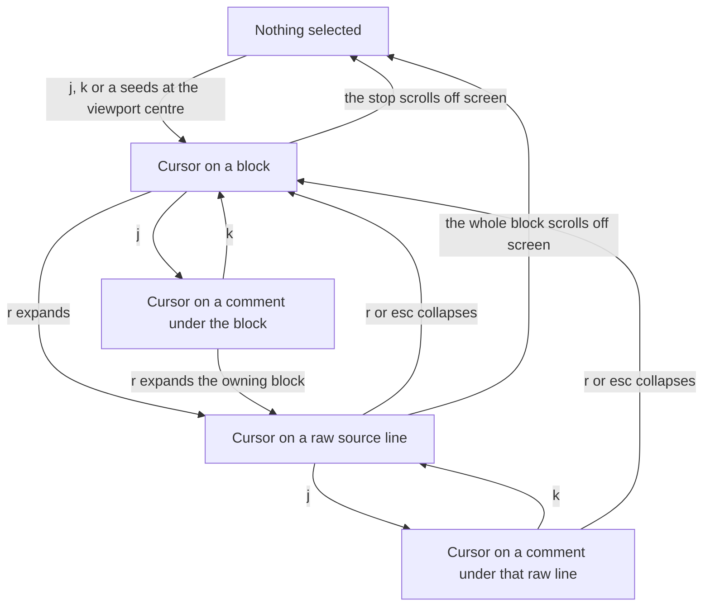

# Raw source expansion for the selected markdown-preview block

Press `r` on the block the preview cursor marks and the block is redrawn as its raw markdown
source, one rendered row per source line. `j`/`k` then step between those source lines, and `a`
annotates the exact line. Press `r` again, or `esc`, and the block goes back to its rendered form.

## Contents

1. [What is true today](#1-what-is-true-today)
2. [The shape of the change](#2-the-shape-of-the-change)
3. [The two-level cursor](#3-the-two-level-cursor)
4. [The six open questions, decided](#4-the-six-open-questions-decided)
5. [What `r` refuses, and what it says](#5-what-r-refuses-and-what-it-says)
6. [The alternative I rejected](#6-the-alternative-i-rejected)
7. [Assumptions](#7-assumptions)
8. [Development approach](#8-development-approach)
9. [Tasks](#9-tasks)
10. [Validation](#10-validation)

---

## 1. What is true today

Read on branch `preview-block-cursor` at commit `aabaa15`, plus the uncommitted work in the tree
(`mdpreview_stops.go` and `mdpreview_stops_test.go` are untracked; six preview files are modified).
Everything below is from the code, not from the brief.

**The frame is composed in three stages, and there is exactly one chokepoint.**
`mdPreviewBody` (`app/ui/mdpreview_cache.go:205`) is the only caller of `mdPreviewBaseRender`,
verified by grep. It returns the cached glamour+mermaid render with annotation rows painted in,
plus the source map re-expressed in the painted render's own row numbers. Every path that puts
preview content on screen goes through it — `mdPreviewFinalRender`, `panMarkdownPreview`,
`moveMdPreviewCursor`, `mdPreviewDeleteAnnotation`, `dropMdPreviewCursorIfHidden`.

**Block anchors already carry source lines in the coordinate an annotation needs.**
`mdPreviewBlockAnchor.startLine` / `.endLine` (`app/ui/mdpreview_srcmap.go:29`) are indices into
`m.file.lines`, the same coordinate `m.nav.diffCursor` uses. That is why
`mdPreviewStartAnnotationAt(idx)` can set the diff cursor and run the ordinary `startAnnotation`
path, producing an annotation indistinguishable from a source-view one. Raw expansion needs no new
coordinate system at all — it needs the rows for `startLine..endLine`, which are already named.

**The cursor is an identity, not an index.** `mdPreviewStopRef` (`app/ui/mdpreview_stops.go:28`)
is `{block int, onAnnot bool, annot int}`. The doc comment there spells out why: a flat index into
the stop list drifts when `A` prepends a file-level stop or a delete removes one from the middle.
It also spells out why `onAnnot` is a bool and not a `-1` in `annot` — a zero value that
accidentally means "the first annotation under block 0" is a trap. A raw-line stop has to follow
that same pattern, or it re-introduces the trap the type exists to avoid.

**The annotation painter already solves the height-accounting problem, in a form worth copying.**
`mdPreviewPaintAnnotationsTracked` (`app/ui/mdpreview_annotate.go:53`) takes `(rendered, srcMap)`
and returns `(painted, srcMap')`. It records where each annotation landed **as the rows are
spliced**, never by scanning the painted string afterwards. Its own doc comment says why a scan
would be a second source of truth free to drift. Its shifting is exact rather than estimated:
block `i` moves by the file-level row count plus every earlier block's annotation row count.

**Nothing in this repository already does "render, then show the source instead".**
`jbcontext search -p app/ui "show the raw markdown source of a rendered block"` returned
`flowchartSubgraph.source` (rebuilding a mermaid fence's own source text for a re-render) and the
`joinWithMermaidFences` origins comment. Neither is prior art for this. There is no existing
mechanism to reuse and none to explain away.

**The base render cache is keyed on `{fileName, loadSeq, width, noColors}`**
(`app/ui/mdpreview_cache.go:20`). Its doc comment states the property this feature has to check
against: the cursor is deliberately not in any key, because the highlight is applied after the last
memo. The scroll cache below it (`mdPreviewScrollCache`) keys on the **body string**, which already
covers "an annotation edit changed the rows".

**`r` is unbound today.** `defaultBindings()` (`app/keymap/keymap.go:260`) has `R` for
`ActionReload` and no `r`. Taking `r` means four hunks in an upstream-owned file.

**A previewable file is full-context.** `markdownPreviewable = isMarkdownFile && singleColLineNum`
(`app/ui/loaders.go:565`), and `singleColLineNum = isFullContext(lines)` (`loaders.go:552`), which
requires every non-divider line to be `ChangeContext`. So every raw line this feature paints has
`ChangeType == diff.ChangeContext`, and divider rows may still be present in principle. The mermaid
walk already skips dividers (`joinWithMermaidFences`, `app/ui/mdpreview.go:126`), so raw expansion
must skip them too or the two disagree about what the document is.

---

## 2. The shape of the change

One new pass, inserted between the two that already exist.

```
mdPreviewBaseRender()          cached glamour + mermaid render        (unchanged)
  -> mdPreviewExpandBlock()    NEW: swap one block's rows for raw source
  -> mdPreviewPaintAnnotationsTracked()   annotations, per line inside the expanded block
  -> applyMdPreviewScroll()    horizontal cut                          (unchanged)
  -> mdPreviewHighlight()      cursor paint                            (unchanged)
```

The new pass has the same signature shape as the annotation painter: `(rendered, srcMap) ->
(rendered', srcMap')`. It runs **before** the painter, so the painter receives a map already in
expanded coordinates and needs no knowledge of expansion for its own shifting to stay exact.

`mdPreviewBody` grows by two lines. That is the only place in the frame pipeline that changes.

**What the pass does.** For the expanded block's anchor, take rows `[row .. endRow]`, count the
trailing blank rows in that span, and replace `[row .. endRow - trailing]` with one row per source
line of `startLine..endLine`. Keeping the trailing blanks is not cosmetic: a non-last block's span
runs to the row before the next block starts, so it includes the padding glamour puts between
blocks, and the last block's span runs to the end of the document. Replacing the whole span would
eat that padding and make the document jump.

**What the pass records.** A new `lines []mdPreviewLineAnchor` field on `mdPreviewSourceMap`,
one entry per painted raw line: its row, and the index into `m.file.lines` it came from. This is
the exact counterpart of `annots`, and it is produced the same way and for the same reason — by the
splice that created the rows, never by scanning afterwards. `mdPreviewSourceMap`'s doc comment
already says `annots` is "the one field NOT produced here"; after this change there are two, and
the comment says which pass owns each.

**Source model, stated once.** The raw lines of a block are `m.file.lines[startLine..endLine]`,
skipping `ChangeDivider` rows, with tabs replaced by `m.cfg.tabSpaces` and C0 control bytes
dropped. Tabs must go: `ansi.StringWidth` counts a tab as one cell while the terminal renders eight,
so leaving them in would make the pan clamp and the horizontal cut disagree with the screen. Control
bytes must go for the same reason `mermaidArtWithoutControls` exists — these bytes bypass glamour.

---

## 3. The two-level cursor



What `a` does in each state — this is the whole point of the feature, so it is stated as a table
rather than left implicit in the diagram:

| Cursor is on | `a` opens an input on |
| --- | --- |
| nothing | the block nearest the viewport centre, at its `startLine` (today's behaviour) |
| a block | that block's `startLine` (today's behaviour, unchanged — see question 6) |
| a comment | that comment's own `(Line, Type)`, so it is edited (today's behaviour) |
| **a raw source line** | **that exact source line** |

Two properties fall out and are worth pinning in tests:

- `a` on a collapsed block and `a` on the first raw line of that same block produce the **same**
  annotation, because both resolve to `startLine`. `Store.Add` replaces on a `(File, Line, Type)`
  collision, so there is no way to end up with two comments meaning the same thing.
- an annotation made on a raw line is byte-identical in the `-o` output to one made in source view,
  because the save path is the same `startAnnotation` -> `saveAnnotation` it has always been. This
  feature adds no new save code.

---

## 4. The six open questions, decided

### Height accounting: reuse the annotation painter's approach, do not extend the painter itself

Decision: a separate pass with the painter's shape, running before it.

Composing the two in that order is what keeps the accounting exact with no shared state. The painter
buckets each annotation by source line (`resolveBlock` -> `anchorAtLine`), which expansion does not
touch, and splices at rows the map hands it, which expansion has already corrected. If expansion ran
*after* the painter instead, every recorded annotation row would be stale the moment a block changed
height, and the painter's `annots` anchors would need a second correction pass — two places that
have to agree about the same rows, which is the failure the painter's own doc comment argues
against.

The one place the painter does change is unrelated to height: per-line splice points, below.

### Does expansion survive moving away: no, and it is the cursor that carries it

Decision: one block expanded at a time, and the expanded block is always the block the cursor is in.

Concretely, the state is a single `expanded bool` on `mdPreviewCursorState`, meaning "`ref.block` is
drawn as raw source". No new tagged state struct is needed, and that is the reason to put it there:
`mdPreviewCursorState` already carries `file` and `seq`, so a file switch and an `R` reload both
collapse the block with no extra code, exactly as they already clear the cursor. Every existing call
site that places the cursor (`setMdPreviewCursorRef`, `setMdPreviewBlockCursor`) assigns a fresh
struct literal, so `expanded` defaults to false and every existing path collapses automatically.
The failure direction is "collapsed when I did not expect it", never "a stale expanded block with a
row map that does not match the screen".

Keeping several blocks expanded was rejected for the reason always-raw was rejected: the document
grows rows the reader did not ask for and cannot see, and there is no on-screen sign of which blocks
are open. Deriving expansion from something other than the cursor was rejected because it would need
its own invalidation on file load, reload and width change — three rules that the cursor's tag
already enforces for free.

Expansion ends when: `r` or `esc` is pressed, the cursor moves to another block, the whole expanded
block scrolls off screen, the file changes, or `R` reloads. Within a long expanded block, a scroll
does **not** end it — see the re-seat rule in Task "keep the cursor inside a scrolling expanded
block".

`j` at the last raw line clamps rather than collapsing and advancing. `moveMdPreviewCursor` already
clamps at both ends and its doc comment says why wrapping is wrong; collapsing on an overrun would
make a held-down `j` silently throw away the reader's expansion.

### Annotations inside an expanded block: not free, and worth the work

Decision: generalise the painter's splice point from "the block's `endRow`" to "a row the map
names", so an annotation on an expanded raw line paints under that line.

It does not fall out. Today `mdPreviewCollectAnnotationRows` buckets by block index and the splice
walk inserts at `anchors[bi].endRow`. With expansion that puts every comment at the bottom of the
block. For a three-line paragraph that is nearly right; for a thirty-line table it is thirty rows
away from the row it belongs to.

The deciding case is not the stored comment, it is the **live input**. `mdPreviewCollectAnnotationRows`
paints the row a reader is actively typing into `blockRows[bi]` like any other, so with block-level
splicing you press `a` on raw line 4 of a table and the input box appears below raw line 30. The
feature exists to let a reader target an exact line; watching the text they are typing detach from
that line undoes it on the first use.

The generalisation:

```go
// on mdPreviewSourceMap
func (sm mdPreviewSourceMap) spliceRow(idx int, idxOK bool) (row, block int)
```

`block` is `resolveBlock(idx, idxOK)` exactly as today. `row` is the line anchor whose source index
is `idx` when one exists, and `anchors[block].endRow` otherwise. `mdPreviewCollectAnnotationRows`
then returns runs keyed by splice row instead of by block, and the splice walk inserts at any row
that has runs.

Two consequences to implement deliberately:

- **shifting becomes a prefix sum.** Today block `row` and `endRow` shift by the same delta. Once a
  splice point can sit *inside* a block's span, they do not: `shift(r) = len(topRows) + Σ inserted[s]
  for every splice row s < r`, applied to `row` and `endRow` separately. That formula is both
  simpler than the current loop and correct in the new case.
- **`ord` stays paint order.** `mdPreviewAnnotAnchor.ord` is documented as position in paint order.
  Emit a block's runs in ascending splice row and assign `ord` in that order, so `stops()` — which
  walks `annots` in slice order and relies on ascending rows — keeps working.

An annotation whose line is inside the expanded block but on a raw line that produced no anchor (a
blank source line, see below) falls back to the block's `endRow`. That is the honest answer and
costs nothing.

### Caching: no memo key changes anywhere, and this was checked rather than assumed

Decision: expansion is applied to the *cached* base render, so nothing about the cache changes.

The check, memo by memo:

- **`mdPreviewRenderCache`** keys `{fileName, loadSeq, width, noColors}` and holds the glamour +
  mermaid render. Expansion is not an input to that render — it operates on the finished string. So
  pressing `r` must not, and does not, cost a glamour pass. Adding expansion to this key would throw
  away a correct cache entry on every toggle for no reason.
- **`mdPreviewScrollCache`** keys on the **body string**, and expansion changes the body. It misses
  and recomputes the widest-row scan and the cut, which is exactly right — the raw rows are usually
  wider than the rendered ones and the pan clamp has to see them.
- **the highlight** is not memoized at all.

The cursor is out of every key because it changes only the paint, after the last memo. Expansion
changes the content, so the naive reading is that it needs a key. It does not, because the memo that
sits downstream of it already keys on the content itself. That is the difference, and it is why the
answer lands the same way for a different reason.

⚠️ One implementation obligation follows from this: when nothing is expanded, the pass must return
the *same* `rendered` string it was handed, not a rebuilt copy. `mdPreviewScrollCache.forBody`
compares `body == c.body`, which is O(1) on a shared backing pointer and a full memcmp on a copy.
`mdPreviewPaintAnnotationsTracked` already uses this trick on its own no-annotations path.

### How raw lines are presented: plain, unprefixed, unwrapped

Decision: the source line and nothing else.

- **No prefix, no gutter, no dim.** Anything added shifts the columns of the text the reader is
  reading, in a pane that is already narrow. The reader knows the block is expanded because it now
  reads `## Heading` and `| a | b |` instead of styled prose. The cursor highlight marks which line
  is selected, which is the only per-row state there is.
- **No styling.** `--no-colors` promises zero ANSI in the rendered document (see
  `mdPreviewStyleNoColor`). A dim SGR would break that promise in the one mode that makes it, or
  need a special case for it. Plain text needs neither. (In practice the map never aligns under
  `--no-colors`, so `r` refuses there anyway — but the promise should not depend on that.)
- **No wrapping.** One source line is one rendered row, always. This is load-bearing, not a
  simplification: it makes the raw row for a source line pure arithmetic off the block's start row,
  so there is no second row-to-line map to keep in agreement with the first.
- **The horizontal pan carries the overflow, and it already works.** Expansion runs before
  `applyMdPreviewScroll`, so `mdPreviewMaxLineWidth` measures the raw rows, the clamp grows, and the
  `«` / `»` indicators appear on the rows that continue. Nothing to build.
- **`r` resets `m.layout.scrollX` to 0, in both directions.** Expanding while panned right would
  show the source starting at column 40, which is not "show me this block's source".
  `toggleMarkdownPreview` already resets the offset on both transitions for the same reason — the
  two views have different natural widths — so this follows an existing rule rather than inventing
  one.
- **A blank source line produces a painted row but no cursor stop.** `mdPreviewHighlight` skips
  blank rows inside a span, so a stop on a blank line would be invisible, and "you always see what
  you are about to annotate" is the feature's own stated invariant.

### `a` on a collapsed block: unchanged

Decision: keep it exactly as it is — annotate the block's `startLine`.

`r` changes what you are looking at; `a` comments on what you are looking at. That rule holds in
both levels with no special case, and it keeps the fast path: a comment that means "this paragraph"
is one keystroke, not `r`, `a`, `esc`. Making `a` expand instead would overload one key with two
meanings and would delete the fast path outright.

The two routes cannot produce contradictory annotations, because block-level `a` and expanded `a` on
the first raw line resolve to the same `startLine` and `Store.Add` replaces on collision. That is
worth a test, not a paragraph of prose.

---

## 5. What `r` refuses, and what it says

Every refusal sets `m.preview.hint`. A silent refusal is indistinguishable from an unbound key —
that is the argument `mdPreviewUnanchorableHint` already makes for `a`, and it applies unchanged.

| Situation | Message |
| --- | --- |
| the map did not align, or the document has no block | reuse `mdPreviewUnanchorableHint` |
| the cursor is on the file-level annotation | `Select a block with j/k to show its source` |
| the block is a mermaid diagram | `Diagram source is one line — press a to annotate it` |
| the block is a code fence | `Code blocks already show their source` |
| the block has no non-blank source line | `Nothing to show` |

**How mermaid is detected.** A mermaid fence is replaced by a placeholder paragraph before glamour
sees it, and every line of the replacement is attributed to the fence's opening line
(`joinWithMermaidFences`). So the block arrives as `mdBlockParagraph` with `startLine == endLine`
pointing at the ```` ```mermaid ```` line. Detect it by testing that one line with the existing
`mdFencePrefix` plus an info string of `mermaid`. Detecting by block kind would not work — the kind
is `paragraph`, same as prose.

**Code fences** are refused by kind (`mdBlockCodeBlock`). Note in passing, not as scope: goldmark's
span for a fenced code block covers the content lines only, never the fences, so a future change
that wanted per-line targeting inside a code block would not need expansion at all — the rendered
rows already are the source rows.

**Per-row table anchoring stays off the roadmap.** Expanding a table and picking the row's source
line is the mechanism, and a second one for the same job is not wanted.

---

## 6. The alternative I rejected

**Ship expansion with block-level annotation painting, and do per-line splicing later.** It is
genuinely smaller — the painter is the most carefully documented function in the feature and leaving
it alone has real value. I rejected it because of the live input: press `a` on raw line 4 of an
expanded table and the box you are typing into appears below raw line 30. That is visible on the
first use of the feature by anyone, and "we will move it later" is not a state worth shipping for a
feature whose entire purpose is precision. The painter change is a generalisation of one concept
(where a run of rows is spliced), not new machinery.

**Renumbering blocks so each raw line becomes a block anchor** was the tempting shortcut: per-line
annotation splicing, per-line stops and per-line `a` would all have fallen out with zero new code.
It breaks `mdPreviewStopRef`'s central promise — block 7 would become block 7+N when block 3
expands, so a cursor that did not move would point somewhere else, and the ref would not survive the
collapse either. The parallel `lines` list keeps block indices stable and costs one extra field.

---

## 7. Assumptions

- **The in-flight work on `preview-block-cursor` lands first.** This plan is written against the
  working tree, including untracked `mdpreview_stops.go` (`mdPreviewStopRef`, `mdPreviewStop`,
  `mdPreviewAnnotAnchor`, `stops()`, `stopAt()`, `mdPreviewDeleteAnnotation`). If that work changes
  shape before this starts, Tasks "a raw-line stop the cursor can reach" and "`a`, `d` and click on
  a raw line" are the ones that move; the expansion pass itself only depends on
  `mdPreviewSourceMap` and `mdPreviewBlockAnchor`, which are committed.
- **`r` is free upstream at the current base.** Confirmed against `defaultBindings()` at HEAD. If a
  rebase brings an upstream `r` binding, the Go compiler catches it as a duplicate map key, exactly
  as it did for `P` / `jump_file`. The PATCH.md task records the resolution to apply.
- **Divider rows inside a previewable file are possible but rare.** `isFullContext` tolerates them.
  Skipping them costs one condition and keeps raw expansion consistent with
  `joinWithMermaidFences`; if the assumption is wrong in the other direction (dividers are truly
  impossible) the condition is dead code and harmless.
- **`m.cfg.tabSpaces` is the right tab width for raw rows.** It is what `renderDiffLine` uses for
  source view, and matching source view is the standard this feature is held to everywhere else.

---

## 8. Development approach

**parallel waves: none.** Every task after the first two edits the same three files
(`mdpreview_srcmap.go`, `mdpreview_stops.go`, `mdpreview_annotate.go`) and each task's tests need
the types the previous one introduced. A single sequential chain, test first per task.

Only one upstream-owned file is touched: `app/keymap/keymap.go`, four hunks, all in Task "the `r`
action". `app/ui/model.go` is **not** touched — `dispatchAction` already routes every action through
`handleMdPreviewAction` while preview is on, and both the allowlist and the handler live in
fork-owned `mdpreview.go`. An action that reaches `dispatchResolvedAction` outside preview mode and
matches no case falls through to the pane handlers and does nothing, so `r` in source view is a
silent no-op with no new guard (verified at `app/ui/model.go:1132`, the `default:` arm).

Everything else lands in fork-owned files plus one new pair, so the rebase surface grows by four
hunks in one file.

---

## 9. Tasks

### Task 1: raw source lines for a block

The pure part: turn a block anchor into the rows that will replace it, and decide whether expansion
is refused at all.

- `mdPreviewRawLines(lines []diff.DiffLine, a mdPreviewBlockAnchor, tabSpaces string) []mdPreviewRawLine`
  where `mdPreviewRawLine` is `{text string, lineIdx int, blank bool}`. Walks `startLine..endLine`,
  skips `ChangeDivider`, replaces tabs, drops C0 control bytes and DEL, marks blank rows.
- `mdPreviewExpandRefusal(a mdPreviewBlockAnchor, lines []diff.DiffLine) string` returning the hint
  or `""`. Code fence by kind, mermaid by fence text on a single-line span, "nothing to show" when
  every raw line is blank.

- [x] Write `mdPreviewRawLines` in `app/ui/mdpreview_expand.go`: walk `startLine..endLine`, skip
  `ChangeDivider` rows, replace tabs, drop C0 control bytes and DEL, mark blank rows.
- [x] Write `mdPreviewExpandRefusal` in `app/ui/mdpreview_expand.go`: refuse code fences by kind,
  mermaid diagrams by fence text on a single-line span, and blocks where every raw line is blank.
- [x] Write tests for both functions in `app/ui/mdpreview_expand_test.go`.
- [x] run `go test ./app/ui/ -race -run 'TestMdPreviewRawLines|TestMdPreviewExpandRefusal'` — must
  pass before the next task

**Files:**
- Create: `app/ui/mdpreview_expand.go`
- Create: `app/ui/mdpreview_expand_test.go`

**Test:** `go test ./app/ui/ -race -run 'TestMdPreviewRawLines|TestMdPreviewExpandRefusal'`

### Task 2: the expansion pass

`mdPreviewExpandBlock(rendered string, srcMap mdPreviewSourceMap, block int, lines []diff.DiffLine,
tabSpaces string) (string, mdPreviewSourceMap)`.

Returns its inputs untouched — the same string value, see the caching obligation — when `block < 0`,
the map is not aligned, or `block` is out of range. Otherwise: count trailing blank rows in
`[row .. endRow]`, replace `[row .. endRow-trailing]` with the raw rows, shift every later anchor by
the signed delta, set the expanded block's own `endRow`, and record one `mdPreviewLineAnchor` per
non-blank raw line.

- [x] Add `lines []mdPreviewLineAnchor` to `mdPreviewSourceMap` in `app/ui/mdpreview_srcmap.go`, and
  update its doc comment to name both `annots` and `lines` and the pass that owns each.
- [x] Write `mdPreviewExpandBlock` in `app/ui/mdpreview_expand.go`: return the inputs untouched (same
  string value) when `block < 0`, the map is not aligned, or `block` is out of range.
- [x] In `mdPreviewExpandBlock`, count trailing blank rows in `[row .. endRow]`, replace
  `[row .. endRow-trailing]` with the raw rows, shift every later anchor by the signed delta, set the
  expanded block's own `endRow`, and record one `mdPreviewLineAnchor` per non-blank raw line.
- [x] Write tests for `mdPreviewExpandBlock` in `app/ui/mdpreview_expand_test.go`.
- [x] run `go test ./app/ui/ -race -run 'TestMdPreviewExpandBlock'` — must pass before the next task

**Files:**
- Modify: `app/ui/mdpreview_srcmap.go` — add `lines []mdPreviewLineAnchor` to `mdPreviewSourceMap`,
  and extend that type's doc comment where it currently says `annots` is "the one field NOT produced
  here" to name both fields and the pass that owns each.
- Modify: `app/ui/mdpreview_expand.go` — add the pass.
- Modify: `app/ui/mdpreview_expand_test.go`

**Test:** `go test ./app/ui/ -race -run 'TestMdPreviewExpandBlock'`

### Task 3: a raw-line stop the cursor can reach

Give the cursor a second level.

- `mdPreviewStopRef` gains `onLine bool` and `line int`, following the existing `onAnnot`/`annot`
  pairing exactly and for the reason that type's doc comment already gives.
- `mdPreviewCursorState` gains `expanded bool`, plus `expandedBlockOf(file string, seq uint64) int`
  returning the expanded block or `-1`. Invariant to state in the doc: `onLine` implies `expanded`.
- `stopAt` resolves a line ref against `sm.lines`.
- `stops()` emits, for the expanded block, its line stops and its annotation stops **merged by
  ascending row** in place of the block's own stop. Every other block keeps today's order. Update
  the doc comment that currently says the order "falls out of the paint geometry" — for the expanded
  block it no longer does, and the merge is why.

- [x] Add `onLine bool` and `line int` to `mdPreviewStopRef` in `app/ui/mdpreview_stops.go`,
  following the existing `onAnnot`/`annot` pairing.
- [x] Add `expanded bool` to `mdPreviewCursorState` and `expandedBlockOf(file string, seq uint64) int`
  in `app/ui/mdpreview_cursor.go`, returning the expanded block or `-1`; document that `onLine`
  implies `expanded`.
- [x] Update `stopAt` in `app/ui/mdpreview_stops.go` to resolve a line ref against `sm.lines`.
- [x] Update `stops()` in `app/ui/mdpreview_stops.go` so the expanded block emits its line stops and
  annotation stops merged by ascending row, in place of the block's own stop; update the doc comment
  that currently says the order "falls out of the paint geometry".
- [x] Write tests in `app/ui/mdpreview_stops_test.go` for the new stop ref, cursor state, and merged
  stop order.
- [x] run `go test ./app/ui/ -race -run 'TestMdPreviewStops|TestMdPreviewStopAt|TestMdPreviewCursorState'`
  — must pass before the next task

**Files:**
- Modify: `app/ui/mdpreview_stops.go` — `mdPreviewStopRef`, `stopAt`, `stops`
- Modify: `app/ui/mdpreview_cursor.go` — `mdPreviewCursorState`, `expandedBlockOf`
- Modify: `app/ui/mdpreview_stops_test.go`

**Test:** `go test ./app/ui/ -race -run 'TestMdPreviewStops|TestMdPreviewStopAt|TestMdPreviewCursorState'`

### Task 4: wire the pass into the frame

`mdPreviewBody` calls the pass between the cached base render and the annotation painter, reading
the expanded block from the cursor.

Assert the caching decision rather than trusting it: a test that toggles expansion and checks the
base render cache still serves (no new glamour pass), and one that checks the scroll cache misses
because the body changed.

- [x] Wire the expansion pass into `mdPreviewBody` in `app/ui/mdpreview_cache.go`, calling it
  between the cached base render and the annotation painter, reading the expanded block from the
  cursor.
- [x] Update the `mdPreviewRenderCache` doc comment's list of what is and is not in the key.
- [x] Write a test that toggles expansion and checks the base render cache still serves, with no new
  glamour pass.
- [x] Write a test that checks the scroll cache misses because the body changed.
- [x] run `go test ./app/ui/ -race -run 'TestMdPreviewBody|TestMdPreviewCache'` — must pass before
  the next task

**Files:**
- Modify: `app/ui/mdpreview_cache.go` — `mdPreviewBody`, and the `mdPreviewRenderCache` doc comment's
  list of what is and is not in the key
- Modify: `app/ui/mdpreview_cache_test.go`

**Test:** `go test ./app/ui/ -race -run 'TestMdPreviewBody|TestMdPreviewCache'`

### Task 5: annotations splice under the raw line they belong to

Generalise the splice point, per the decision in question 3.

- Add `spliceRow(idx int, idxOK bool) (row, block int)` to `mdPreviewSourceMap`.
- `mdPreviewCollectAnnotationRows` returns runs keyed by splice row; `mdPreviewAnnotRun` carries its
  rows and its owning block.
- `mdPreviewPaintAnnotationsTracked` shifts anchors by the prefix sum `shift(r) = len(topRows) +
  Σ inserted[s] for s < r`, applied to `row` and `endRow` separately, and to `sm.lines` rows too.
- The live-input branch uses `spliceRow(liveIdx, true)` instead of `max(anchorAtLine(liveIdx), 0)`,
  which also unifies the two fallbacks that exist there today.

- [ ] Add `spliceRow(idx int, idxOK bool) (row, block int)` to `mdPreviewSourceMap` in
  `app/ui/mdpreview_srcmap.go`, beside `resolveBlock`.
- [ ] Change `mdPreviewCollectAnnotationRows` in `app/ui/mdpreview_annotate.go` to return runs keyed
  by splice row, with `mdPreviewAnnotRun` carrying its rows and its owning block.
- [ ] Change `mdPreviewPaintAnnotationsTracked` to shift anchors by the prefix sum
  `shift(r) = len(topRows) + Σ inserted[s] for s < r`, applied to `row` and `endRow` separately, and
  to `sm.lines` rows too.
- [ ] Change the live-input branch to use `spliceRow(liveIdx, true)` instead of
  `max(anchorAtLine(liveIdx), 0)`, unifying the two fallbacks.
- [ ] Write tests in `app/ui/mdpreview_annotate_test.go` for `spliceRow` and the shifted painter.
- [ ] run `go test ./app/ui/ -race -run 'TestMdPreviewPaintAnnotations|TestMdPreviewSpliceRow'` —
  must pass before the next task

**Files:**
- Modify: `app/ui/mdpreview_srcmap.go` — add `spliceRow` beside `resolveBlock`
- Modify: `app/ui/mdpreview_annotate.go` — `mdPreviewCollectAnnotationRows`,
  `mdPreviewPaintAnnotationsTracked`, `mdPreviewAnnotRun`, `appendMdPreviewAnnotAnchors`
- Modify: `app/ui/mdpreview_annotate_test.go`

**Test:** `go test ./app/ui/ -race -run 'TestMdPreviewPaintAnnotations|TestMdPreviewSpliceRow'`

### Task 6: the `r` action

Four hunks in the upstream-owned keymap file, one allowlist entry, one handler case.

- `ActionToggleRaw Action = "toggle_raw"` in the const block, in `validActions`, in
  `defaultDescriptions()` as `{ActionToggleRaw, "toggle raw source for the selected preview block",
  "View"}`, and `"r": ActionToggleRaw` in `defaultBindings()`.
- `keymap.ActionToggleRaw: true` in `mdPreviewAllowedActions`, with its own bullet in that map's doc
  comment, matching the per-action explanation style already used there.
- `case keymap.ActionToggleRaw:` in `handleMdPreviewAction`.
- `mdPreviewToggleRaw()` in the new file: collapse when already expanded; otherwise resolve the
  target block (the cursor's block, or a fresh seed at the viewport centre when nothing is selected,
  matching `a`), check `mdPreviewExpandRefusal`, set the cursor to the block's first raw-line stop
  with `expanded: true`, reset `scrollX`, and finish through the existing
  `repaintMdPreviewAfterStopChange` — which already recomposes the body and follows the cursor,
  which is exactly what a height change needs.
- On an annotation stop, `r` expands the owning block and lands on the raw line that annotation is
  attached to, falling back to the first raw line.

- [ ] Add `ActionToggleRaw Action = "toggle_raw"` to the const block, `validActions`,
  `defaultDescriptions()` (`{ActionToggleRaw, "toggle raw source for the selected preview block",
  "View"}`), and `"r": ActionToggleRaw` in `defaultBindings()`, all in `app/keymap/keymap.go`.
- [ ] Add `keymap.ActionToggleRaw: true` to `mdPreviewAllowedActions` in `app/ui/mdpreview.go`, with
  its own bullet in that map's doc comment.
- [ ] Add `case keymap.ActionToggleRaw:` to `handleMdPreviewAction` in `app/ui/mdpreview.go`.
- [ ] Write `mdPreviewToggleRaw()` in `app/ui/mdpreview_expand.go`: collapse when already expanded;
  otherwise resolve the target block (the cursor's block, or a fresh seed at the viewport centre when
  nothing is selected, matching `a`), check `mdPreviewExpandRefusal`, set the cursor to the block's
  first raw-line stop with `expanded: true`, reset `scrollX`, and finish through
  `repaintMdPreviewAfterStopChange`.
- [ ] In `mdPreviewToggleRaw()`, handle the case where the cursor is on an annotation stop: expand
  the owning block and land on the raw line that annotation is attached to, falling back to the
  first raw line.
- [ ] Write tests in `app/keymap/keymap_test.go` and `app/ui/mdpreview_expand_test.go`.
- [ ] run `go test ./app/keymap/ ./app/ui/ -race -run 'TestActionToggleRaw|TestMdPreviewToggleRaw'`
  — must pass before the next task

**Files:**
- Modify: `app/keymap/keymap.go` — const block, `validActions`, `defaultDescriptions`,
  `defaultBindings`
- Modify: `app/ui/mdpreview.go` — `mdPreviewAllowedActions`, `handleMdPreviewAction`
- Modify: `app/ui/mdpreview_expand.go` — `mdPreviewToggleRaw`
- Modify: `app/keymap/keymap_test.go`
- Modify: `app/ui/mdpreview_expand_test.go`

**Test:** `go test ./app/keymap/ ./app/ui/ -race -run 'TestActionToggleRaw|TestMdPreviewToggleRaw'`

### Task 7: `esc` collapses, and `j`/`k` step between raw lines

- `handleMdPreviewAction` gains a `keymap.ActionDismiss` case that collapses when expanded and
  returns handled; otherwise it keeps falling through to `handleEscKey`'s search-highlight clear.
- `moveMdPreviewCursor` needs no new branch — the stops list carries line stops — but it does need
  a test that `j` from the last raw line clamps instead of collapsing, and that `k` from the first
  raw line clamps rather than escaping to the previous block.

- [ ] Add a `keymap.ActionDismiss` case to `handleMdPreviewAction` in `app/ui/mdpreview.go` that
  collapses the expanded block and returns handled; otherwise it falls through to `handleEscKey`'s
  search-highlight clear.
- [ ] Update the `dismiss` bullet in the `mdPreviewAllowedActions` doc comment, which currently says
  esc "only clears a leftover search-match highlight".
- [ ] Write a test in `app/ui/mdpreview_cursor_test.go` that `j` from the last raw line clamps
  instead of collapsing.
- [ ] Write a test that `k` from the first raw line clamps rather than escaping to the previous
  block.
- [ ] run `go test ./app/ui/ -race -run 'TestMdPreviewEsc|TestMoveMdPreviewCursor'` — must pass
  before the next task

**Files:**
- Modify: `app/ui/mdpreview.go` — `handleMdPreviewAction`, and the `dismiss` bullet in the
  `mdPreviewAllowedActions` doc comment (it currently says esc "only clears a leftover search-match
  highlight")
- Modify: `app/ui/mdpreview_cursor_test.go`

**Test:** `go test ./app/ui/ -race -run 'TestMdPreviewEsc|TestMoveMdPreviewCursor'`

### Task 8: keep the cursor inside a scrolling expanded block

Without this, a page-down inside a thirty-line expanded table drops the cursor, which collapses the
block and reflows the document under a reader who was only scrolling.

`dropMdPreviewCursorIfHidden` gains one rule for the expanded case: if any part of the expanded
block's row span is still on screen, re-seat the cursor onto that block's raw-line stop nearest the
viewport centre (`mdPreviewNearestStop` over that block's stops) instead of clearing it. Only when
the whole block is off screen is the cursor cleared, which collapses the block. Both invariants
survive: the reader always sees what `a` and `d` will act on, and expansion ends when the block
does.

This covers the wheel too, at no extra cost — `flushPreviewWheelPending` already calls this function
once per burst.

- [ ] Add a rule to `dropMdPreviewCursorIfHidden` in `app/ui/mdpreview_cursor.go` for the expanded
  case: if any part of the expanded block's row span is still on screen, re-seat the cursor onto
  that block's raw-line stop nearest the viewport centre (`mdPreviewNearestStop`) instead of
  clearing it.
- [ ] Keep clearing the cursor only when the whole expanded block is off screen, which collapses the
  block.
- [ ] Write tests in `app/ui/mdpreview_cursor_test.go` for both cases.
- [ ] run `go test ./app/ui/ -race -run 'TestMdPreviewViewportOnlyScroll'` — must pass before the
  next task

**Files:**
- Modify: `app/ui/mdpreview_cursor.go` — `dropMdPreviewCursorIfHidden`
- Modify: `app/ui/mdpreview_cursor_test.go`

**Test:** `go test ./app/ui/ -race -run 'TestMdPreviewViewportOnlyScroll'`

### Task 9: `a`, `d` and click on a raw line

- `mdPreviewStartAnnotation` gains a first branch for a line stop: annotate that line's diff index
  via the existing `mdPreviewStartAnnotationAt`. No new save path.
- `mdPreviewDeleteAnnotation` currently lands the cursor on the owning block, which would collapse
  an expanded one. When the block was expanded, stay expanded and land on the raw line the deleted
  annotation was attached to, falling back to the block's first raw line.
- `mdPreviewClickDiff` maps the clicked row to a raw-line stop when one covers it, before falling
  back to `anchorAtRow`, so a click inside an expanded block annotates the line it hit.
- Test the two pinned properties from section 3: block `a` and first-raw-line `a` produce one
  annotation, and a raw-line annotation is identical to the source-view one for the same line.

- [ ] Add a first branch to `mdPreviewStartAnnotation` in `app/ui/mdpreview_annotate.go` for a line
  stop: annotate that line's diff index via the existing `mdPreviewStartAnnotationAt`.
- [ ] Change `mdPreviewDeleteAnnotation` in `app/ui/mdpreview_stops.go` so that when the block was
  expanded, it stays expanded and lands on the raw line the deleted annotation was attached to,
  falling back to the block's first raw line.
- [ ] Change `mdPreviewClickDiff` in `app/ui/mdpreview_annotate.go` to map the clicked row to a
  raw-line stop when one covers it, before falling back to `anchorAtRow`.
- [ ] Write a test that block-level `a` and first-raw-line `a` produce one annotation.
- [ ] Write a test that a raw-line annotation is identical to the source-view one for the same line.
- [ ] run `go test ./app/ui/ -race -run 'TestMdPreviewStartAnnotation|TestMdPreviewDeleteAnnotation|TestMdPreviewClickDiff'`
  — must pass before the next task

**Files:**
- Modify: `app/ui/mdpreview_annotate.go` — `mdPreviewStartAnnotation`, `mdPreviewClickDiff`
- Modify: `app/ui/mdpreview_stops.go` — `mdPreviewDeleteAnnotation`
- Modify: `app/ui/mdpreview_annotate_test.go`

**Test:** `go test ./app/ui/ -race -run 'TestMdPreviewStartAnnotation|TestMdPreviewDeleteAnnotation|TestMdPreviewClickDiff'`

### Task 10: PATCH.md and gotchas.md

- **PATCH.md, "New files added by the patch"**: add `app/ui/mdpreview_expand.go` and its test, with
  a one-line description naming the pass, the refusal rules and `mdPreviewToggleRaw`. Update the
  "twenty-eight files" count.
- **PATCH.md, "Existing files edited, and where"**: a new subsection for this feature listing the
  four `app/keymap/keymap.go` hunks. State that `app/ui/model.go` is deliberately untouched and why
  (`dispatchAction` already routes through `handleMdPreviewAction`).
- **PATCH.md, rebase section**: a new subsection beside "The `P` key collision with upstream's
  `jump_file`", written the same way — `r` was unbound at the fork base; an upstream `r` binding
  will fail the build as a duplicate map key; the resolution is to keep `toggle_raw` on `r` and move
  the upstream action, or the reverse if upstream's use is the more valuable one; and the test files
  carrying assertions tied to this key.
- **PATCH.md, the preview narrative**: extend the block-cursor section with the two-level cursor,
  the one-expanded-at-a-time rule, and the "cursor carries expansion" state model.
- **`.claude/rules/gotchas.md`**, markdown-preview cache paragraph: `mdPreviewBody` is now three
  stages; expansion is deliberately not in `mdPreviewCacheKey` because the base render does not
  depend on it, and the downstream scroll memos key on the body string which already carries it; and
  the no-expansion path must return the same string value so the body compare stays O(1).

- [ ] In PATCH.md "New files added by the patch", add `app/ui/mdpreview_expand.go` and its test,
  with a one-line description naming the pass, the refusal rules and `mdPreviewToggleRaw`. Update
  the "twenty-eight files" count.
- [ ] In PATCH.md "Existing files edited, and where", add a new subsection for this feature listing
  the four `app/keymap/keymap.go` hunks, and state that `app/ui/model.go` is deliberately untouched
  and why.
- [ ] In PATCH.md's rebase section, add a new subsection beside "The `P` key collision with
  upstream's `jump_file`": `r` was unbound at the fork base, an upstream `r` binding will fail the
  build as a duplicate map key, the resolution is to keep `toggle_raw` on `r` and move the upstream
  action (or the reverse), and note the test files carrying assertions tied to this key.
- [ ] In PATCH.md's preview narrative, extend the block-cursor section with the two-level cursor,
  the one-expanded-at-a-time rule, and the "cursor carries expansion" state model.
- [ ] In `.claude/rules/gotchas.md`'s markdown-preview cache paragraph, note that `mdPreviewBody` is
  now three stages, that expansion is deliberately not in the cache key, and that the no-expansion
  path must return the same string value so the body compare stays O(1).
- [ ] review the diff against the section names above — this task has no automated test

**Files:**
- Modify: `PATCH.md` — "New files added by the patch", "Existing files edited, and where", the
  preview block-cursor narrative, and a new subsection after "The `P` key collision with upstream's
  `jump_file`"
- Modify: `.claude/rules/gotchas.md` — the markdown-preview memo paragraph

**Test:** no test; review the diff against the section names above.

### Task 11: Verify acceptance criteria

Run the full suite and lint, then walk through the manual pass from the plan's own validation
section.

- [ ] run `make test` — must pass (race detector + coverage)
- [ ] run `make lint` — must report 0 issues
- [ ] Manual: open `revdiff --only docs/plans/20260811-preview-raw-block-expansion.md`, press `P`,
  then `j` a few times to place the cursor on this file's own tasks table.
- [ ] Manual: press `r` — confirm the table becomes its markdown source, one row per line, and the
  rows below it move by the height difference with nothing else on the document changing.
- [ ] Manual: `j` down a few source lines, `a`, type, Enter — confirm the input appears under the
  line selected, not at the bottom of the table, and the saved comment stays there.
- [ ] Manual: press `right` / `left` — confirm the raw rows pan and show `«` / `»`, and the pan
  reaches the end of the longest raw line.
- [ ] Manual: press `esc` — confirm the table is rendered again and the comment is back under the
  block.
- [ ] Manual: press `r` on a mermaid diagram and on a code fence — confirm a hint appears in the
  status bar and nothing changes on screen.
- [ ] Manual: press `O` to flush, then check the output file — confirm the line number is the
  source line selected and the entry is indistinguishable from one made with `P` off.

### Task 12: [Final] Update documentation

- [ ] Check whether README.md needs updates for this feature (the `r` keybinding, raw source
  expansion behavior).
- [ ] Check whether `site/docs.html` needs updates to stay in sync with README.md.
- [ ] Move this plan file to `docs/plans/completed/`.

---

## 10. Validation

Run once, at the end:

```sh
make test    # race detector + coverage
make lint    # must report 0 issues
```

Then a manual pass, because the parts this feature is judged on are visual:

1. `revdiff --only docs/plans/20260811-preview-raw-block-expansion.md`, press `P`, then `j` a few
   times to place the cursor on this file's own tasks table.
2. `r` — the table becomes its markdown source, one row per line, and the rows below it move by the
   height difference without any other part of the document changing.
3. `j` down a few source lines, `a`, type, Enter. The input appears **under the line you selected**,
   not at the bottom of the table, and the saved comment stays there.
4. `right` / `left` — the raw rows pan and show `«` / `»`; the pan reaches the end of the longest
   raw line.
5. `esc` — the table is rendered again and the comment is back under the block.
6. `r` on a mermaid diagram and on a code fence — a hint in the status bar, no change on screen.
7. `O` to flush, and check the output file: the line number is the source line you selected, and the
   entry is indistinguishable from one made with `P` off.
